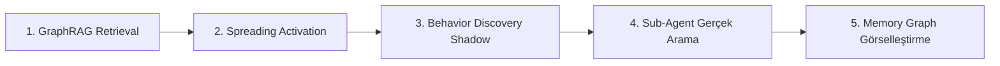
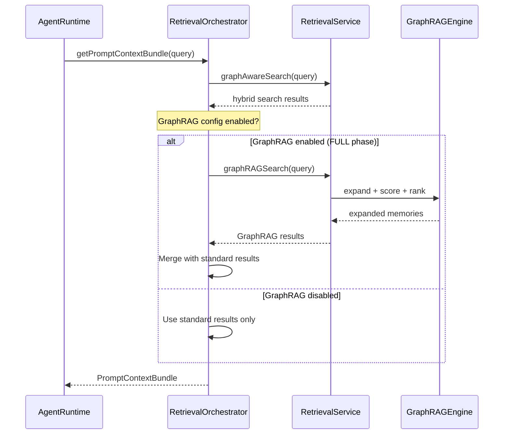
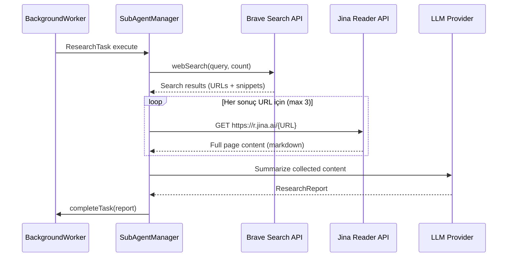
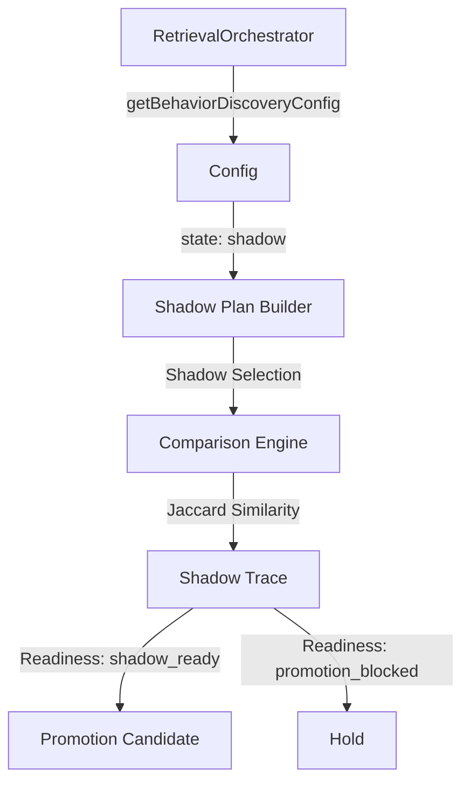
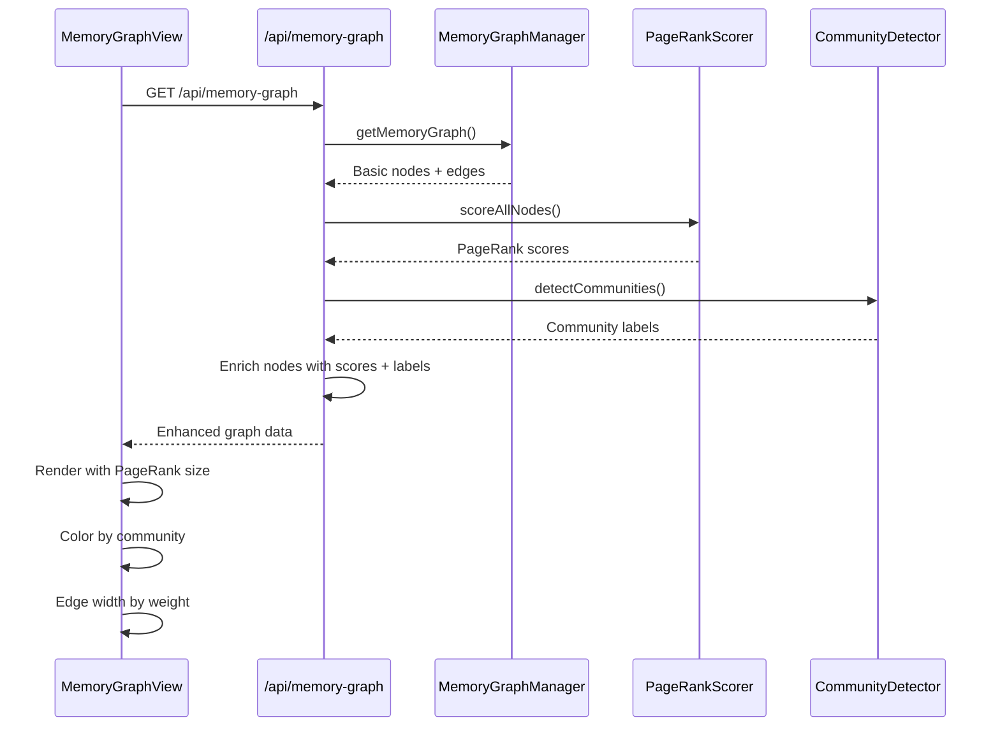

# PenceAI — Aktif Olmayan Özellikler Implementasyon Planı

**Tarih:** 3 Nisan 2026  
**Hazırlayan:** Architect Mode  
**Versiyon:** 1.0

---

## 📋 Genel Bakış

Bu plan, PenceAI sisteminde mevcut ancak aktif olmayan 5 özelliğin production-ready hale getirilmesi için detaylı teknik adımları içerir.

### Implementasyon Sırası (Önerilen)



**Sıralama Mantığı:**
1. **GraphRAG Retrieval** önce gelmeli çünkü diğer özellikler buna bağımlı olabilir
2. **Spreading Activation** GraphRAG'ın retrieval pipeline'ına entegre olmalı
3. **Behavior Discovery Shadow** retrieval karşılaştırması yaptığı için 1 ve 2'den sonra gelmeli
4. **Sub-Agent Gerçek Arama** bağımsız bir özellik, paralel geliştirilebilir
5. **Memory Graph Görselleştirme** frontend odaklı, backend değişikliklerinden etkilenmez

---

## 1. GraphRAG Retrieval Entegrasyonu (#4)

### Mimari Tasarım

Mevcut durumda `GraphRAGEngine` ve `graphRAGSearch()` metodu `RetrievalService` içinde hazır. Ancak `RetrievalOrchestrator` bu metodu doğrudan `getPromptContextBundle()` içinde çağırmıyor.



### Dosya Değişiklikleri

| Dosya | Değişiklik Tipi | Açıklama |
|-------|----------------|----------|
| [`src/memory/retrievalOrchestrator.ts`](src/memory/retrievalOrchestrator.ts:147) | Interface genişletme | `RetrievalOrchestratorDeps`'e `graphRAGSearch` dependency ekle |
| [`src/memory/retrievalOrchestrator.ts`](src/memory/retrievalOrchestrator.ts:1763) | Metod güncelleme | `getPromptContextBundle()` içinde GraphRAG çağrısı ekle |
| [`src/memory/manager/index.ts`](src/memory/manager/index.ts:127) | Dependency injection | Orchestrator'a `graphRAGSearch` dependency'sini geç |
| [`src/memory/graphRAG/config.ts`](src/memory/graphRAG/config.ts) | Config kontrol | FULL phase kontrolü için helper fonksiyon |

### Implementasyon Adımları

#### Adım 1: `RetrievalOrchestratorDeps` Interface'ini Genişlet

**Dosya:** [`src/memory/retrievalOrchestrator.ts`](src/memory/retrievalOrchestrator.ts:147)

```typescript
// Mevcut interface'e (satır ~147) şu dependency'yi ekle:
export interface RetrievalOrchestratorDeps {
    // ... mevcut dependency'ler ...
    graphRAGSearch?: (options: {
        query: string;
        maxResults?: number;
        maxHops?: number;
        useCommunities?: boolean;
        usePageRank?: boolean;
        minConfidence?: number;
    }) => Promise<{
        memories: MemoryRow[];
        communitySummaries: CommunitySummary[];
        graphContext: { expandedNodeIds: number[]; edgeCount: number; maxHopReached: boolean };
        searchMetadata: { duration: number; cacheHit: boolean; communityCount: number };
    }>;
    getGraphRAGConfig?: () => { enabled: boolean; phase: number };
    // ... geri kalanı aynı ...
}
```

#### Adım 2: `getPromptContextBundle()` İçinde GraphRAG Çağrısı

**Dosya:** [`src/memory/retrievalOrchestrator.ts`](src/memory/retrievalOrchestrator.ts:1763)

`getPromptContextBundle()` metodunda, `graphAwareSearch` çağrısından sonra (satır ~1785-1790 civarı) GraphRAG retrieval ekle:

```typescript
// Satır 1785-1790'daki Promise.all'dan SONRA, searchResult alındıktan SONRA:

// GraphRAG retrieval (eğer enabled ve FULL phase)
let graphRAGMemories: MemoryRow[] = [];
if (this.deps.graphRAGSearch && this.deps.getGraphRAGConfig?.().enabled) {
    try {
        const graphRAGResult = await this.deps.graphRAGSearch({
            query,
            maxResults: relevantCandidateLimit,
            maxHops: recipe.graphDepth,
            useCommunities: true,
            usePageRank: true,
            minConfidence: 0.3,
        });
        graphRAGMemories = graphRAGResult.memories;
        
        // Debug log
        this.deps.recordDebug({
            graphRAG: {
                enabled: true,
                memoryCount: graphRAGMemories.length,
                duration: graphRAGResult.searchMetadata.duration,
                cacheHit: graphRAGResult.searchMetadata.cacheHit,
            },
        });
    } catch (err) {
        // Fallback: GraphRAG başarısız → standard hybrid search kullan
        this.deps.recordDebug({
            graphRAG: { enabled: true, error: String(err), fallback: 'standard_hybrid' },
        });
    }
}

// graphRAGMemories'yi relevantBase'e merge et
// Unique ID'leri koruyarak birleştir
if (graphRAGMemories.length > 0) {
    const existingIds = new Set(relevantBase.map(m => m.id));
    const newMemories = graphRAGMemories.filter(m => !existingIds.has(m.id));
    relevantBase = [...relevantBase, ...newMemories].slice(0, relevantCandidateLimit * 2);
}
```

#### Adım 3: MemoryManager'da Dependency Injection

**Dosya:** [`src/memory/manager/index.ts`](src/memory/manager/index.ts:127)

Orchestrator constructor'ına (satır ~127) şu dependency'leri ekle:

```typescript
this.retrievalOrchestrator = new MemoryRetrievalOrchestrator({
    // ... mevcut dependency'ler ...
    graphRAGSearch: (options) => this.retrievalService.graphRAGSearch(options),
    getGraphRAGConfig: () => {
        const config = GraphRAGConfigManager.getConfig();
        return { enabled: config.enabled, phase: config.currentPhase };
    },
    // ... geri kalanı aynı ...
});
```

**Not:** `GraphRAGConfigManager` import'unu dosya başına ekle:
```typescript
import { GraphRAGConfigManager } from '../graphRAG/config.js';
```

### Test Stratejisi

**Birim Testler:**
- `tests/memory/retrievalOrchestrator.graphRAG.test.ts` oluştur
- Mock `graphRAGSearch` dependency ile test et
- GraphRAG başarısız olduğunda fallback davranışını test et

**Entegrasyon Testleri:**
- `tests/memory/graphRAG/retrievalIntegration.test.ts` dosyasını güncelle
- FULL phase config ile end-to-end retrieval test et
- GraphRAG vs standard retrieval sonuç karşılaştırması yap

**Test Senaryoları:**
1. GraphRAG enabled, başarılı retrieval
2. GraphRAG enabled, başarısız retrieval → fallback
3. GraphRAG disabled, sadece standard retrieval
4. GraphRAG + standard results merge doğruluğu

---

## 2. Sub-Agent Gerçek Arama (#7)

### Mimari Tasarım

Mevcut durumda `curiosityEngine.ts` LLM ile mock rapor üretiyor. Gerçek web araması için Brave Search API ve Jina Reader entegrasyonu gerekli.



### Dosya Değişiklikleri

| Dosya | Değişiklik Tipi | Açıklama |
|-------|----------------|----------|
| [`src/autonomous/curiosityEngine.ts`](src/autonomous/curiosityEngine.ts:1) | Yeni metod ekleme | `generateResearchReport()` fonksiyonunu güncelle |
| [`src/gateway/index.ts`](src/gateway/index.ts:289) | Handler güncelleme | Mock rapor yerine gerçek arama çağrısı |
| [`src/agent/tools.ts`](src/agent/tools.ts) | Mevcut tool kullanımı | `webSearch` tool'unu sub-agent için uyarla |
| [`src/gateway/config.ts`](src/gateway/config.ts) | Config doğrulama | BRAVE_SEARCH_API_KEY ve JINA_READER_API_KEY kontrolü |

### Implementasyon Adımları

#### Adım 1: `curiosityEngine.ts`'e Gerçek Arama Desteği

**Dosya:** [`src/autonomous/curiosityEngine.ts`](src/autonomous/curiosityEngine.ts:1)

Dosyanın sonuna şu fonksiyonu ekle:

```typescript
/**
 * Gerçek web araması yaparak araştırma raporu üretir.
 * 
 * Akış:
 * 1. Brave Search API ile web araması yap
 * 2. İlk 3 URL'nin içeriğini Jina Reader ile oku
 * 3. Toplanan içeriği LLM ile özetle
 * 4. ResearchReport döndür
 */
export async function generateResearchReport(
    task: ResearchTask,
    config: {
        braveSearchApiKey: string;
        jinaReaderApiKey: string;
        llmProvider: LLMProvider;
        maxResults?: number;
        maxPagesToRead?: number;
    }
): Promise<ResearchReport> {
    const maxResults = config.maxResults ?? 5;
    const maxPagesToRead = config.maxPagesToRead ?? 3;

    // 1. Brave Search ile web araması
    const searchResults = await braveSearch(task.query, config.braveSearchApiKey, maxResults);
    
    if (searchResults.length === 0) {
        // Fallback: LLM ile genel bilgi
        return generateFallbackReport(task, config.llmProvider);
    }

    // 2. Jina Reader ile sayfa içeriklerini oku
    const pageContents: Array<{ url: string; content: string; title: string }> = [];
    
    for (let i = 0; i < Math.min(maxPagesToRead, searchResults.length); i++) {
        const result = searchResults[i];
        try {
            const content = await jinaReader(result.url, config.jinaReaderApiKey);
            if (content) {
                pageContents.push({
                    url: result.url,
                    content,
                    title: result.title,
                });
            }
        } catch (err) {
            logger.warn(`[SubAgent] Jina Reader failed for ${result.url}: ${err}`);
        }
    }

    // 3. LLM ile özet üret
    const report = await synthesizeReport(task, pageContents, config.llmProvider);
    
    // 4. Kaynakları ekle
    report.sources = searchResults.slice(0, maxResults).map(r => r.url);
    
    return report;
}

/**
 * Brave Search API ile web araması yapar.
 */
async function braveSearch(
    query: string,
    apiKey: string,
    count: number = 5
): Promise<Array<{ url: string; title: string; snippet: string }>> {
    const response = await fetch(
        `https://api.search.brave.com/res/v1/web/search?q=${encodeURIComponent(query)}&count=${count}`,
        {
            headers: {
                'Accept': 'application/json',
                'X-Subscription-Token': apiKey,
            },
        }
    );

    if (!response.ok) {
        throw new Error(`Brave Search API error: ${response.status}`);
    }

    const data = await response.json();
    return (data.web?.results ?? []).map((r: any) => ({
        url: r.url,
        title: r.title,
        snippet: r.description,
    }));
}

/**
 * Jina Reader ile web sayfası içeriğini okur.
 */
async function jinaReader(url: string, apiKey: string): Promise<string | null> {
    const response = await fetch(`https://r.jina.ai/${url}`, {
        headers: {
            'Authorization': `Bearer ${apiKey}`,
            'Accept': 'text/markdown',
            'X-Return-Format': 'markdown',
        },
    });

    if (!response.ok) {
        return null;
    }

    const text = await response.text();
    return text.length > 4000 ? text.substring(0, 4000) + '...' : text;
}

/**
 * Toplanan içerikten LLM ile araştırma raporu sentezler.
 */
async function synthesizeReport(
    task: ResearchTask,
    pageContents: Array<{ url: string; content: string; title: string }>,
    llmProvider: LLMProvider
): Promise<ResearchReport> {
    const contentBlock = pageContents
        .map((p, i) => `## Kaynak ${i + 1}: ${p.title}\nURL: ${p.url}\n\n${p.content}`)
        .join('\n\n---\n\n');

    const messages = [
        {
            role: 'system' as const,
            content: RESEARCH_SYSTEM_PROMPT,
        },
        {
            role: 'user' as const,
            content: `## Araştırma Sorusu\n${task.query}\n\n## Bağlam\n${task.context}\n\n## Toplanan İçerikler\n\n${contentBlock}\n\nYukarıdaki kaynakları kullanarak araştırma sorusunu yanıtla.`,
        },
    ];

    const response = await llmProvider.chat(messages, { temperature: 0.3, maxTokens: 800 });

    // SubAgentManager'ın parseReport metodunu kullan
    const manager = new SubAgentManager(null as any);
    return manager.parseReport(response.content, 0.85);
}

/**
 * Fallback: API'ler yoksa LLM ile genel bilgi üret.
 */
async function generateFallbackReport(
    task: ResearchTask,
    llmProvider: LLMProvider
): Promise<ResearchReport> {
    const messages = [
        { role: 'system' as const, content: RESEARCH_SYSTEM_PROMPT },
        { role: 'user' as const, content: task.query },
    ];

    const response = await llmProvider.chat(messages, { temperature: 0.3, maxTokens: 600 });
    const manager = new SubAgentManager(null as any);
    return manager.parseReport(response.content, 0.5);
}
```

#### Adım 2: Gateway'de Worker Handler'ı Güncelle

**Dosya:** [`src/gateway/index.ts`](src/gateway/index.ts:289)

Satır 289-302'deki mock handler'ı şu şekilde güncelle:

```typescript
// --- GERÇEK WEB ARAMASI ---
const { generateResearchReport } = await import('../autonomous/curiosityEngine.js');
const { LLMProviderFactory } = await import('../llm/index.js');

const config = getConfig();
if (!config.braveSearchApiKey || !config.jinaReaderApiKey) {
    logger.warn('[Worker] Brave Search veya Jina Reader API key yok, fallback kullanılacak');
}

try {
    const llmProvider = await LLMProviderFactory.create(config.defaultLLMProvider);
    const report = await generateResearchReport(task, {
        braveSearchApiKey: config.braveSearchApiKey || '',
        jinaReaderApiKey: config.jinaReaderApiKey || '',
        llmProvider,
        maxResults: 5,
        maxPagesToRead: 3,
    });

    subAgentManager.completeTask(task.id, report);
} catch (err) {
    logger.error({ err }, `[Worker] SubAgent araştırma hatası: "${fixationTopic}"`);
    subAgentManager.failTask(task.id, String(err));
}
```

### Test Stratejisi

**Birim Testler:**
- `tests/autonomous/curiosityEngine.realSearch.test.ts` oluştur
- Brave Search API mock ile test et
- Jina Reader mock ile test et
- Fallback davranışını test et (API key yoksa)

**Entegrasyon Testleri:**
- Gerçek API key'ler ile end-to-end test (opsiyonel, CI'da skip edilebilir)
- Rate limiting davranışını test et

**Test Senaryoları:**
1. Brave Search + Jina Reader başarılı
2. Brave Search başarısız → fallback
3. Jina Reader başarısız (bazı URL'ler) → kalanlarla devam
4. API key yoksa → LLM fallback
5. Rapor formatı doğrulama

---

## 3. Spreading Activation (#9)

### Mimari Tasarım

Spreading activation altyapısı `retrievalOrchestrator.ts` içinde zaten implement edilmiş (`buildSpreadingActivationState`, `computeSpreadingActivationBonus`). Ancak `getMemoryNeighborsBatch` dependency'si doğru formatta dönmüyor ve `getSpreadingActivationConfig` eksik.

```mermaid
graph TD
    A[RetrievalOrchestrator] -->|getMemoryNeighborsBatch| B[MemoryGraphManager]
    A -->|getSpreadingActivationConfig| C[Config Manager]
    B -->|MemoryRelationNeighbor[]| A
    C -->|SpreadingActivationConfig| A
    
    A -->|Activation Score| D[Ranking Engine]
    D -->|Final Score| E[Memory Selection]
```

### Dosya Değişiklikleri

| Dosya | Değişiklik Tipi | Açıklama |
|-------|----------------|----------|
| [`src/memory/graph.ts`](src/memory/graph.ts:215) | Metod güncelleme | `getMemoryNeighborsBatch` relation bilgisi döndürmeli |
| [`src/memory/manager/index.ts`](src/memory/manager/index.ts:134) | Dependency ekleme | `getSpreadingActivationConfig` dependency'sini geç |
| [`src/memory/retrievalOrchestrator.ts`](src/memory/retrievalOrchestrator.ts:155) | Config default | `getSpreadingActivationConfig` default değer ayarla |

### Implementasyon Adımları

#### Adım 1: `MemoryGraphManager.getMemoryNeighborsBatch` Relation Bilgisi Döndür

**Dosya:** [`src/memory/graph.ts`](src/memory/graph.ts:215)

Mevcut `getMemoryNeighborsBatch` metodu `MemoryRow[]` döndürüyor, ancak `RetrievalOrchestrator` `MemoryRelationNeighbor[]` (relation_type, relation_confidence, relation_description içeren) bekliyor.

Mevcut metodu güncelle:

```typescript
// Satır 215-268'deki metodu şu şekilde güncelle:

getMemoryNeighborsBatch(
    memoryIds: number[],
    limitPerNode: number = 10
): Map<number, Array<MemoryRow & {
    relation_type: string;
    relation_confidence: number;
    relation_description: string;
}>> {
    if (memoryIds.length === 0) return new Map();

    const uniqueIds = [...new Set(memoryIds)];
    const placeholders = uniqueIds.map(() => '?').join(',');

    const rows = this.db.prepare(`
        SELECT
            mr.source_memory_id as edge_source,
            mr.target_memory_id as edge_target,
            m.*,
            mr.relation_type,
            mr.confidence as relation_confidence,
            mr.description as relation_description
        FROM memory_relations mr
        JOIN memories m ON (
            (mr.source_memory_id IN (${placeholders}) AND m.id = mr.target_memory_id)
            OR
            (mr.target_memory_id IN (${placeholders}) AND m.id = mr.source_memory_id)
        )
        WHERE m.is_archived = 0
        ORDER BY mr.confidence DESC
    `).all(...uniqueIds, ...uniqueIds) as Array<{
        edge_source: number;
        edge_target: number;
        relation_type: string;
        relation_confidence: number;
        relation_description: string;
    } & MemoryRow>;

    const resultMap = new Map<number, Array<MemoryRow & {
        relation_type: string;
        relation_confidence: number;
        relation_description: string;
    }>>();

    for (const id of uniqueIds) {
        resultMap.set(id, []);
    }

    for (const row of rows) {
        const { edge_source, edge_target, ...memoryData } = row;
        const neighborData = {
            ...memoryData,
            relation_type: row.relation_type,
            relation_confidence: row.relation_confidence,
            relation_description: row.relation_description,
        };

        if (resultMap.has(edge_source) && memoryData.id === edge_target) {
            const arr = resultMap.get(edge_source)!;
            if (arr.length < limitPerNode) arr.push(neighborData);
        }
        if (resultMap.has(edge_target) && memoryData.id === edge_source) {
            const arr = resultMap.get(edge_target)!;
            if (arr.length < limitPerNode) arr.push(neighborData);
        }
    }

    return resultMap;
}
```

#### Adım 2: MemoryManager'da Spreading Activation Config Dependency

**Dosya:** [`src/memory/manager/index.ts`](src/memory/manager/index.ts:127)

Orchestrator constructor'ına ekle:

```typescript
this.retrievalOrchestrator = new MemoryRetrievalOrchestrator({
    // ... mevcut dependency'ler ...
    getSpreadingActivationConfig: () => ({
        enabled: true,
        rolloutState: 'shadow', // 'off' | 'shadow' | 'soft'
        seedLimit: 2,
        neighborsPerSeed: 3,
        maxCandidates: 3,
        maxHopDepth: 1,
        seedConfidenceFloor: 0.72,
        seedScoreFloor: 1.28,
        candidateConfidenceFloor: 0.68,
        relationConfidenceFloor: 0.55,
        minEffectiveBonus: 0.025,
        hopDecay: 0.55,
        activationScale: 0.05,
        maxCandidateBonus: 0.05,
    }),
    // ... geri kalanı aynı ...
});
```

#### Adım 3: Rollout State'i 'soft'a Çek (Production)

Spreading activation'ı production'a almak için config'i `'shadow'` → `'soft'` olarak değiştir:

```typescript
getSpreadingActivationConfig: () => ({
    enabled: true,
    rolloutState: 'soft', // Shadow mode'dan aktif moda geç
    // ... diğer ayarlar aynı ...
}),
```

### Test Stratejisi

**Birim Testler:**
- `tests/memory/spreadingActivation.test.ts` oluştur
- `getMemoryNeighborsBatch` relation bilgisi döndürme testini güncelle
- Activation bonus hesaplama testleri

**Entegrasyon Testleri:**
- `tests/memory/retrievalOrchestrator.spreadingActivation.test.ts` oluştur
- Shadow mode vs soft mode karşılaştırması
- Activation bonus'un ranking'e etkisi

**Test Senaryoları:**
1. Seed memory seçimi (confidence floor, score floor)
2. Neighbor propagation (hop decay)
3. Candidate bonus capping
4. Shadow mode (ranking'e etki etmez, loglanır)
5. Soft mode (ranking'e etki eder)

---

## 4. Behavior Discovery Shadow Mode (#16)

### Mimari Tasarım

Behavior Discovery Shadow Mode altyapısı `retrievalOrchestrator.ts` içinde zaten implement edilmiş (`maybeBuildBehaviorDiscoveryShadowPlan`, `buildBehaviorDiscoveryTrace`). Ancak `getBehaviorDiscoveryConfig` dependency'si hardcoded `'shadow'` state ile çalışıyor.



### Dosya Değişiklikleri

| Dosya | Değişiklik Tipi | Açıklama |
|-------|----------------|----------|
| [`src/memory/manager/index.ts`](src/memory/manager/index.ts:135) | Config güncelleme | `getBehaviorDiscoveryConfig`'i dinamik yap |
| [`src/memory/retrievalOrchestrator.ts`](src/memory/retrievalOrchestrator.ts:1095) | Shadow comparison | Jaccard similarity, precision, recall metrikleri ekle |
| [`src/gateway/routes.ts`](src/gateway/routes.ts) | Yeni endpoint | `/api/behavior-discovery/status` endpoint'i ekle |

### Implementasyon Adımları

#### Adım 1: MemoryManager'da Dinamik Config

**Dosya:** [`src/memory/manager/index.ts`](src/memory/manager/index.ts:135)

Hardcoded config'i dinamik yap:

```typescript
// Satır 135'teki hardcoded config'i güncelle:
getBehaviorDiscoveryConfig: () => {
    // Environment variable veya settings'ten oku
    const state = process.env.BEHAVIOR_DISCOVERY_RETRIEVAL_STATE as 'disabled' | 'observe' | 'candidate' | 'shadow' ?? 'shadow';
    return { retrieval: { state } };
},
```

#### Adım 2: Shadow Comparison'a Metrikler Ekle

**Dosya:** [`src/memory/retrievalOrchestrator.ts`](src/memory/retrievalOrchestrator.ts:1095)

`buildBehaviorDiscoveryTrace` fonksiyonuna (satır ~1161) Jaccard similarity, precision, recall metriklerini ekle:

```typescript
// buildBehaviorDiscoveryTrace fonksiyonunun içinde, shadowComparison objesine:

const currentSet = new Set(currentSelectionIds);
const shadowSet = new Set(shadowPlan.shadowSelectionIds);

// Jaccard Similarity
const intersection = new Set([...currentSet].filter(x => shadowSet.has(x)));
const union = new Set([...currentSet, ...shadowSet]);
const jaccardSimilarity = union.size > 0 ? intersection.size / union.size : 1;

// Precision: shadow selection'ın ne kadarı current'te var
const precision = shadowSet.size > 0 ? intersection.size / shadowSet.size : 1;

// Recall: current selection'ın ne kadarı shadow'da var
const recall = currentSet.size > 0 ? intersection.size / currentSet.size : 1;

// shadowComparison objesine ekle:
shadowComparison: {
    candidateId: shadowPlan.candidate.id,
    currentSelectionIds,
    shadowSelectionIds: shadowPlan.shadowSelectionIds,
    addedIds,
    removedIds,
    changed,
    summary: changed
        ? `shadow_diff:+${addedIds.join(',') || 'none'}:-${removedIds.join(',') || 'none'}`
        : 'shadow_matches_current_selection',
    readiness,
    // YENİ METRİKLER:
    metrics: {
        jaccardSimilarity: Number(jaccardSimilarity.toFixed(3)),
        precision: Number(precision.toFixed(3)),
        recall: Number(recall.toFixed(3)),
        intersectionSize: intersection.size,
        unionSize: union.size,
    },
},
```

#### Adım 3: Behavior Discovery Status API

**Dosya:** [`src/gateway/routes.ts`](src/gateway/routes.ts)

GraphRAG Rollout API'den sonra yeni endpoint ekle:

```typescript
// ============ Behavior Discovery Status API ============

app.get('/api/behavior-discovery/status', (_req, res) => {
    // MemoryManager'dan son retrieval debug snapshot'u al
    const snapshot = memory.getRetrievalDebugSnapshot('promptContextBundle');
    
    res.json({
        state: process.env.BEHAVIOR_DISCOVERY_RETRIEVAL_STATE ?? 'shadow',
        lastRetrievalTrace: snapshot?.behaviorDiscovery ?? null,
        availableStates: ['disabled', 'observe', 'candidate', 'shadow'],
    });
});

app.post('/api/behavior-discovery/set-state', (req, res) => {
    const { state } = req.body;
    const validStates = ['disabled', 'observe', 'candidate', 'shadow'];
    
    if (!validStates.includes(state)) {
        return res.status(400).json({ 
            error: `Invalid state. Use: ${validStates.join(', ')}` 
        });
    }
    
    // Environment variable'ı güncelle (runtime'da)
    process.env.BEHAVIOR_DISCOVERY_RETRIEVAL_STATE = state;
    
    res.json({
        state,
        message: `Behavior discovery state set to '${state}'`,
    });
});
```

### Test Stratejisi

**Birim Testler:**
- `tests/memory/behaviorDiscoveryShadow.test.ts` oluştur
- Jaccard similarity hesaplama testleri
- Precision/recall hesaplama testleri

**Entegrasyon Testleri:**
- Shadow mode retrieval karşılaştırması
- State değiştirme (disabled → observe → shadow → candidate)

**Test Senaryoları:**
1. Shadow mode: retrieval sonuçları değişmez, trace loglanır
2. Jaccard similarity = 1.0 (tam eşleşme)
3. Jaccard similarity < 1.0 (kısmi eşleşme)
4. Precision yüksek, recall düşük (shadow çok seçici)
5. Promotion readiness kontrolü

---

## 5. Memory Graph Gelişmiş Görselleştirme (#18)

### Mimari Tasarım

Mevcut `/api/memory-graph` endpoint'i sadece basit node ve edge verisi döndürüyor. PageRank skorları, community etiketleri ve relation weight'leri eklenmeli. Frontend'de bu veriler görselleştirilmeli.



### Dosya Değişiklikleri

| Dosya | Değişiklik Tipi | Açıklama |
|-------|----------------|----------|
| [`src/memory/graph.ts`](src/memory/graph.ts:286) | Metod güncelleme | `getMemoryGraph` PageRank + community + weight ekle |
| [`src/gateway/routes.ts`](src/gateway/routes.ts:159) | Response zenginleştirme | Enhanced graph data döndür |
| [`src/web/react-app/src/hooks/useMemoryGraph.ts`](src/web/react-app/src/hooks/useMemoryGraph.ts) | Görselleştirme | PageRank size, community color, edge width |
| [`src/web/react-app/src/components/chat/MemoryGraphView.tsx`](src/web/react-app/src/components/chat/MemoryGraphView.tsx) | UI güncelleme | Yeni legend + controls |
| [`src/memory/types.ts`](src/memory/types.ts) | Tip güncelleme | GraphNode ve GraphEdge interface'lerini genişlet |

### Implementasyon Adımları

#### Adım 1: GraphNode ve GraphEdge Interface'lerini Genişlet

**Dosya:** [`src/memory/types.ts`](src/memory/types.ts)

```typescript
// GraphNode interface'ini genişlet:
export interface GraphNode {
    id: string;
    type: 'memory' | 'entity';
    label: string;
    fullContent?: string;
    rawId?: number;
    category?: string;
    importance?: number;
    entityType?: string;
    // YENİ ALANLAR:
    pageRankScore?: number;       // PageRank skoru [0, 1]
    communityId?: string;         // Community etiketi
    communityLabel?: string;      // Community özet adı
}

// GraphEdge interface'ini genişlet:
export interface GraphEdge {
    source: string | GraphNode;
    target: string | GraphNode;
    type: string;
    confidence: number;
    description?: string;
    // YENİ ALANLAR:
    weight?: number;              // Görselleştirmede edge kalınlığı
    relationCount?: number;       // Bu tipteki toplam ilişki sayısı
}

// MemoryGraph interface'ini genişlet:
export interface MemoryGraph {
    nodes: GraphNode[];
    edges: GraphEdge[];
    // YENİ ALANLAR:
    communities?: Array<{
        id: string;
        label: string;
        memberCount: number;
        color: string;
    }>;
    metadata?: {
        totalNodes: number;
        totalEdges: number;
        communityCount: number;
        avgPageRank: number;
        generatedAt: string;
    };
}
```

#### Adım 2: `getMemoryGraph` Metodunu Zenginleştir

**Dosya:** [`src/memory/graph.ts`](src/memory/graph.ts:286)

Metodun sonuna PageRank ve community detection ekle:

```typescript
getMemoryGraph(limit: number = 200): MemoryGraph {
    // ... mevcut kod aynı (satır 287-380) ...
    
    const graph = { nodes, edges };
    
    // === PAGE RANK SCORING ===
    const pageRankScores = this.computePageRank(limit);
    for (const node of nodes) {
        if (node.rawId && pageRankScores.has(node.rawId)) {
            node.pageRankScore = pageRankScores.get(node.rawId)!;
        }
    }
    
    // === COMMUNITY DETECTION ===
    const communities = this.detectCommunities(memoryIdArray);
    const communityColorMap = new Map<string, string>();
    const communityColors = ['#6366f1', '#10b981', '#f59e0b', '#ef4444', '#8b5cf6', '#06b6d4'];
    
    for (let i = 0; i < communities.length; i++) {
        const community = communities[i];
        const color = communityColors[i % communityColors.length];
        communityColorMap.set(community.id, color);
        
        // Node'lara community etiketi ekle
        for (const nodeId of community.memberNodeIds) {
            const node = nodes.find(n => n.rawId === nodeId);
            if (node) {
                node.communityId = community.id;
                node.communityLabel = community.label;
            }
        }
    }
    
    // === EDGE WEIGHT HESAPLAMA ===
    const relationTypeCounts = new Map<string, number>();
    for (const edge of edges) {
        relationTypeCounts.set(edge.type, (relationTypeCounts.get(edge.type) || 0) + 1);
    }
    for (const edge of edges) {
        edge.weight = edge.confidence * (edge.type === 'has_entity' ? 0.5 : 1);
        edge.relationCount = relationTypeCounts.get(edge.type) || 0;
    }
    
    // === METADATA ===
    const avgPageRank = nodes.length > 0
        ? nodes.reduce((sum, n) => sum + (n.pageRankScore ?? 0), 0) / nodes.length
        : 0;
    
    return {
        ...graph,
        communities: communities.map((c, i) => ({
            id: c.id,
            label: c.label,
            memberCount: c.memberNodeIds.length,
            color: communityColorMap.get(c.id) || communityColors[i % communityColors.length],
        })),
        metadata: {
            totalNodes: nodes.length,
            totalEdges: edges.length,
            communityCount: communities.length,
            avgPageRank: Number(avgPageRank.toFixed(3)),
            generatedAt: new Date().toISOString(),
        },
    };
}

/**
 * Basit PageRank hesaplama (iterative)
 */
private computePageRank(limit: number): Map<number, number> {
    const damping = 0.85;
    const iterations = 20;
    
    // Graph adjacency list oluştur
    const adjacencyList = new Map<number, number[]>();
    const allNodeIds = new Set<number>();
    
    const relations = this.db.prepare(`
        SELECT source_memory_id, target_memory_id FROM memory_relations
        WHERE source_memory_id IN (
            SELECT id FROM memories WHERE is_archived = 0 LIMIT ?
        )
    `).all(limit) as Array<{ source_memory_id: number; target_memory_id: number }>;
    
    for (const rel of relations) {
        allNodeIds.add(rel.source_memory_id);
        allNodeIds.add(rel.target_memory_id);
        
        if (!adjacencyList.has(rel.source_memory_id)) {
            adjacencyList.set(rel.source_memory_id, []);
        }
        adjacencyList.get(rel.source_memory_id)!.push(rel.target_memory_id);
    }
    
    // PageRank initialization
    const scores = new Map<number, number>();
    const nodeCount = allNodeIds.size;
    if (nodeCount === 0) return scores;
    
    for (const nodeId of allNodeIds) {
        scores.set(nodeId, 1 / nodeCount);
    }
    
    // Iterative PageRank
    for (let iter = 0; iter < iterations; iter++) {
        const newScores = new Map<number, number>();
        
        for (const nodeId of allNodeIds) {
            let rank = (1 - damping) / nodeCount;
            
            for (const [sourceId, targets] of adjacencyList.entries()) {
                if (targets.includes(nodeId)) {
                    const outDegree = targets.length;
                    rank += damping * (scores.get(sourceId) ?? 0) / outDegree;
                }
            }
            
            newScores.set(nodeId, rank);
        }
        
        for (const [nodeId, score] of newScores.entries()) {
            scores.set(nodeId, score);
        }
    }
    
    return scores;
}

/**
 * Basit community detection (connected components + heuristic labeling)
 */
private detectCommunities(memoryIds: number[]): Array<{
    id: string;
    label: string;
    memberNodeIds: number[];
}> {
    if (memoryIds.length === 0) return [];
    
    // Connected components bul
    const adjacencyList = new Map<number, Set<number>>();
    const allIds = new Set(memoryIds);
    
    const placeholders = memoryIds.map(() => '?').join(',');
    const relations = this.db.prepare(`
        SELECT source_memory_id, target_memory_id FROM memory_relations
        WHERE source_memory_id IN (${placeholders}) AND target_memory_id IN (${placeholders})
    `).all(...memoryIds, ...memoryIds) as Array<{ source_memory_id: number; target_memory_id: number }>;
    
    for (const rel of relations) {
        if (!adjacencyList.has(rel.source_memory_id)) {
            adjacencyList.set(rel.source_memory_id, new Set());
        }
        if (!adjacencyList.has(rel.target_memory_id)) {
            adjacencyList.set(rel.target_memory_id, new Set());
        }
        adjacencyList.get(rel.source_memory_id)!.add(rel.target_memory_id);
        adjacencyList.get(rel.target_memory_id)!.add(rel.source_memory_id);
    }
    
    // BFS ile connected components
    const visited = new Set<number>();
    const communities: Array<{ id: string; label: string; memberNodeIds: number[] }> = [];
    
    for (const startNode of memoryIds) {
        if (visited.has(startNode)) continue;
        
        const component: number[] = [];
        const queue = [startNode];
        visited.add(startNode);
        
        while (queue.length > 0) {
            const current = queue.shift()!;
            component.push(current);
            
            for (const neighbor of adjacencyList.get(current) ?? []) {
                if (!visited.has(neighbor)) {
                    visited.add(neighbor);
                    queue.push(neighbor);
                }
            }
        }
        
        // Community label: en yaygın category'den
        const categoryCounts = new Map<string, number>();
        const categoryRows = this.db.prepare(`
            SELECT category, COUNT(*) as cnt FROM memories WHERE id IN (${component.map(() => '?').join(',')}) GROUP BY category ORDER BY cnt DESC LIMIT 1
        `).all(...component) as Array<{ category: string; cnt: number }>;
        
        const label = categoryRows.length > 0 ? categoryRows[0].category : 'general';
        
        communities.push({
            id: `community_${communities.length}`,
            label,
            memberNodeIds: component,
        });
    }
    
    return communities;
}
```

#### Adım 3: Frontend Görselleştirme Güncellemeleri

**Dosya:** [`src/web/react-app/src/hooks/useMemoryGraph.ts`](src/web/react-app/src/hooks/useMemoryGraph.ts)

D3 force simulation'da PageRank ve community bilgilerini kullan:

```typescript
// Satır 271-289'daki force simulation'ı güncelle:

const simulation = d3
    .forceSimulation<GraphNode>(nodes)
    .force(
        'link',
        d3
            .forceLink<GraphNode, GraphEdge>(links)
            .id((d) => d.id)
            .distance((d) => {
                // Community içi linkler daha yakın
                const sourceNode = nodes.find(n => n.id === (typeof d.source === 'object' ? d.source.id : d.source));
                const targetNode = nodes.find(n => n.id === (typeof d.target === 'object' ? d.target.id : d.target));
                if (sourceNode?.communityId && sourceNode.communityId === targetNode?.communityId) {
                    return 80;
                }
                return d.type === 'has_entity' ? 60 : 120;
            })
            .strength((d) => {
                // Edge weight'e göre strength
                const baseStrength = d.type === 'has_entity' ? 0.8 : d.confidence * 0.5;
                return (d.weight ? d.weight * baseStrength : baseStrength);
            })
    )
    .force(
        'charge',
        d3.forceManyBody<GraphNode>().strength((d) => {
            // PageRank'e göre charge: yüksek PageRank = daha fazla çekim
            const pageRank = d.pageRankScore ?? 0;
            const baseCharge = d.type === 'entity' ? -150 : -250;
            return baseCharge * (1 + pageRank * 0.5);
        })
    )
    .force('center', d3.forceCenter(width / 2, height / 2))
    .force(
        'collision',
        d3.forceCollide<GraphNode>().radius((d) => {
            // PageRank'e göre radius: yüksek PageRank = daha büyük node
            const pageRank = d.pageRankScore ?? 0;
            const baseRadius = d.type === 'entity' ? 20 : 30;
            return baseRadius * (1 + pageRank * 0.3);
        })
    );
```

Node rendering'i PageRank ve community'ye göre güncelle:

```typescript
// Satır 358-372'deki memory node rendering'ini güncelle:

nodeEnter
    .filter((d) => d.type === 'memory')
    .append('rect')
    .attr('class', 'node-shape')
    .attr('width', (d) => {
        // PageRank'e göre boyut
        const pageRank = d.pageRankScore ?? 0;
        return 28 + pageRank * 20;
    })
    .attr('height', (d) => {
        const pageRank = d.pageRankScore ?? 0;
        return 28 + pageRank * 20;
    })
    .attr('x', (d) => {
        const pageRank = d.pageRankScore ?? 0;
        return -(14 + pageRank * 10);
    })
    .attr('y', (d) => {
        const pageRank = d.pageRankScore ?? 0;
        return -(14 + pageRank * 10);
    })
    .attr('rx', 6)
    .attr('ry', 6)
    .attr('fill', (d) => {
        // Community varsa community rengi, yoksa category rengi
        if (d.communityId && graphData?.communities) {
            const community = graphData.communities.find(c => c.id === d.communityId);
            return community?.color || CATEGORY_COLORS[d.category || ''] || '#6366f1';
        }
        return CATEGORY_COLORS[d.category || ''] || '#6366f1';
    })
    .attr('fill-opacity', 0.8)
    .attr('stroke', (d) => {
        if (d.communityId && graphData?.communities) {
            const community = graphData.communities.find(c => c.id === d.communityId);
            return community?.color || CATEGORY_COLORS[d.category || ''] || '#6366f1';
        }
        return CATEGORY_COLORS[d.category || ''] || '#6366f1';
    })
    .attr('stroke-width', (d) => {
        // PageRank'e göre stroke kalınlığı
        const pageRank = d.pageRankScore ?? 0;
        return 2 + pageRank * 3;
    })
    .attr('stroke-opacity', 0.4);
```

Edge rendering'i weight'e göre güncelle:

```typescript
// Satır 323-335'teki link rendering'ini güncelle:

const linkEnter = link
    .enter()
    .append('line')
    .attr('stroke', (d) => EDGE_COLORS[d.type] || '#475569')
    .attr('stroke-opacity', (d) => {
        const baseOpacity = d.type === 'has_entity' ? 0.2 : Math.max(0.3, d.confidence * 0.8);
        return d.weight ? Math.max(baseOpacity, d.weight * 0.8) : baseOpacity;
    })
    .attr('stroke-width', (d) => {
        // Weight'e göre kalınlık
        const baseWidth = d.type === 'has_entity' ? 1 : Math.max(1, d.confidence * 3);
        return d.weight ? Math.max(baseWidth, d.weight * 4) : baseWidth;
    })
    .attr('stroke-dasharray', (d) =>
        d.type === 'contradicts' ? '5,5' : d.type === 'has_entity' ? '2,4' : null
    )
    .attr('marker-end', (d) => {
        if (['supports', 'caused_by', 'part_of'].includes(d.type)) return `url(#arrow-${d.type})`;
        return null;
    });
```

#### Adım 4: MemoryGraphLegend Bileşenini Güncelle

**Dosya:** [`src/web/react-app/src/components/chat/MemoryGraphLegend.tsx`](src/web/react-app/src/components/chat/MemoryGraphLegend.tsx)

Community renklerini legend'a ekle:

```typescript
// Mevcut legend'a community bölümü ekle:
export const MemoryGraphLegend = () => {
    // ... mevcut kod ...
    
    // Community legend (API'den geliyorsa)
    const { data: graphData } = useMemoryGraphQuery();
    
    return (
        <div className="...">
            {/* Mevcut legend içeriği */}
            
            {graphData?.communities && graphData.communities.length > 0 && (
                <div className="mt-3">
                    <h4 className="text-xs font-medium text-white/60 mb-2">Communities</h4>
                    <div className="flex flex-wrap gap-2">
                        {graphData.communities.map(community => (
                            <div key={community.id} className="flex items-center gap-1.5">
                                <div
                                    className="h-3 w-3 rounded-full"
                                    style={{ backgroundColor: community.color }}
                                />
                                <span className="text-xs text-white/60">
                                    {community.label} ({community.memberCount})
                                </span>
                            </div>
                        ))}
                    </div>
                </div>
            )}
            
            {/* PageRank açıklaması */}
            <div className="mt-3">
                <h4 className="text-xs font-medium text-white/60 mb-2">Node Size</h4>
                <div className="flex items-center gap-2">
                    <div className="h-3 w-3 rounded bg-indigo-500" />
                    <span className="text-xs text-white/60">Düşük PageRank</span>
                    <div className="h-5 w-5 rounded bg-indigo-500" />
                    <span className="text-xs text-white/60">Yüksek PageRank</span>
                </div>
            </div>
        </div>
    );
};
```

### Test Stratejisi

**Birim Testler:**
- `tests/memory/graphPageRank.test.ts` oluştur
- PageRank hesaplama doğrulama (bilinen graph ile)
- Community detection doğrulama

**Entegrasyon Testleri:**
- `/api/memory-graph` response schema validation
- Frontend rendering testleri (React Testing Library)

**Test Senaryoları:**
1. PageRank: düğüm graph'ta doğru skorlar
2. Community: connected components doğru tespit
3. Edge weight: confidence * type factor doğru hesaplama
4. Frontend: PageRank'e göre node boyutu değişimi
5. Frontend: community'ye göre renk değişimi
6. Frontend: edge weight'e göre kalınlık değişimi

---

## 📅 Implementasyon Sırası ve Bağımlılıklar

### Faz 1: Backend Retrieval Altyapısı (Öncelik: YÜKSEK)

| # | Görev | Dosyalar | Tahmini Karmaşıklık |
|---|-------|----------|---------------------|
| 1.1 | GraphRAG dependency injection | `retrievalOrchestrator.ts`, `manager/index.ts` | Orta |
| 1.2 | GraphRAG retrieval çağrısı | `retrievalOrchestrator.ts` | Orta |
| 1.3 | Fallback mekanizması | `retrievalOrchestrator.ts` | Düşük |
| 1.4 | GraphRAG birim testleri | `tests/memory/` | Orta |

### Faz 2: Spreading Activation (Öncelik: YÜKSEK)

| # | Görev | Dosyalar | Tahmini Karmaşıklık |
|---|-------|----------|---------------------|
| 2.1 | `getMemoryNeighborsBatch` relation info | `graph.ts` | Orta |
| 2.2 | Spreading activation config | `manager/index.ts` | Düşük |
| 2.3 | Shadow → soft mode geçişi | `manager/index.ts` | Düşük |
| 2.4 | Spreading activation testleri | `tests/memory/` | Orta |

### Faz 3: Behavior Discovery Shadow (Öncelik: ORTA)

| # | Görev | Dosyalar | Tahmini Karmaşıklık |
|---|-------|----------|---------------------|
| 3.1 | Dinamik config | `manager/index.ts` | Düşük |
| 3.2 | Jaccard/Precision/Recall metrikleri | `retrievalOrchestrator.ts` | Orta |
| 3.3 | Status API endpoint | `routes.ts` | Düşük |
| 3.4 | Shadow mode testleri | `tests/memory/` | Orta |

### Faz 4: Sub-Agent Gerçek Arama (Öncelik: ORTA)

| # | Görev | Dosyalar | Tahmini Karmaşıklık |
|---|-------|----------|---------------------|
| 4.1 | `generateResearchReport` fonksiyonu | `curiosityEngine.ts` | Yüksek |
| 4.2 | Brave Search entegrasyonu | `curiosityEngine.ts` | Orta |
| 4.3 | Jina Reader entegrasyonu | `curiosityEngine.ts` | Orta |
| 4.4 | Worker handler güncelleme | `gateway/index.ts` | Düşük |
| 4.5 | Sub-Agent testleri | `tests/autonomous/` | Yüksek |

### Faz 5: Memory Graph Görselleştirme (Öncelik: DÜŞÜK)

| # | Görev | Dosyalar | Tahmini Karmaşıklık |
|---|-------|----------|---------------------|
| 5.1 | GraphNode/GraphEdge interface genişletme | `types.ts` | Düşük |
| 5.2 | PageRank hesaplama | `graph.ts` | Orta |
| 5.3 | Community detection | `graph.ts` | Orta |
| 5.4 | Edge weight hesaplama | `graph.ts` | Düşük |
| 5.5 | D3.js görselleştirme güncellemeleri | `useMemoryGraph.ts` | Yüksek |
| 5.6 | Legend ve metadata UI | `MemoryGraphLegend.tsx` | Düşük |
| 5.7 | Frontend testleri | `tests/web/` | Orta |

---

## ⚠️ Riskler ve Önlemler

### Risk 1: GraphRAG Performance
**Risk:** GraphRAG retrieval, standard retrieval'dan 3-5x daha yavaş olabilir.  
**Önlem:** Timeout mekanizması ekle (5s), fallback to standard search.

### Risk 2: API Rate Limiting (Sub-Agent)
**Risk:** Brave Search ve Jina Reader API rate limit'lerine takılma.  
**Önlem:** Exponential backoff retry, daily quota tracking.

### Risk 3: Frontend Performance
**Risk:** PageRank + community hesaplama büyük graph'larda yavaş olabilir.  
**Önlem:** Limit 200 node, lazy loading, caching.

### Risk 4: Backward Compatibility
**Risk:** Interface değişiklikleri mevcut kodu bozabilir.  
**Önlem:** Tüm yeni alanlar optional (`?`), default değerler sağla.

---

## ✅ Backward Compatibility Kontrol Listesi

- [ ] Tüm yeni interface alanları optional (`?`)
- [ ] Default değerler mevcut davranışı koruyor
- [ ] GraphRAG disabled iken standard retrieval çalışıyor
- [ ] Spreading activation shadow mode'da ranking'i etkilemiyor
- [ ] Sub-Agent API key yoksa fallback çalışıyor
- [ ] Frontend eski graph data formatını da render edebiliyor
- [ ] Mevcut testler passing kalıyor

---

## 📊 Metrikler ve İzleme

### GraphRAG Retrieval
- Cache hit rate
- Average retrieval latency
- Fallback rate

### Spreading Activation
- Activation bonus distribution
- Seed selection rate
- Candidate promotion rate

### Behavior Discovery Shadow
- Jaccard similarity trend
- Precision/recall trend
- Promotion readiness rate

### Sub-Agent
- Research success rate
- Average report generation time
- API error rate

### Memory Graph
- PageRank computation time
- Community detection time
- Frontend render time
