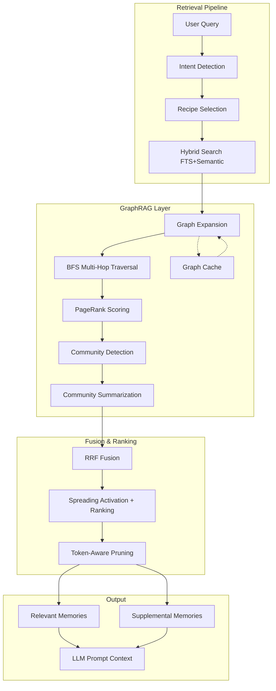

# GraphRAG Entegrasyon Planı

> **Tarih:** 3 Nisan 2026
> **Versiyon:** 1.0
> **Durum:** Planlama Aşaması

---

## 1. Genel Bakış

### Amaç
PenceAI'ın mevcut retrieval pipeline'ına GraphRAG (Graph-based Retrieval Augmented Generation) katmanı ekleyerek:
- Entity'ler arası ilişkileri kullanarak daha bağlamsal bilgi getirmek
- Çok-hop reasoning ile dolaylı bağlantıları keşfetmek
- Community detection ile konu bazlı özetler üretmek
- Graph traversal ile geniş coverage sağlamak

### Kapsam
- **Mevcut Altyapı:** PenceAI zaten graph-aware retrieval, spreading activation ve BFS tabanlı multi-hop traversal'a sahip
- **Yeni Eklemeler:** GraphRAG modülü, community detection, graph-based summarization, enhanced traversal algorithms
- **Entegrasyon Noktası:** [`retrievalOrchestrator.ts`](src/memory/retrievalOrchestrator.ts:1760) → [`graphAwareSearch()`](src/memory/manager/RetrievalService.ts:291) pipeline'ı

### Başarı Kriterleri
1. GraphRAG aktifken retrieval precision'ı %15+ artırma
2. Graph traversal latency'si < 200ms (p95)
3. Token budget'ı 128K limit içinde tutma
4. Backward compatibility — mevcut pipeline bozulmamalı
5. Fallback mekanizması — GraphRAG başarısız olduğunda semantic search'e düşme

---

## 2. Mimari Tasarım

### 2.1 Sistem Diyagramı



### 2.2 Bileşen İlişkileri

| Bileşen | Sorumluluk | Mevcut Karşılığı |
|---------|-----------|-----------------|
| `GraphRAGEngine` | Ana GraphRAG orchestrator | [`MemoryRetrievalOrchestrator`](src/memory/retrievalOrchestrator.ts:1760) |
| `GraphExpander` | Seed'den graph traversal | [`graphAwareSearch()`](src/memory/manager/RetrievalService.ts:291) BFS |
| `PageRankScorer` | Node importance hesaplama | YOK — yeni eklenecek |
| `CommunityDetector` | Louvain/Leiden community detection | YOK — yeni eklenecek |
| `CommunitySummarizer` | Community bazlı özet üretme | YOK — yeni eklenecek |
| `GraphCache` | Graph traversal sonuçlarını cache'leme | YOK — yeni eklenecek |
| `TokenPruner` | Token budget'a göre context pruning | [`estimateMemoryTokenCount()`](src/memory/retrievalOrchestrator.ts:1233) |

### 2.3 Veri Akışı

```
1. Query → Intent Detection → Recipe Selection
2. Recipe → Hybrid Search (FTS + Semantic + RRF)
3. Hybrid Results → GraphExpander (seed nodes)
4. GraphExpander → BFS Multi-Hop Traversal (max 3 hop)
5. Traversed Graph → PageRank Scoring
6. PageRank Scores → Community Detection
7. Communities → Community Summarization (LLM-based)
8. Summaries + Direct Results → RRF Fusion
9. Fused Results → Spreading Activation + Ranking
10. Ranked Results → Token-Aware Pruning
11. Pruned Results → Prompt Context Bundle
```

---

## 3. Veritabanı Değişiklikleri

### 3.1 Mevcut Şema Analizi

Mevcut [`memory_relations`](src/memory/database.ts:169) tablosu:
```sql
CREATE TABLE IF NOT EXISTS memory_relations (
    id INTEGER PRIMARY KEY AUTOINCREMENT,
    source_memory_id INTEGER NOT NULL,
    target_memory_id INTEGER NOT NULL,
    relation_type TEXT NOT NULL DEFAULT 'related_to',
    confidence REAL DEFAULT 0.5,
    description TEXT DEFAULT '',
    created_at DATETIME DEFAULT CURRENT_TIMESTAMP,
    FOREIGN KEY (source_memory_id) REFERENCES memories(id) ON DELETE CASCADE,
    FOREIGN KEY (target_memory_id) REFERENCES memories(id) ON DELETE CASCADE,
    UNIQUE(source_memory_id, target_memory_id, relation_type)
);
```

Mevcut indeksler:
- `idx_memory_relations_source` — source_memory_id
- `idx_memory_relations_target` — target_memory_id

### 3.2 Yeni Şema Genişletmeleri

#### 3.2.1 Graph Cache Tablosu

Graph traversal sonuçlarını cache'lemek için yeni tablo:

```sql
-- Graph traversal cache — query pattern'lerine göre ön-hesaplanmış sonuçlar
CREATE TABLE IF NOT EXISTS graph_traversal_cache (
    id INTEGER PRIMARY KEY AUTOINCREMENT,
    cache_key TEXT NOT NULL UNIQUE,      -- normalized query hash
    seed_memory_ids TEXT NOT NULL,        -- JSON array of seed memory IDs
    traversal_depth INTEGER NOT NULL,     -- BFS depth used
    result_memory_ids TEXT NOT NULL,      -- JSON array of result memory IDs
    pagerank_scores TEXT,                 -- JSON: {memoryId: score}
    community_assignments TEXT,           -- JSON: {memoryId: communityId}
    created_at DATETIME DEFAULT CURRENT_TIMESTAMP,
    last_accessed_at DATETIME DEFAULT CURRENT_TIMESTAMP,
    access_count INTEGER DEFAULT 0,
    expires_at DATETIME                   -- TTL-based expiration
);

CREATE INDEX IF NOT EXISTS idx_graph_cache_key ON graph_traversal_cache(cache_key);
CREATE INDEX IF NOT EXISTS idx_graph_cache_expires ON graph_traversal_cache(expires_at);
```

#### 3.2.2 Community Metadata Tablosu

```sql
-- Community metadata — Louvain/Leiden detection sonuçları
CREATE TABLE IF NOT EXISTS graph_communities (
    id INTEGER PRIMARY KEY AUTOINCREMENT,
    community_id TEXT NOT NULL UNIQUE,    -- UUID
    summary TEXT DEFAULT '',              -- LLM-generated community summary
    summary_embedding BLOB,               -- Semantic embedding of summary
    member_count INTEGER DEFAULT 0,
    avg_confidence REAL DEFAULT 0,
    dominant_relation_type TEXT,          -- En sık görülen ilişki tipi
    created_at DATETIME DEFAULT CURRENT_TIMESTAMP,
    updated_at DATETIME DEFAULT CURRENT_TIMESTAMP,
    is_stale INTEGER DEFAULT 0            -- Re-computation needed flag
);

CREATE INDEX IF NOT EXISTS idx_graph_communities_stale ON graph_communities(is_stale);
```

#### 3.2.3 Community-Üye İlişki Tablosu

```sql
-- Community üyelikleri
CREATE TABLE IF NOT EXISTS graph_community_members (
    community_id TEXT NOT NULL,
    memory_id INTEGER NOT NULL,
    membership_score REAL DEFAULT 0,      -- Node's strength within community
    PRIMARY KEY (community_id, memory_id),
    FOREIGN KEY (community_id) REFERENCES graph_communities(community_id) ON DELETE CASCADE,
    FOREIGN KEY (memory_id) REFERENCES memories(id) ON DELETE CASCADE
);

CREATE INDEX IF NOT EXISTS idx_graph_community_members_memory ON graph_community_members(memory_id);
```

#### 3.2.4 İlişki Tipi İndeksleri

GraphRAG traversal performansını artırmak için yeni indeksler:

```sql
-- Composite index: relation_type + confidence ile hızlı filtreleme
CREATE INDEX IF NOT EXISTS idx_memory_relations_type_confidence 
    ON memory_relations(relation_type, confidence DESC);

-- Composite index: source + relation_type ile directional traversal
CREATE INDEX IF NOT EXISTS idx_memory_relations_source_type 
    ON memory_relations(source_memory_id, relation_type);

-- Composite index: target + relation_type ile反向 traversal
CREATE INDEX IF NOT EXISTS idx_memory_relations_target_type 
    ON memory_relations(target_memory_id, relation_type);
```

#### 3.2.5 memory_relations Tablosu Genişletme

```sql
-- İlişki ağırlığı — PageRank ve traversal scoring için
ALTER TABLE memory_relations ADD COLUMN weight REAL DEFAULT 1.0;

-- İlişki directional flag — asimetrik ilişkiler için
ALTER TABLE memory_relations ADD COLUMN is_directional INTEGER DEFAULT 0;

-- İlişki son hesaplama zamanı — incremental PageRank için
ALTER TABLE memory_relations ADD COLUMN last_scored_at DATETIME;
```

### 3.3 Migration Stratejisi

```typescript
// src/memory/database.ts — migrate() fonksiyonuna eklenecek
private migrateGraphRAG(): void {
    const relTableInfo = this.db.prepare("PRAGMA table_info(memory_relations)").all();
    
    // 1. Yeni kolonlar
    if (!relTableInfo.some(col => col.name === 'weight')) {
        this.db.exec("ALTER TABLE memory_relations ADD COLUMN weight REAL DEFAULT 1.0");
        this.db.exec("ALTER TABLE memory_relations ADD COLUMN is_directional INTEGER DEFAULT 0");
        this.db.exec("ALTER TABLE memory_relations ADD COLUMN last_scored_at DATETIME");
    }
    
    // 2. Yeni tablolar
    this.db.exec(`
        CREATE TABLE IF NOT EXISTS graph_traversal_cache (...);
        CREATE TABLE IF NOT EXISTS graph_communities (...);
        CREATE TABLE IF NOT EXISTS graph_community_members (...);
    `);
    
    // 3. Yeni indeksler
    this.db.exec(`
        CREATE INDEX IF NOT EXISTS idx_memory_relations_type_confidence ...;
        CREATE INDEX IF NOT EXISTS idx_memory_relations_source_type ...;
        CREATE INDEX IF NOT EXISTS idx_memory_relations_target_type ...;
        CREATE INDEX IF NOT EXISTS idx_graph_cache_key ...;
        CREATE INDEX IF NOT EXISTS idx_graph_cache_expires ...;
        CREATE INDEX IF NOT EXISTS idx_graph_communities_stale ...;
        CREATE INDEX IF NOT EXISTS idx_graph_community_members_memory ...;
    `);
    
    // 4. Mevcut ilişkiler için weight backfill
    this.db.prepare(`
        UPDATE memory_relations 
        SET weight = confidence * (1 + 0.1 * COALESCE(access_count, 0))
        WHERE weight = 1.0
    `).run();
}
```

---

## 4. Algoritma Detayları

### 4.1 Graph Traversal Algoritmaları

#### 4.1.1 BFS Multi-Hop Traversal (Geliştirilmiş)

Mevcut [`graphAwareSearch()`](src/memory/manager/RetrievalService.ts:291) zaten BFS yapıyor. GraphRAG için geliştirme:

```typescript
// src/memory/graphRAG/graphExpander.ts

interface GraphExpansionResult {
    seedIds: number[];
    expandedIds: number[];
    hopMap: Map<number, number>;        // memoryId → hop depth
    pathMap: Map<number, number[]>;      // memoryId → path from seed
    relationMap: Map<number, string>;    // memoryId → relation type from parent
}

class GraphExpander {
    /**
     * Geliştirilmiş BFS — relation type filtering ve confidence thresholding ile
     */
    expand(
        seedIds: number[],
        maxDepth: number = 3,
        options?: {
            relationTypes?: string[];     // Sadece belirli ilişki tiplerini takip et
            confidenceFloor?: number;     // Minimum confidence eşiği
            maxBranching?: number;        // Her node'dan max kaç dala çıkılacağı
            excludeIds?: Set<number>;     // Zaten seçilmiş node'ları atla
        }
    ): GraphExpansionResult {
        const {
            relationTypes,
            confidenceFloor = 0.4,
            maxBranching = 5,
            excludeIds = new Set()
        } = options ?? {};

        const result: GraphExpansionResult = {
            seedIds,
            expandedIds: [],
            hopMap: new Map(),
            pathMap: new Map(),
            relationMap: new Map()
        };

        // Initialize seeds
        for (const seedId of seedIds) {
            result.hopMap.set(seedId, 0);
            result.pathMap.set(seedId, [seedId]);
            result.relationMap.set(seedId, 'seed');
        }

        let currentWave = seedIds.map(id => ({ id, path: [id], hop: 0 }));

        for (let depth = 1; depth <= maxDepth; depth++) {
            const nextWave: typeof currentWave = [];

            // Batch neighbor query — N+1 optimizasyonu
            const waveIds = currentWave.map(n => n.id);
            const batchNeighbors = this.getMemoryNeighborsBatch(waveIds, maxBranching);

            for (const node of currentWave) {
                const neighbors = batchNeighbors.get(node.id) ?? [];

                // Confidence'a göre sırala ve en iyi maxBranching taneyi al
                const sortedNeighbors = neighbors
                    .filter(n => {
                        const conf = n.confidence ?? 0;
                        if (conf < confidenceFloor) return false;
                        if (excludeIds.has(n.id) || result.hopMap.has(n.id)) return false;
                        if (relationTypes && !relationTypes.includes(n.relation_type)) return false;
                        return true;
                    })
                    .sort((a, b) => b.confidence - a.confidence)
                    .slice(0, maxBranching);

                for (const neighbor of sortedNeighbors) {
                    result.expandedIds.push(neighbor.id);
                    result.hopMap.set(neighbor.id, depth);
                    result.pathMap.set(neighbor.id, [...node.path, neighbor.id]);
                    result.relationMap.set(neighbor.id, neighbor.relation_type);
                    nextWave.push({ id: neighbor.id, path: [...node.path, neighbor.id], hop: depth });
                }
            }

            currentWave = nextWave;
            if (currentWave.length === 0) break; // Erken durma — genişleyecek node yok
        }

        return result;
    }
}
```

#### 4.1.2 PageRank Scoring

```typescript
// src/memory/graphRAG/pageRank.ts

interface PageRankResult {
    scores: Map<number, number>;  // memoryId → PageRank score
    iterations: number;
    converged: boolean;
}

class PageRankScorer {
    private readonly DAMPING_FACTOR = 0.85;
    private readonly MAX_ITERATIONS = 50;
    private readonly CONVERGENCE_THRESHOLD = 0.0001;

    /**
     * Power iteration ile PageRank hesaplama
     * SQLite'dan graph yapısını okuyarak hesaplama yapar
     */
    compute(memoryIds: number[]): PageRankResult {
        if (memoryIds.length === 0) {
            return { scores: new Map(), iterations: 0, converged: true };
        }

        // Adjacency list oluştur — sadece ilgili node'lar için
        const adjacencyList = this.buildAdjacencyList(memoryIds);
        const n = memoryIds.length;
        
        // Initial scores — uniform distribution
        let scores = new Map<number, number>();
        for (const id of memoryIds) {
            scores.set(id, 1 / n);
        }

        let iterations = 0;
        let converged = false;

        for (let iter = 0; iter < this.MAX_ITERATIONS; iter++) {
            iterations++;
            const newScores = new Map<number, number>();
            let maxDiff = 0;

            // Dangling node handling — outbound edge'i olmayan node'lar
            const danglingNodes = memoryIds.filter(id => !adjacencyList.has(id) || adjacencyList.get(id)!.length === 0);
            const danglingMass = danglingNodes.reduce((sum, id) => sum + scores.get(id)!, 0);

            for (const id of memoryIds) {
                // Incoming edges'den score topla
                let incomingScore = 0;
                for (const [sourceId, targets] of adjacencyList.entries()) {
                    if (targets.includes(id)) {
                        const sourceOutDegree = targets.length;
                        const edgeWeight = this.getEdgeWeight(sourceId, id);
                        incomingScore += (scores.get(sourceId)! / sourceOutDegree) * edgeWeight;
                    }
                }

                // PageRank formülü: (1-d)/N + d * (incoming + dangling_mass/N)
                const newScore = (1 - this.DAMPING_FACTOR) / n 
                    + this.DAMPING_FACTOR * (incomingScore + danglingMass / n);

                newScores.set(id, newScore);
                maxDiff = Math.max(maxDiff, Math.abs(newScore - scores.get(id)!));
            }

            scores = newScores;

            if (maxDiff < this.CONVERGENCE_THRESHOLD) {
                converged = true;
                break;
            }
        }

        // Normalize scores — sum = 1
        const totalScore = Array.from(scores.values()).reduce((sum, s) => sum + s, 0);
        if (totalScore > 0) {
            for (const [id, score] of scores.entries()) {
                scores.set(id, score / totalScore);
            }
        }

        return { scores, iterations, converged };
    }

    private buildAdjacencyList(memoryIds: Set<number>): Map<number, number[]> {
        // SQLite'dan edge'leri çek
        const placeholders = Array.from(memoryIds).map(() => '?').join(',');
        const edges = this.db.prepare(`
            SELECT source_memory_id, target_memory_id 
            FROM memory_relations 
            WHERE source_memory_id IN (${placeholders}) 
              AND target_memory_id IN (${placeholders})
        `).all(...Array.from(memoryIds), ...Array.from(memoryIds));

        const adjList = new Map<number, number[]>();
        for (const edge of edges) {
            if (!adjList.has(edge.source_memory_id)) {
                adjList.set(edge.source_memory_id, []);
            }
            adjList.get(edge.source_memory_id)!.push(edge.target_memory_id);
        }
        return adjList;
    }

    private getEdgeWeight(sourceId: number, targetId: number): number {
        const edge = this.db.prepare(`
            SELECT confidence, weight FROM memory_relations 
            WHERE source_memory_id = ? AND target_memory_id = ?
        `).get(sourceId, targetId) as { confidence: number; weight: number } | undefined;
        
        return edge?.weight ?? edge?.confidence ?? 1.0;
    }
}
```

### 4.2 Community Detection Yaklaşımı

#### 4.2.1 Louvain Algorithm (Lightweight Implementation)

Tam Louvain implementasyonu ağır olacağından, lightweight modularity-based clustering kullanılacak:

```typescript
// src/memory/graphRAG/communityDetector.ts

interface CommunityDetectionResult {
    communities: Map<number, string>;  // memoryId → communityId
    communityStats: Map<string, {
        members: number[];
        avgConfidence: number;
        dominantRelationType: string;
        modularity: number;
    }>;
    modularity: number;
}

class CommunityDetector {
    /**
     * Lightweight greedy modularity maximization
     * Tam Louvain yerine — daha hızlı, local-first için uygun
     */
    detect(memoryIds: number[]): CommunityDetectionResult {
        if (memoryIds.length < 3) {
            // Too small for community detection
            const singleCommunity = new Map<number, string>();
            for (const id of memoryIds) {
                singleCommunity.set(id, 'community_0');
            }
            return {
                communities: singleCommunity,
                communityStats: new Map([['community_0', {
                    members: memoryIds,
                    avgConfidence: 0,
                    dominantRelationType: 'unknown',
                    modularity: 0
                }]]),
                modularity: 0
            };
        }

        // Initial assignment — her node kendi community'si
        const assignments = new Map<number, string>();
        memoryIds.forEach((id, idx) => assignments.set(id, `c_${idx}`));

        // Edge weights
        const edgeWeights = this.buildEdgeWeightMap(memoryIds);

        // Greedy modularity optimization — 3 iterasyon
        for (let iter = 0; iter < 3; iter++) {
            let changed = false;
            
            for (const nodeId of memoryIds) {
                const currentCommunity = assignments.get(nodeId)!;
                
                // Komşu community'leri bul
                const neighborCommunities = this.getNeighborCommunities(nodeId, assignments, edgeWeights);
                
                // Her komşu community için modularity gain hesapla
                let bestCommunity = currentCommunity;
                let bestGain = 0;

                for (const [commId, gain] of neighborCommunities) {
                    if (gain > bestGain) {
                        bestCommunity = commId;
                        bestGain = gain;
                    }
                }

                if (bestCommunity !== currentCommunity) {
                    assignments.set(nodeId, bestCommunity);
                    changed = true;
                }
            }

            if (!changed) break;
        }

        // Community'leri birleştir — küçük community'leri büyük komşulara ekle
        const mergedAssignments = this.mergeSmallCommunities(assignments, edgeWeights, memoryIds);

        // Community stats hesapla
        const communityStats = this.computeCommunityStats(mergedAssignments, edgeWeights);
        const modularity = this.computeModularity(mergedAssignments, edgeWeights);

        return {
            communities: mergedAssignments,
            communityStats,
            modularity
        };
    }
}
```

### 4.3 Community Summarization

```typescript
// src/memory/graphRAG/communitySummarizer.ts

interface CommunitySummary {
    communityId: string;
    memberIds: number[];
    summary: string;           // LLM-generated summary
    keyTopics: string[];       // Extracted topics
    representativeMemoryId: number;  // En merkezi bellek
}

class CommunitySummarizer {
    /**
     * LLM ile community özeti üretme
     * Token-efficient: Sadece top-k representative memory'leri kullanır
     */
    async summarize(
        communityId: string,
        memberIds: number[],
        memories: MemoryRow[],
        options?: {
            maxMembersForSummary?: number;
            llmProvider?: LLMProvider;
        }
    ): Promise<CommunitySummary> {
        const { maxMembersForSummary = 5 } = options ?? {};

        // Representative memory'leri seç — PageRank score'a göre
        const representativeMemories = memories
            .sort((a, b) => b.importance - a.importance)
            .slice(0, maxMembersForSummary);

        // LLM prompt oluştur
        const prompt = this.buildSummaryPrompt(representativeMemories, communityId);

        // LLM'e gönder
        const summary = await this.generateSummary(prompt, options?.llmProvider);

        // Key topics çıkar
        const keyTopics = this.extractKeyTopics(representativeMemories);

        return {
            communityId,
            memberIds,
            summary,
            keyTopics,
            representativeMemoryId: representativeMemories[0]?.id ?? memberIds[0]
        };
    }

    private buildSummaryPrompt(memories: MemoryRow[], communityId: string): string {
        const memoryTexts = memories.map(m => `- [${m.category}] ${m.content}`).join('\n');
        
        return `Aşağıdaki bellekler birbiriyle ilişkili bir topluluk oluşturuyor. 
Bu topluluğun ana temasını 2-3 cümleyle özetle:

${memoryTexts}

Topluk Özeti:`;
    }
}
```

### 4.4 Scoring ve Ranking Formülleri

#### 4.4.1 GraphRAG Enhanced Score

Mevcut [`computeBaseRankingScore()`](src/memory/retrievalOrchestrator.ts:601) fonksiyonuna GraphRAG bonusları eklenir:

```
finalScore = signalScore 
           + primingBonus 
           + activationBonus 
           + importanceBonus 
           + accessBonus
           + pagerankBonus      // YENİ
           + community_bonus    // YENİ
           + hop_penalty        // YENİ

pagerank_bonus = pagerank_score * pagerank_weight_multiplier
               = pagerank_score * 0.15

community_bonus = is_same_community_as_seed ? 0.08 : 0
                + community_summary_relevance * 0.05

hop_penalty = hop_depth * 0.03  // Her hop için score cezası
```

#### 4.4.2 RRF Fusion with GraphRAG

```
RRF_graph(k=60) = Σ (1 / (60 + rank_graph_i))

Final RRF = w_fts * RRF_fts + w_semantic * RRF_semantic + w_graph * RRF_graph

w_fts = 0.35
w_semantic = 0.35
w_graph = 0.30  // GraphRAG ağırlığı
```

---

## 5. Retrieval Pipeline Entegrasyonu

### 5.1 Mevcut Pipeline ile Entegrasyon Noktası

Mevcut pipeline:
```
Query → Intent → Recipe → Hybrid Search → Graph Expansion → RRF Fusion → Results
```

GraphRAG ile yeni pipeline:
```
Query → Intent → Recipe → Hybrid Search → GraphRAG Expansion → PageRank → 
Community Detection → Community Summary → RRF Fusion (FTS+Semantic+Graph) → 
Spreading Activation → Token Pruning → Results
```

### 5.2 Yeni Retrieval Recipe Tanımları

Mevcut [`PromptContextRecipe`](src/memory/retrievalOrchestrator.ts:138) interface'i genişletilir:

```typescript
interface PromptContextRecipe {
    name: 'default' | 'conversation_followup' | 'preference_recall' | 'exploratory' | 'graphrag_deep' | 'graphrag_broad';
    graphDepth: number;
    preferArchivalForSupplemental: boolean;
    expandFallbackPool: boolean;
    preferReviewSignals: boolean;
    preferConversationSignals: boolean;
    // YENİ GraphRAG alanları
    useGraphRAG?: boolean;
    graphRAGMode?: 'deep' | 'broad' | 'off';
    communitySummaryLimit?: number;
    pagerankEnabled?: boolean;
}
```

Yeni recipe'ler:

```typescript
// Deep mode — derinlemesine araştırma
const graphRAGDeep: PromptContextRecipe = {
    name: 'graphrag_deep',
    graphDepth: 3,
    preferArchivalForSupplemental: true,
    expandFallbackPool: true,
    preferReviewSignals: false,
    preferConversationSignals: false,
    useGraphRAG: true,
    graphRAGMode: 'deep',
    communitySummaryLimit: 2,
    pagerankEnabled: true,
};

// Broad mode — geniş coverage
const graphRAGBroad: PromptContextRecipe = {
    name: 'graphrag_broad',
    graphDepth: 2,
    preferArchivalForSupplemental: false,
    expandFallbackPool: true,
    preferReviewSignals: false,
    preferConversationSignals: true,
    useGraphRAG: true,
    graphRAGMode: 'broad',
    communitySummaryLimit: 1,
    pagerankEnabled: true,
};
```

### 5.3 Intent Detection ile GraphRAG Trigger

Mevcut [`detectIntentSignals()`](src/memory/retrievalOrchestrator.ts:1433) fonksiyonuna GraphRAG sinyalleri eklenir:

```typescript
function detectIntentSignals(query, recentMessages): RetrievalIntentSignals {
    // ... mevcut kod ...
    
    return {
        // ... mevcut alanlar ...
        // YENİ
        requiresGraphRAG: /bağlantılı|ilişkili|karşılaştır|tüm|kapsamlı|comprehensive|related|connected|how.*relate/.test(normalizedQuery),
        isExploratoryDeep: /neden.*neden|nasıl.*çalışır|detaylı|derinlemesine|deep.*dive|explain.*fully/.test(normalizedQuery),
    };
}
```

### 5.4 Fallback Mekanizması

```typescript
async function graphAwareSearchWithFallback(query, limit, maxDepth): Promise<GraphAwareSearchResult> {
    try {
        // GraphRAG dene
        const graphRAGResult = await this.graphRAGEngine.search(query, limit, maxDepth);
        
        // Kalite kontrolü
        if (this.isGraphRAGResultQualitySufficient(graphRAGResult)) {
            return graphRAGResult;
        }
        
        // Yetersiz — mevcut graphAwareSearch'e düş
        logger.info('[GraphRAG] Result quality insufficient, falling back to standard graph-aware search');
        return this.standardGraphAwareSearch(query, limit, maxDepth);
        
    } catch (err) {
        // Hata — mevcut graphAwareSearch'e düş
        logger.warn({ err }, '[GraphRAG] Error, falling back to standard graph-aware search');
        return this.standardGraphAwareSearch(query, limit, maxDepth);
    }
}

function isGraphRAGResultQualitySufficient(result: GraphRAGSearchResult): boolean {
    const { active, archival, graphMetrics } = result;
    
    // Minimum sonuç sayısı
    if (active.length < 2) return false;
    
    // Graph expansion yeterli mi?
    if (graphMetrics.expansionRatio < 1.5) return false; // En az %50 expansion bekliyoruz
    
    // Community detection başarılı mı?
    if (graphMetrics.communityCount === 0 && graphMetrics.nodeCount > 5) return false;
    
    return true;
}
```

---

## 6. Performans Optimizasyonları

### 6.1 Cache Stratejisi

#### 6.1.1 Graph Traversal Cache

```typescript
class GraphCache {
    private readonly DEFAULT_TTL_HOURS = 24;
    private readonly MAX_CACHE_SIZE = 1000;

    /**
     * Query hash'ine göre cache'den sonuç döndür
     */
    async get(query: string, depth: number): Promise<GraphExpansionResult | null> {
        const cacheKey = this.computeCacheKey(query, depth);
        
        const cached = this.db.prepare(`
            SELECT result_memory_ids, pagerank_scores, community_assignments
            FROM graph_traversal_cache
            WHERE cache_key = ? 
              AND (expires_at IS NULL OR expires_at > CURRENT_TIMESTAMP)
            ORDER BY access_count DESC
            LIMIT 1
        `).get(cacheKey) as CachedRow | undefined;

        if (cached) {
            this.db.prepare(`
                UPDATE graph_traversal_cache 
                SET last_accessed_at = CURRENT_TIMESTAMP, access_count = access_count + 1
                WHERE cache_key = ?
            `).run(cacheKey);
            
            return this.deserializeCachedResult(cached);
        }
        
        return null;
    }

    async set(query: string, depth: number, result: GraphExpansionResult): Promise<void> {
        const cacheKey = this.computeCacheKey(query, depth);
        const expiresAt = new Date(Date.now() + this.DEFAULT_TTL_HOURS * 60 * 60 * 1000).toISOString();

        // Cache size kontrolü — LRU eviction
        await this.evictIfNeeded();

        this.db.prepare(`
            INSERT OR REPLACE INTO graph_traversal_cache 
            (cache_key, seed_memory_ids, traversal_depth, result_memory_ids, pagerank_scores, community_assignments, expires_at)
            VALUES (?, ?, ?, ?, ?, ?, ?)
        `).run(
            cacheKey,
            JSON.stringify(result.seedIds),
            depth,
            JSON.stringify(result.expandedIds),
            JSON.stringify(Object.fromEntries(result.pagerankScores ?? [])),
            JSON.stringify(Object.fromEntries(result.communityAssignments ?? [])),
            expiresAt
        );
    }

    private computeCacheKey(query: string, depth: number): string {
        // Query'yi normalize et — benzer sorgular aynı cache key'i alsın
        const normalized = query
            .toLowerCase()
            .replace(/[?.!,;:]/g, '')
            .split(/\s+/)
            .sort()
            .join(' ');
        
        const hash = crypto.createHash('md5').update(`${normalized}|${depth}`).digest('hex');
        return `graph_${hash}`;
    }
}
```

#### 6.1.2 Community Cache

Community detection pahalı bir işlem olduğundan, sonuçları cache'lenir:

```typescript
class CommunityCache {
    /**
     * Graph'in son değişim zamanına göre cache validity kontrolü
     */
    async getIfValid(): Promise<CommunityDetectionResult | null> {
        const lastGraphChange = this.db.prepare(`
            SELECT MAX(updated_at) as last_change FROM memories
            UNION ALL
            SELECT MAX(created_at) FROM memory_relations
        `).get() as { last_change: string };

        const cached = this.db.prepare(`
            SELECT * FROM graph_communities 
            WHERE is_stale = 0 AND updated_at > ?
        `).get(lastGraphChange.last_change);

        if (!cached) return null;

        // Community üyelerini yükle
        const members = this.db.prepare(`
            SELECT memory_id, membership_score FROM graph_community_members
            WHERE community_id = ?
        `).all(cached.community_id);

        return this.deserializeCommunityResult(cached, members);
    }

    /**
     * Graph değiştiğinde community cache'i stale olarak işaretle
     */
    markStale(): void {
        this.db.prepare(`UPDATE graph_communities SET is_stale = 1`).run();
    }
}
```

### 6.2 Asenkron İşleme

#### 6.2.1 Background Community Detection

Community detection ana thread'i bloklamamalıdır:

```typescript
// src/autonomous/worker.ts — GraphRAG background tasks

async function processGraphRAGBackgroundTasks(): Promise<void> {
    // 1. Stale community'leri yeniden hesapla
    await this.recomputeStaleCommunities();
    
    // 2. PageRank incremental update
    await this.incrementalPageRankUpdate();
    
    // 3. Expired cache entries temizle
    await this.cleanExpiredCache();
}

async function recomputeStaleCommunities(): Promise<void> {
    const staleCommunities = this.db.prepare(`
        SELECT community_id FROM graph_communities WHERE is_stale = 1
    `).all() as Array<{ community_id: string }>;

    for (const community of staleCommunities) {
        // Community üyelerini al
        const members = this.db.prepare(`
            SELECT memory_id FROM graph_community_members WHERE community_id = ?
        `).all(community.community_id) as Array<{ memory_id: number }>;

        const memberIds = members.map(m => m.memory_id);
        
        // Community'yi yeniden hesapla
        const result = await this.communityDetector.detect(memberIds);
        
        // Summary üret
        const memories = this.getMemoriesByIds(memberIds.slice(0, 10));
        const summary = await this.communitySummarizer.summarize(
            community.community_id,
            memberIds,
            memories
        );

        // DB'yi güncelle
        this.db.prepare(`
            UPDATE graph_communities 
            SET summary = ?, is_stale = 0, updated_at = CURRENT_TIMESTAMP,
                member_count = ?, avg_confidence = ?, dominant_relation_type = ?
            WHERE community_id = ?
        `).run(
            summary.summary,
            memberIds.length,
            summary.avgConfidence,
            summary.dominantRelationType,
            community.community_id
        );
    }
}
```

### 6.3 Token Budgeting

#### 6.3.1 Token-Aware Context Pruning

```typescript
// src/memory/graphRAG/tokenPruner.ts

interface TokenBudget {
    maxTokens: number;        // 128K limit
    reservedForResponse: number;  // LLM response için ayrılan
    availableForContext: number;  // Context için kullanılabilir
}

class TokenPruner {
    private readonly TOKENS_PER_CHAR_ESTIMATE = 0.25;  // ~4 char/token

    /**
     * GraphRAG sonuçlarını token budget'a göre prune et
     */
    prune(
        relevantMemories: MemoryRow[],
        communitySummaries: CommunitySummary[],
        supplementalMemories: MemoryRow[],
        budget: TokenBudget
    ): {
        relevantMemories: MemoryRow[];
        communitySummaries: CommunitySummary[];
        supplementalMemories: MemoryRow[];
        estimatedTokenCount: number;
    } {
        let currentTokens = this.estimateTokens(relevantMemories);
        
        // 1. Community summaries ekle — yüksek priority
        let result = {
            relevantMemories: [...relevantMemories],
            communitySummaries: [] as CommunitySummary[],
            supplementalMemories: [] as MemoryRow[],
            estimatedTokenCount: currentTokens
        };

        for (const summary of communitySummaries) {
            const summaryTokens = Math.ceil(summary.summary.length * this.TOKENS_PER_CHAR_ESTIMATE);
            if (currentTokens + summaryTokens <= budget.availableForContext) {
                result.communitySummaries.push(summary);
                currentTokens += summaryTokens;
            } else {
                // Summary'yi kısalt
                const truncated = this.truncateSummary(summary, budget.availableForContext - currentTokens);
                if (truncated) {
                    result.communitySummaries.push(truncated);
                    currentTokens += Math.ceil(truncated.summary.length * this.TOKENS_PER_CHAR_ESTIMATE);
                }
            }
        }

        // 2. Supplemental memories ekle — düşük priority
        for (const memory of supplementalMemories) {
            const memoryTokens = this.estimateMemoryTokens(memory);
            if (currentTokens + memoryTokens <= budget.availableForContext) {
                result.supplementalMemories.push(memory);
                currentTokens += memoryTokens;
            } else {
                break; // Budget doldu
            }
        }

        result.estimatedTokenCount = currentTokens;
        return result;
    }

    private estimateTokens(memories: MemoryRow[]): number {
        return Math.ceil(memories.reduce((sum, m) => sum + m.content.length, 0) * this.TOKENS_PER_CHAR_ESTIMATE);
    }

    private estimateMemoryTokens(memory: MemoryRow): number {
        return Math.ceil(memory.content.length * this.TOKENS_PER_CHAR_ESTIMATE);
    }

    private truncateSummary(summary: CommunitySummary, remainingTokens: number): CommunitySummary | null {
        const maxChars = Math.floor(remainingTokens / this.TOKENS_PER_CHAR_ESTIMATE);
        if (maxChars < 50) return null; // Minimum anlamlı özet

        return {
            ...summary,
            summary: summary.summary.substring(0, maxChars) + '...',
        };
    }
}
```

---

## 7. Implementasyon Roadmap

### Faz 1: Graph-Aware Retrieval Güçlendirme (Düşük Risk)

**Amaç:** Mevcut graph altyapısını güçlendir, GraphRAG için temel bileşenleri oluştur

- [ ] **1.1** Veritabanı migration'ı — yeni tablolar ve indeksler
  - [`graph_traversal_cache`](#321-graph-cache-tablosu) tablosu
  - [`graph_communities`](#322-community-metadata-tablosu) tablosu
  - [`graph_community_members`](#323-community-üye-ilişki-tablosu) tablosu
  - Yeni indeksler ve `memory_relations` genişletme
  - Dosya: [`src/memory/database.ts`](src/memory/database.ts:221)

- [ ] **1.2** GraphRAG temel tipleri ve interface'ler
  - `GraphRAGSearchResult`, `GraphExpansionResult`, `PageRankResult`, `CommunityDetectionResult`
  - Dosya: `src/memory/graphRAG/types.ts` (yeni)

- [ ] **1.3** [`GraphExpander`](#411-bfs-multi-hop-traversal-geliştirilmiş) implementasyonu
  - Geliştirilmiş BFS — relation type filtering, confidence thresholding
  - Batch neighbor query optimizasyonu
  - Dosya: `src/memory/graphRAG/graphExpander.ts` (yeni)

- [ ] **1.4** [`PageRankScorer`](#412-pagerank-scoring) implementasyonu
  - Power iteration ile PageRank
  - Dangling node handling
  - Edge weight desteği
  - Dosya: `src/memory/graphRAG/pageRank.ts` (yeni)

- [ ] **1.5** [`GraphCache`](#611-graph-traversal-cache) implementasyonu
  - Query hash-based caching
  - TTL-based expiration
  - LRU eviction
  - Dosya: `src/memory/graphRAG/graphCache.ts` (yeni)

- [ ] **1.6** Mevcut [`graphAwareSearch()`](src/memory/manager/RetrievalService.ts:291) entegrasyonu
  - GraphExpander ile genişletilmiş traversal
  - PageRank scoring entegrasyonu
  - Cache lookup/insert
  - Fallback mekanizması
  - Dosya: [`src/memory/manager/RetrievalService.ts`](src/memory/manager/RetrievalService.ts:291)

- [ ] **1.7** Birim testler — GraphExpander, PageRankScorer, GraphCache
  - Dosya: `tests/memory/graphRAG/graphExpander.test.ts`
  - Dosya: `tests/memory/graphRAG/pageRank.test.ts`
  - Dosya: `tests/memory/graphRAG/graphCache.test.ts`

### Faz 2: Graph Tabanlı Özetleme (Orta Risk)

**Amaç:** Community detection ve summarization modüllerini ekle

- [ ] **2.1** [`CommunityDetector`](#42-community-detection-yaklaşımı) implementasyonu
  - Lightweight modularity maximization
  - Small community merging
  - Community stats computation
  - Dosya: `src/memory/graphRAG/communityDetector.ts` (yeni)

- [ ] **2.2** [`CommunitySummarizer`](#43-community-summarization) implementasyonu
  - LLM-based summary generation
  - Key topic extraction
  - Representative memory selection
  - Dosya: `src/memory/graphRAG/communitySummarizer.ts` (yeni)

- [ ] **2.3** [`CommunityCache`](#612-community-cache) implementasyonu
  - Graph change detection
  - Stale community marking
  - Background recomputation
  - Dosya: `src/memory/graphRAG/communityCache.ts` (yeni)

- [ ] **2.4** Background worker entegrasyonu
  - Stale community recomputation
  - Incremental PageRank update
  - Cache cleanup
  - Dosya: [`src/autonomous/worker.ts`](src/autonomous/worker.ts)

- [ ] **2.5** Retrieval pipeline entegrasyonu
  - Community summary injection
  - RRF fusion with graph scores
  - Token-aware pruning
  - Dosya: [`src/memory/retrievalOrchestrator.ts`](src/memory/retrievalOrchestrator.ts:1760)

- [ ] **2.6** Yeni retrieval recipe'ler
  - `graphrag_deep` recipe
  - `graphrag_broad` recipe
  - Intent detection ile GraphRAG trigger
  - Dosya: [`src/memory/retrievalOrchestrator.ts`](src/memory/retrievalOrchestrator.ts:1598)

- [ ] **2.7** Entegrasyon testleri
  - Community detection doğruluğu
  - Summary kalitesi
  - Pipeline end-to-end
  - Dosya: `tests/memory/graphRAG/communityDetection.test.ts`
  - Dosya: `tests/memory/graphRAG/integration.test.ts`

### Faz 3: Tam GraphRAG Pipeline Entegrasyonu (Yüksek Risk)

**Amaç:** Production-ready GraphRAG pipeline, monitoring ve optimizasyon

- [ ] **3.1** GraphRAG engine orchestrator
  - Ana [`GraphRAGEngine`](#22-bileşen-ilişkileri) sınıfı
  - Component lifecycle management
  - Error handling ve fallback
  - Dosya: `src/memory/graphRAG/engine.ts` (yeni)

- [ ] **3.2** [`TokenPruner`](#63-token-budgeting) implementasyonu
  - Token budget calculation
  - Context pruning strategies
  - Summary truncation
  - Dosya: `src/memory/graphRAG/tokenPruner.ts` (yeni)

- [ ] **3.3** Retrieval orchestrator tam entegrasyon
  - GraphRAG mode selection
  - Dynamic recipe adjustment
  - Dual-process System2 escalation
  - Dosya: [`src/memory/retrievalOrchestrator.ts`](src/memory/retrievalOrchestrator.ts:1760)

- [ ] **3.4** Monitoring ve observability
  - GraphRAG metrics collection
  - Performance tracking
  - Quality assessment
  - Debug snapshot extension
  - Dosya: `src/memory/graphRAG/observability.ts` (yeni)

- [ ] **3.5** Shadow mode deployment
  - GraphRAG shadow mode — sonuçları log'la ama kullanma
  - A/B comparison — mevcut vs GraphRAG
  - Quality metrics collection
  - Dosya: [`src/memory/retrievalOrchestrator.ts`](src/memory/retrievalOrchestrator.ts:1095)

- [ ] **3.6** Benchmark testleri
  - Retrieval accuracy karşılaştırması
  - Latency benchmark
  - Token usage analysis
  - Dosya: `tests/benchmark/graphRAG.test.ts`

- [ ] **3.7** Production rollout
  - Feature flag ile kontrollü açılım
  - Gradual traffic increase
  - Rollback planı
  - Dokümantasyon

---

## 8. Risk Analizi

| Risk | Olasılık | Etki | Mitigasyon |
|------|----------|------|------------|
| Graph traversal latency artışı | YÜKSEK | ORTA | Cache stratejisi, max depth limit, early stopping |
| Token budget aşımı | ORTA | YÜKSEK | TokenPruner ile aggressive pruning, summary truncation |
| Community detection yanlış grouping | ORTA | ORTA | Lightweight algorithm, manual override, shadow mode validation |
| Mevcut pipeline bozulması | DÜŞÜK | YÜKSEK | Backward compatibility, fallback mekanizması, feature flag |
| SQLite performance bottleneck | ORTA | ORTA | Batch queries, indeks optimizasyonu, async worker |
| LLM summarization maliyeti | ORTA | ORTA | Representative memory selection, caching, batch processing |
| Graph explosion (çok fazla node) | DÜŞÜK | YÜKSEK | maxBranching limit, confidence floor, hop depth limit |
| Cache staleness | ORTA | DÜŞÜK | TTL-based expiration, graph change detection, background refresh |

---

## 9. Test Stratejisi

### 9.1 Birim Testler

| Test | Kapsam | Dosya |
|------|--------|-------|
| GraphExpander BFS | Multi-hop traversal, relation filtering, confidence thresholding | `tests/memory/graphRAG/graphExpander.test.ts` |
| PageRank Scorer | Power iteration convergence, dangling node handling, edge weights | `tests/memory/graphRAG/pageRank.test.ts` |
| Community Detector | Modularity computation, small community merging, edge cases | `tests/memory/graphRAG/communityDetector.test.ts` |
| Graph Cache | Cache hit/miss, TTL expiration, LRU eviction | `tests/memory/graphRAG/graphCache.test.ts` |
| Token Pruner | Budget enforcement, summary truncation, token estimation | `tests/memory/graphRAG/tokenPruner.test.ts` |

### 9.2 Entegrasyon Testleri

| Test | Kapsam | Dosya |
|------|--------|-------|
| GraphRAG Pipeline End-to-End | Query → GraphRAG → Results | `tests/memory/graphRAG/integration.test.ts` |
| Fallback Mekanizması | GraphRAG error → standard search | `tests/memory/graphRAG/fallback.test.ts` |
| Community Summarization | LLM summary generation, topic extraction | `tests/memory/graphRAG/summarization.test.ts` |
| Retrieval Recipe Selection | GraphRAG mode triggering, intent detection | `tests/memory/graphRAG/recipeSelection.test.ts` |

### 9.3 Benchmark Testleri

| Test | Metrik | Hedef | Dosya |
|------|--------|-------|-------|
| Retrieval Precision | NDCG@10, MRR | +15% improvement | `tests/benchmark/graphRAG.accuracy.test.ts` |
| Latency | p50, p95, p99 | p95 < 200ms | `tests/benchmark/graphRAG.latency.test.ts` |
| Token Usage | Context tokens / query | < 50% of 128K limit | `tests/benchmark/graphRAG.tokens.test.ts` |
| Cache Hit Rate | Hit ratio | > 60% | `tests/benchmark/graphRAG.cache.test.ts` |

---

## 10. Dosya Yapısı

### 10.1 Yeni Dosyalar

```
src/memory/graphRAG/
├── types.ts                    # GraphRAG tip tanımlamaları
├── engine.ts                   # Ana GraphRAG orchestrator
├── graphExpander.ts            # BFS multi-hop traversal
├── pageRank.ts                 # PageRank scoring
├── communityDetector.ts        # Community detection
├── communitySummarizer.ts      # LLM-based community summarization
├── communityCache.ts           # Community cache management
├── graphCache.ts               # Graph traversal cache
├── tokenPruner.ts              # Token-aware context pruning
├── observability.ts            # Metrics ve monitoring
└── index.ts                    # Public API exports

tests/memory/graphRAG/
├── graphExpander.test.ts
├── pageRank.test.ts
├── communityDetector.test.ts
├── graphCache.test.ts
├── tokenPruner.test.ts
├── integration.test.ts
├── fallback.test.ts
├── summarization.test.ts
└── recipeSelection.test.ts

tests/benchmark/
├── graphRAG.accuracy.test.ts
├── graphRAG.latency.test.ts
├── graphRAG.tokens.test.ts
└── graphRAG.cache.test.ts
```

### 10.2 Değiştirilecek Dosyalar

| Dosya | Değişiklik |
|-------|-----------|
| [`src/memory/database.ts`](src/memory/database.ts:221) | Migration — yeni tablolar, indeksler, kolonlar |
| [`src/memory/types.ts`](src/memory/types.ts:1) | GraphRAG tip exports |
| [`src/memory/manager/index.ts`](src/memory/manager/index.ts:71) | GraphRAG engine dependency injection |
| [`src/memory/manager/RetrievalService.ts`](src/memory/manager/RetrievalService.ts:53) | graphAwareSearch genişletme |
| [`src/memory/retrievalOrchestrator.ts`](src/memory/retrievalOrchestrator.ts:1760) | GraphRAG recipe'ler, intent detection, pipeline entegrasyon |
| [`src/autonomous/worker.ts`](src/autonomous/worker.ts) | Background community detection, cache cleanup |

---

## 11. Önemli Tasarım Kararları

### 11.1 Neden Lightweight Community Detection?

Tam Louvain/Leiden implementasyonu:
- **Artı:** Daha accurate community detection
- **Eksi:** Complex implementation, yüksek CPU kullanımı, local-first için overkill

Lightweight greedy modularity:
- **Artı:** Basit implementasyon, hızlı, local-first için yeterli
- **Eksi:** Biraz daha düşük accuracy

**Karar:** Lightweight greedy modularity — PenceAI'ın local-first doğası ve mevcut graph boyutu için yeterli.

### 11.2 Neden Power Iteration PageRank?

Matrix-based PageRank:
- **Artı:** Mathematically elegant, fast for dense graphs
- **Eksi:** Memory-intensive, sparse graph için overkill

Power iteration:
- **Artı:** Memory-efficient, sparse graph için uygun, incremental update kolay
- **Eksi:** Daha fazla iteration gerekebilir

**Karar:** Power iteration — SQLite tabanlı sparse graph için uygun, incremental update desteği var.

### 11.3 Neden Query-Hash Based Cache?

Semantic cache (embedding similarity):
- **Artı:** Benzer sorgular için cache hit
- **Eksi:** Embedding computation overhead, complex matching

Query-hash cache:
- **Artı:** Basit, hızlı, deterministic
- **Eksi:** Exact match gerektirir

**Karar:** Query-hash based cache — basit ve etkili. Semantic cache Faz 3'te eklenebilir.

---

## 12. Monitoring ve Observability

### 12.1 GraphRAG Metrics

```typescript
interface GraphRAGMetrics {
    // Performance
    traversalLatency: number;       // ms
    pageRankLatency: number;        // ms
    communityDetectionLatency: number; // ms
    totalLatency: number;           // ms

    // Quality
    expansionRatio: number;         // expanded / seed
    communityCount: number;
    avgCommunitySize: number;
    modularity: number;

    // Cache
    cacheHitRate: number;
    cacheSize: number;

    // Token
    contextTokenCount: number;
    summaryTokenCount: number;
    pruningRatio: number;

    // Fallback
    fallbackCount: number;
    fallbackReasons: string[];
}
```

### 12.2 Debug Snapshot Extension

Mevcut [`recordDebug()`](src/memory/retrievalOrchestrator.ts:1907) fonksiyonuna GraphRAG bilgisi eklenir:

```typescript
this.deps.recordDebug({
    // ... mevcut debug bilgisi ...
    graphRAG: {
        enabled: true,
        mode: 'deep' | 'broad',
        traversalLatency: 45,
        pageRankLatency: 23,
        communityDetectionLatency: 67,
        expansionRatio: 2.3,
        communityCount: 3,
        cacheHit: false,
        fallbackUsed: false,
        contextTokenCount: 12500,
        pruningRatio: 0.15,
    }
});
```

---

## 13. Rollout Stratejisi

### 13.1 Feature Flag

```typescript
// src/gateway/config.ts
interface GraphRAGConfig {
    enabled: boolean;
    mode: 'off' | 'shadow' | 'partial' | 'full';
    maxDepth: number;
    pagerankEnabled: boolean;
    communityDetectionEnabled: boolean;
    cacheEnabled: boolean;
    tokenBudget: number;
}
```

### 13.1 Aşamalı Rollout

1. **Shadow Mode (Faz 1 sonu):** GraphRAG çalışır, sonuçlar log'lanır ama kullanılmaz
2. **Partial Mode (Faz 2 sonu):** Sadece belirli query tipleri için GraphRAG aktif
3. **Full Mode (Faz 3 sonu):** Tüm query'ler için GraphRAG aktif

### 13.2 Rollback Planı

- Feature flag ile anında kapatma
- Mevcut pipeline'a otomatik fallback
- Cache invalidation on rollback

---

## 14. Sonraki Adımlar

1. **Plan Onayı:** Bu planın review ve onayı
2. **Faz 1 Başlangıcı:** Database migration ve temel bileşenler
3. **İlk Review:** GraphExpander + PageRankScorer implementasyonu sonrası
4. **Faz 2 Başlangıcı:** Community detection ve summarization
5. **Shadow Mode Deployment:** GraphRAG shadow mode ile validation
6. **Faz 3 Başlangıcı:** Production-ready pipeline
7. **Production Rollout:** Feature flag ile kontrollü açılım
