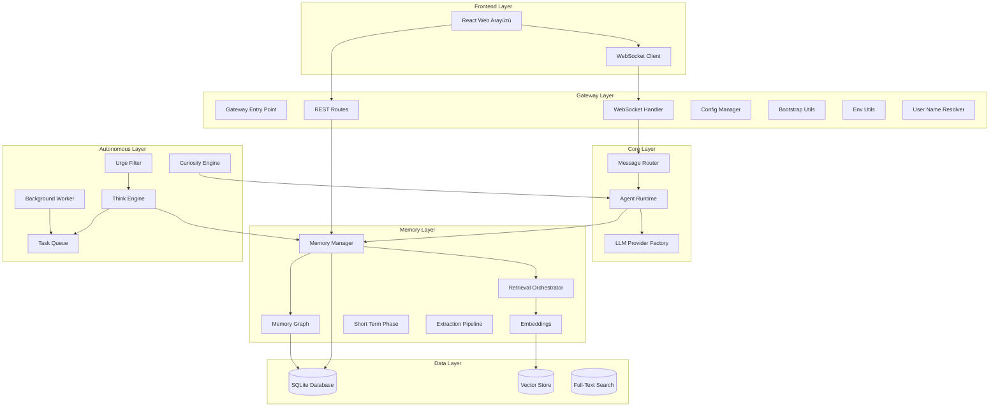
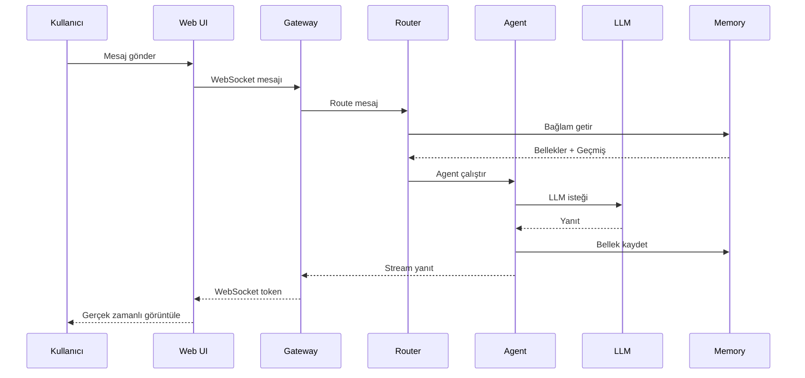
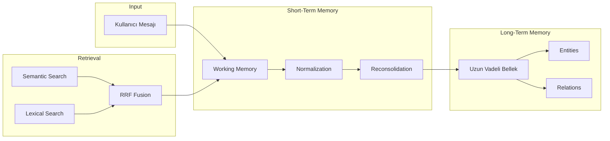
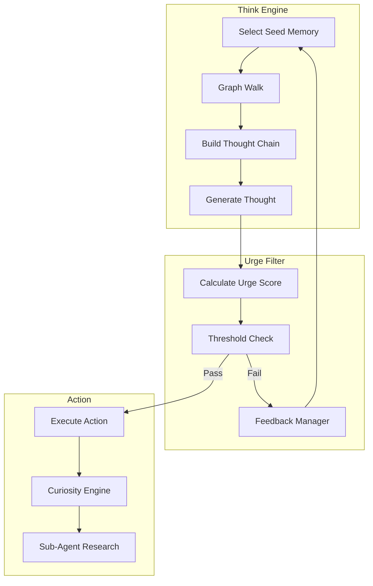
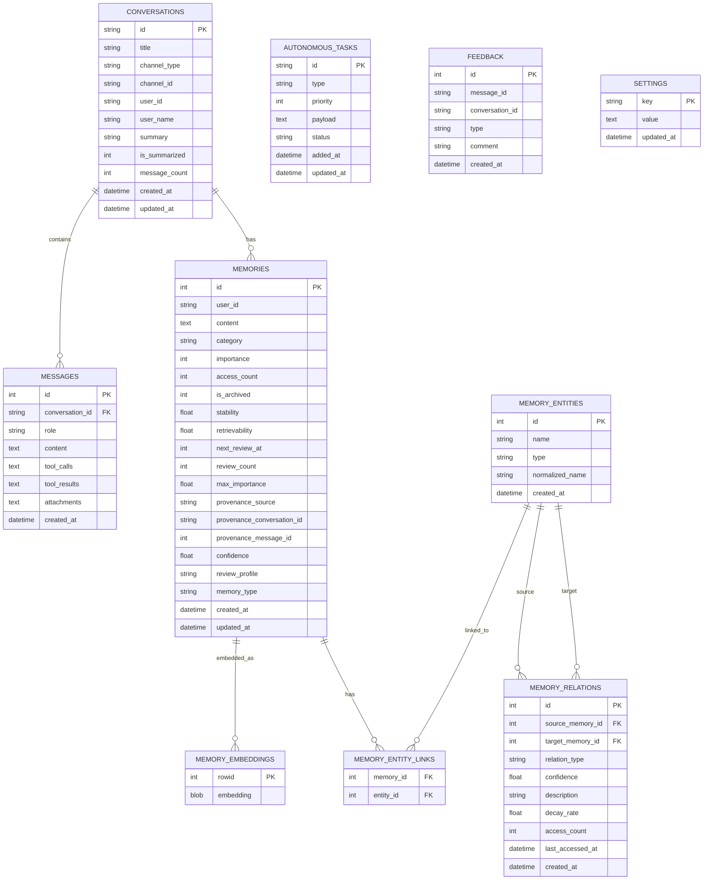
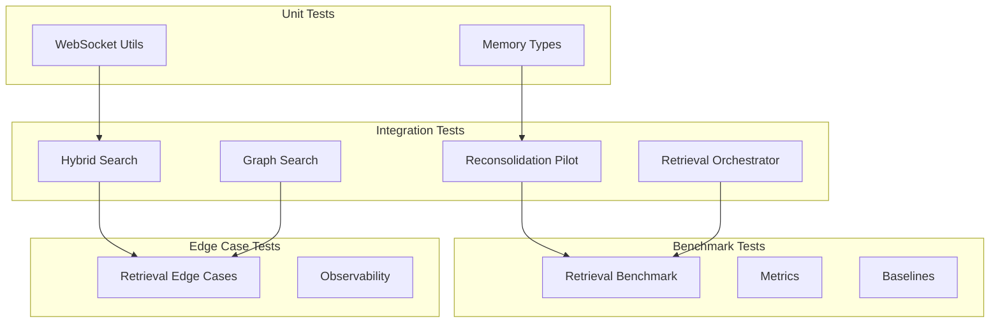

# PenceAI Proje Haritası

> **Son Güncelleme:** 31 Mart 2026
> **Versiyon:** 1.1.0
> **Lisans:** MIT

---

## 📋 İçindekiler

1. [Proje Özeti](#proje-özeti)
2. [Mimari Genel Bakış](#mimari-genel-bakış)
3. [Modül Yapısı](#modül-yapısı)
4. [Veritabanı Şeması](#veritabanı-şeması)
5. [Teknoloji Yığını](#teknoloji-yığını)
6. [API Endpoints](#api-endpoints)
7. [WebSocket Protokolü](#websocket-protokolü)
8. [Güvenlik](#güvenlik)
9. [Test Yapısı](#test-yapısı)
10. [Geliştirici Notları](#geliştirici-notları)

---

## Proje Özeti

**PenceAI**, self-hosted ve local-first bir AI agent platformudur. End-to-end TypeScript mimarisi ile çoklu LLM provider desteği, bilişsel bellek katmanı ve otonom düşünme mekanizması sunar.

### Temel Özellikler

- 🧠 **Bilişsel Bellek Sistemi**: Ebbinghaus unutma eğrisi tabanlı uzun vadeli bellek yönetimi
- 🔄 **ReAct Döngüsü**: Reason → Act → Observe paradigması ile otonom ajan davranışı
- 🔗 **Çoklu LLM Desteği**: OpenAI, Anthropic, Ollama, Groq, Mistral, NVIDIA NIM, MiniMax, GitHub Models
- 💾 **Local-First**: Tüm veriler yerel SQLite veritabanında saklanır
- 🎯 **Semantik Router**: Intent eşleştirme için ONNX tabanlı embedding modeli
- 🤖 **Otonom Düşünme**: Inner Monologue ve Merak motoru ile bağımsız düşünme
- 🧩 **Reconsolidation Pilot**: Bellek birleştirme ve güncelleme güvenlik mekanizması
- 📊 **Retrieval Orchestration**: Dual-process (System1/System2) bellek getirme mimarisi

---

## Mimari Genel Bakış



### Veri Akışı



---

## Modül Yapısı

### 1. Agent Modülü (`src/agent/`)

Ana ajan mantığını ve LLM etkileşimini yöneten modül.

| Dosya | Açıklama |
|-------|----------|
| [`prompt.ts`](src/agent/prompt.ts) | Sistem prompt'ları ve LLM araç tanımları |
| [`runtime.ts`](src/agent/runtime.ts) | ReAct döngüsünü uygulayan ana runtime sınıfı |
| [`runtimeContext.ts`](src/agent/runtimeContext.ts) | Konuşma geçmişi budama ve bağlam formatlama |
| [`tools.ts`](src/agent/tools.ts) | Yerleşik araç implementasyonları ve güvenlik kontrolleri |

#### `prompt.ts` - Prompt Yönetimi

```typescript
// Ana fonksiyonlar
buildSystemPrompt()           // Kullanıcı bilgileri, bellekler ve bağlam ile sistem prompt'u oluşturur
getBuiltinToolDefinitions()   // Yerleşik araç tanımlarını döndürür

// Prompt şablonları
buildLightExtractionPrompt()   // Hafif bilgi çıkarımı
buildDeepExtractionPrompt()    // Derin bilgi çıkarımı
buildSummarizationPrompt()     // Özetleme
buildEntityExtractionPrompt()  // Entity çıkarımı
```

#### `runtime.ts` - Agent Runtime

```typescript
class AgentRuntime {
  // Ana metotlar
  processMessage()           // Kullanıcı mesajını işler
  runReActLoop()            // Reason-Act-Observe döngüsü
  
  // Bellek çıkarımı
  extractMemoriesLight()     // Hafif bellek çıkarımı (throttle: her 3 mesajda bir)
  extractMemoriesDeep()      // Derin bellek çıkarımı (konuşma sonunda)
  summarizeConversation()    // Konuşma özetleme
  processRawTextForMemories() // Düz metinden bellek çıkarımı
  
  // Graph işleme
  processMemoryGraphWithLLM() // Entity extraction ve graph güncelleme
  
  // Optimizasyonlar
  slidingWindowPrune()       // 128K token limit için context budama
  parallelFetch()            // Paralel bellek ve bağlam çekme
  joinUIContent()            // Markdown yapılarını koruyan içerik birleştirme
}
```

#### `tools.ts` - Yerleşik Araçlar

| Araç | Açıklama | Güvenlik |
|------|----------|----------|
| `readFile` | Dosya okuma | Path validation + Zod schema |
| `writeFile` | Dosya yazma | Path validation + confirm |
| `listDirectory` | Dizin listeleme | Path validation |
| `searchMemory` | Bellek arama | Read-only, graph-aware |
| `deleteMemory` | Bellek silme | Confirm required |
| `saveMemory` | Bellek kaydetme | Validation + mergeFn |
| `searchConversation` | Konuşma arama | Read-only, hybrid search |
| `webTool` | Web isteği | URL validation, quick/deep mode |
| `executeShell` | Komut çalıştırma | Blocked commands + path extraction |
| `webSearch` | Web arama | Brave Search API, rate limited |

#### `runtimeContext.ts` - Context Yönetimi

```typescript
// Ana fonksiyonlar
pruneConversationHistory()     // Sliding window context budama (atomik çift-korumalı)
formatRecentContextMessages()  // Son mesajları prompt formatına dönüştürme

// Tipler
interface HistoryPruneResult {
  history: ConversationMessage[];
  prunedChunkCount: number;
  repairedAssistantCount: number;
  skippedToolCount: number;
}
```

---

### 2. LLM Modülü (`src/llm/`)

Çoklu LLM sağlayıcı desteği için soyutlama katmanı.

| Dosya | Açıklama |
|-------|----------|
| [`provider.ts`](src/llm/provider.ts) | Soyut temel sınıf ve fabrika pattern'i |
| [`index.ts`](src/llm/index.ts) | Tüm provider'ları dışa aktarır |
| [`openai.ts`](src/llm/openai.ts) | OpenAI provider |
| [`anthropic.ts`](src/llm/anthropic.ts) | Anthropic provider |
| [`ollama.ts`](src/llm/ollama.ts) | Ollama yerel provider |
| [`minimax.ts`](src/llm/minimax.ts) | MiniMax provider |
| [`github.ts`](src/llm/github.ts) | GitHub Models provider |
| [`groq.ts`](src/llm/groq.ts) | Groq provider |
| [`mistral.ts`](src/llm/mistral.ts) | Mistral AI provider |
| [`nvidia.ts`](src/llm/nvidia.ts) | NVIDIA NIM provider |

#### Provider Mimarisi

```typescript
abstract class LLMProvider {
  abstract readonly name: string;
  abstract readonly supportedModels: string[];
  
  // Ana metotlar
  abstract chat(messages, options): Promise<LLMResponse>;
  chatStream?(messages, options, onToken): Promise<LLMResponse>;
  abstract healthCheck(): Promise<boolean>;
  
  // Yardımcı metotlar
  protected resolveModel(requestedModel?): string;
}

class LLMProviderFactory {
  static register(name, factory): void;
  static async create(name): Promise<LLMProvider>;
  static getAvailable(): string[];
}
```

#### Desteklenen Modeller

| Provider | Modeller |
|----------|----------|
| **OpenAI** | gpt-4o, gpt-4o-mini, gpt-4-turbo, gpt-4, gpt-3.5-turbo, o1, o1-mini |
| **Anthropic** | claude-sonnet-4-20250514, claude-3-5-haiku-20241022, claude-3-opus-20240229 |
| **Ollama** | llama3.3, llama3.1, mistral, codellama, deepseek-r1, qwen2.5 |
| **MiniMax** | MiniMax-M2.5, MiniMax-M2.5-highspeed, MiniMax-M2.1, MiniMax-M2 |
| **GitHub** | gpt-4o, gpt-4.1, o1, o3, llama-3.x, phi-4, deepseek-r1, mistral-large |
| **Groq** | llama-3.3-70b-versatile, groq/compound, llama-4-scout, qwen3-32b |
| **Mistral** | mistral-large-latest, codestral-latest, devstral-latest, magistral-medium |
| **NVIDIA** | llama-4-maverick, deepseek-v3.2, qwen3.5-397b, gemma-3-27b, phi-4-multimodal |

---

### 3. Memory Modülü (`src/memory/`)

Bilişsel bellek sistemi ve bilgi yönetimi.

| Dosya | Açıklama |
|-------|----------|
| [`database.ts`](src/memory/database.ts) | SQLite veritabanı bağlantısı ve şema |
| [`graph.ts`](src/memory/graph.ts) | Bellek grafi yönetimi |
| [`ebbinghaus.ts`](src/memory/ebbinghaus.ts) | Ebbinghaus unutma eğrisi |
| [`embeddings.ts`](src/memory/embeddings.ts) | Embedding provider'ları |
| [`contextUtils.ts`](src/memory/contextUtils.ts) | Bağlam hesaplama yardımcıları |
| [`retrievalOrchestrator.ts`](src/memory/retrievalOrchestrator.ts) | Bellek getirme stratejileri |
| [`shortTermPhase.ts`](src/memory/shortTermPhase.ts) | Kısa vadeli bellek fazı |
| [`types.ts`](src/memory/types.ts) | Tip tanımları |

#### Manager Alt Modülü (`src/memory/manager/`)

| Dosya | Açıklama |
|-------|----------|
| [`index.ts`](src/memory/manager/index.ts) | MemoryManager ana giriş noktası (Facade Pattern) |
| [`ConversationManager.ts`](src/memory/manager/ConversationManager.ts) | Konuşma yönetimi |
| [`MemoryStore.ts`](src/memory/manager/MemoryStore.ts) | Bellek depolama işlemleri |
| [`RetrievalService.ts`](src/memory/manager/RetrievalService.ts) | Bellek getirme servisi |
| [`types.ts`](src/memory/manager/types.ts) | Manager tip tanımları |

#### Extraction Pipeline (`src/memory/extraction/`)

| Dosya | Açıklama |
|-------|----------|
| [`pipeline.ts`](src/memory/extraction/pipeline.ts) | Ana pipeline orchestrator |
| [`types.ts`](src/memory/extraction/types.ts) | Extraction tip tanımları |
| [`steps/datetime.ts`](src/memory/extraction/steps/datetime.ts) | Tarih/saat çıkarımı (chrono-node) |
| [`steps/knownEntities.ts`](src/memory/extraction/steps/knownEntities.ts) | Bilinen entity eşleştirme |
| [`steps/network.ts`](src/memory/extraction/steps/network.ts) | Ağ analizi (URL, email, IP) |
| [`steps/llmFallback.ts`](src/memory/extraction/steps/llmFallback.ts) | LLM tabanlı çıkarım |

#### Bellek Katmanları



#### `manager/index.ts` - MemoryManager (Facade)

```typescript
class MemoryManager {
  // Konuşma yönetimi
  getOrCreateConversation()
  beginConversationTurn()
  addMessage()
  getConversationHistory()
  updateConversationSummary()
  
  // Bellek CRUD
  addMemory()              // Semantik dedup + reconsolidation pilot
  deleteMemory()
  editMemory()
  
  // Arama
  searchMemories()         // FTS tam metin arama
  semanticSearch()         // Embedding benzerlik arama
  hybridSearch()           // FTS + Semantik + RRF fusion
  graphAwareSearch()       // Graph-aware hibrit arama
  hybridSearchMessages()   // Mesajlarda hibrit arama
  
  // Prompt context
  getPromptContextBundle() // Çok aşamalı bellek getirme
  
  // Graph yönetimi
  processMemoryGraph()
  getMemoryGraph()
  decayRelationships()
  
  // Ebbinghaus
  decayMemories()
  executeEbbinghausUpdates()
  getMemoriesDueForReview()
  
  // Feedback
  saveFeedback()
  getFeedbacks()
}
```

#### `ebbinghaus.ts` - Unutma Eğrisi

```typescript
// Ebbinghaus matematik fonksiyonları
computeRetention(stability, daysSince)         // Hatırlama olasılığı: R(t) = e^(-t/S)
computeNextReview(stability)                   // Sonraki gözden geçirme tarihi
computeNewStability(currentStability, R)       // Yeni stabilite: S_new = S * (1 + 0.9 * R)
daysSinceAccess(lastAccessedStr)               // Son erişimden bu yana geçen gün

// Review politikaları
const REVIEW_POLICIES = {
  strict:   { initialStabilityMultiplier: 0.9, retentionFloor: 0.8 },
  standard: { initialStabilityMultiplier: 1.0, retentionFloor: 0.7 },
  volatile: { initialStabilityMultiplier: 0.7, retentionFloor: 0.62 },
  durable:  { initialStabilityMultiplier: 1.2, retentionFloor: 0.6 },
};
```

#### `retrievalOrchestrator.ts` - Getirme Stratejileri

```typescript
class MemoryRetrievalOrchestrator {
  // Dual-process mimarisi
  async getPromptContextBundle(request): Promise<PromptContextBundle> {
    // 1. Intent sinyalleri tespiti
    // 2. Recipe seçimi (preference_recall, conversation_followup, exploratory, default)
    // 3. Bilişsel yük değerlendirmesi
    // 4. Retrieval priming (entity hints, topic hints)
    // 5. Graph-aware search
    // 6. Spreading activation (graph propagation)
    // 7. Deterministic second pass (coverage gap filling)
    // 8. Behavior discovery shadow comparison
    // 9. Memory explanation generation
  }
}
```

#### `shortTermPhase.ts` - Reconsolidation Pilot

```typescript
// Bellek birleştirme kararları
function decideMemoryMerge(input): MemoryMergeDecision
function decideReconsolidationPilot(input): ReconsolidationDecision

// Reconsolidation aksiyonları
type ReconsolidationProposalMode = 'skip' | 'proposal_append' | 'commit_update';

// Guardrail'ler
interface ReconsolidationGuardrailSnapshot {
  confidenceFloor: number;           // 0.78
  strictContainmentFloor: number;    // 0.92
  structuredVarianceSimilarityFloor: number; // 0.95
  highSimilaritySemanticFloor: number;       // 0.93
  appendSemanticFloor: number;               // 0.86
}
```

---

### 4. Router Modülü (`src/router/`)

Mesaj yönlendirme ve semantik intent eşleştirme.

| Dosya | Açıklama |
|-------|----------|
| [`index.ts`](src/router/index.ts) | Mesaj yönlendirme ve kanal yönetimi |
| [`types.ts`](src/router/types.ts) | Router ve LLM tip tanımları |
| [`semantic.ts`](src/router/semantic.ts) | Semantik intent eşleştirme |
| [`embedding-worker.ts`](src/router/embedding-worker.ts) | Worker thread embedding |

#### Semantic Router

```typescript
class SemanticRouter {
  // Intent eşleştirme
  async route(message, context): Promise<{ handled: boolean, response: string | null }> {
    // 1. Input embedding (worker thread)
    // 2. Cosine similarity with cached intent examples
    // 3. Threshold filtering (0.82)
    // 4. Return matched intent action result
  }
  
  registerIntent(intent: SemanticIntent): void;
  
  // Worker thread: Xenova/all-MiniLM-L6-v2 (INT8 quantized)
}
```

---

### 5. Gateway Modülü (`src/gateway/`)

HTTP/WebSocket sunucusu ve uygulama başlatma.

| Dosya | Açıklama |
|-------|----------|
| [`index.ts`](src/gateway/index.ts) | Ana giriş noktası |
| [`routes.ts`](src/gateway/routes.ts) | REST API route tanımları |
| [`websocket.ts`](src/gateway/websocket.ts) | WebSocket bağlantı yönetimi |
| [`config.ts`](src/gateway/config.ts) | Uygulama konfigürasyonu |
| [`bootstrap.ts`](src/gateway/bootstrap.ts) | Başlatma yardımcıları |
| [`envUtils.ts`](src/gateway/envUtils.ts) | .env dosyası işlemleri |
| [`userName.ts`](src/gateway/userName.ts) | Kullanıcı adı çözümleme |

#### Konfigürasyon (`config.ts`)

```typescript
interface AppConfig {
  port: number;                    // Sunucu portu (default: 3000)
  host: string;                    // Host adresi
  dbPath: string;                  // Veritabanı yolu
  projectRoot: string;
  defaultUserName: string;
  
  // LLM
  defaultLLMProvider: 'openai' | 'anthropic' | 'ollama' | 'minimax' | 'github' | 'groq' | 'mistral' | 'nvidia';
  defaultLLMModel: string;
  openaiApiKey?: string;
  anthropicApiKey?: string;
  minimaxApiKey?: string;
  githubToken?: string;
  groqApiKey?: string;
  mistralApiKey?: string;
  nvidiaApiKey?: string;
  ollamaBaseUrl: string;
  enableOllamaTools: boolean;
  enableNvidiaTools: boolean;
  
  // Embedding
  embeddingProvider: 'minimax' | 'openai' | 'none';
  embeddingModel: string;
  
  // Security
  allowShellExecution: boolean;
  fsRootDir?: string;
  dashboardPassword?: string;
  braveSearchApiKey?: string;
  jinaReaderApiKey?: string;
  sensitivePaths: string[];
  
  // Advanced
  systemPrompt?: string;
  autonomousStepLimit: number;
  memoryDecayThreshold: number;
  semanticSearchThreshold: number;
  logLevel: 'debug' | 'info' | 'error';
  temperature: number;
  maxTokens: number;
}
```

---

### 6. Autonomous Modülü (`src/autonomous/`)

Otonom düşünme ve görev yönetimi.

| Dosya | Açıklama |
|-------|----------|
| [`thinkEngine.ts`](src/autonomous/thinkEngine.ts) | İç Ses Motoru (Inner Monologue) |
| [`curiosityEngine.ts`](src/autonomous/curiosityEngine.ts) | Merak motoru (Sub-Agent) |
| [`urgeFilter.ts`](src/autonomous/urgeFilter.ts) | Dürtü Eşiği ve Aksiyon Filtresi |
| [`queue.ts`](src/autonomous/queue.ts) | Öncelik tabanlı görev kuyruğu |
| [`worker.ts`](src/autonomous/worker.ts) | Arka plan görev çalıştırıcısı |
| [`index.ts`](src/autonomous/index.ts) | Modül giriş noktası |

#### Otonom Düşünme Akışı



#### `thinkEngine.ts` - İç Ses Motoru

```typescript
// Ana fonksiyonlar
selectSeed(db): ThoughtSeed | null           // Tohum seçimi (3 strateji)
graphWalk(db, seedId, maxDepth): Association[]  // BFS çağrışım gezintisi
buildThoughtChain(seed, associations, emotion): ThoughtChain
synthesizeThoughtPrompt(chain): string       // LLM prompt sentezi
think(db, emotion): ThoughtLogEntry | null   // Ana düşünme fonksiyonu

// Sabitler
const FRESHNESS_THRESHOLD = 0.3;             // Ebbinghaus tazelik eşiği
const MAX_HOP_DEPTH = 2;                     // Maksimum graph derinliği
const MAX_ASSOCIATIONS = 8;                  // Maksimum çağrışım sayısı
```

#### `queue.ts` - Görev Kuyruğu

```typescript
enum TaskPriority {
  P1_CRITICAL = 1,  // Conflict resolution, user direct requests
  P2_HIGH = 2,      // Semantic routing fallback, initial graph extraction
  P3_NORMAL = 3,    // Routine memory consolidation, decay processing
  P4_LOW = 4        // Deep philosophical analysis, slow background tasks
}

class TaskQueue {
  enqueue(task): void;
  dequeue(): AutonomousTask | undefined;
  registerHandler(type, handler): void;
  markCompleted(taskId): void;
  markFailed(taskId): void;
  clear(): void;
  
  // SQLite checkpointing
  private syncToDb(task, status, payloadStr?): void;
  loadPendingTasks(): void;
}
```

#### `worker.ts` - Arka Plan Çalıştırıcısı

```typescript
class BackgroundWorker {
  start(): void;
  stop(): void;
  registerUserActivity(): void;  // Kullanıcı aktivitesi → graceful interrupt
  
  // Hardware monitoring
  private isHardwareOverloaded(): boolean;  // CPU load + memory check
  
  // Run loop
  private async runLoop(): Promise<void>;
  private interrupt(reason: string): void;
}
```

#### `urgeFilter.ts` - Dürtü Filtresi

```typescript
// 3 Katmanlı Filtre:
// 1. Mutlak Kurallar (Hard Logic) — Sessiz saat, arousal taban
// 2. Deterministik Skorlama — Confirmation bias önlemi
// 3. Geri Bildirim Döngüsü — Kullanıcı davranışına göre uyarlanır

// Formül: Skor = (İlgi × 0.6) + (Zaman Hassasiyeti × 0.4) - (İsteksizlik Cezası)
function computeUrgeScore(evaluation, reluctancePenalty): number;
function computeEffectiveThreshold(feedbackAdjustment): number;
function decideAction(score, threshold): ActionDecision;
function filterThought(evaluation, feedbackState, currentHour): FilterResult;

// Feedback loop
class FeedbackManager {
  applySignal(signal: UserBehaviorSignal): FeedbackState;
  applyDecay(): void;
  reset(): void;
}
```

---

### 7. Web Arayüzü (`src/web/`)

#### React Uygulaması (`src/web/react-app/`)

| Dosya | Açıklama |
|-------|----------|
| [`src/App.tsx`](src/web/react-app/src/App.tsx) | Ana giriş noktası |
| [`src/main.tsx`](src/web/react-app/src/main.tsx) | React bootstrap |
| [`src/hooks/useAgentSocket.ts`](src/web/react-app/src/hooks/useAgentSocket.ts) | WebSocket hook |
| [`src/hooks/useConversationFilters.ts`](src/web/react-app/src/hooks/useConversationFilters.ts) | Konuşma filtreleme hook'u |
| [`src/hooks/useConversations.ts`](src/web/react-app/src/hooks/useConversations.ts) | Konuşma yönetimi hook'u |
| [`src/hooks/useFileUpload.ts`](src/web/react-app/src/hooks/useFileUpload.ts) | Dosya yükleme hook'u |
| [`src/hooks/useMemoryGraph.ts`](src/web/react-app/src/hooks/useMemoryGraph.ts) | Bellek grafiği hook'u |
| [`src/hooks/useMessageBuilder.ts`](src/web/react-app/src/hooks/useMessageBuilder.ts) | Mesaj oluşturma hook'u |
| [`src/hooks/useSettingsForm.ts`](src/web/react-app/src/hooks/useSettingsForm.ts) | Ayarlar form hook'u |
| [`src/store/agentStore.ts`](src/web/react-app/src/store/agentStore.ts) | Zustand state |
| [`src/lib/api-client.ts`](src/web/react-app/src/lib/api-client.ts) | API istemcisi |
| [`src/lib/utils.ts`](src/web/react-app/src/lib/utils.ts) | Yardımcı fonksiyonlar |

##### Bileşenler (`src/components/chat/`)

| Bileşen | Açıklama |
|---------|----------|
| [`ChatWindow.tsx`](src/web/react-app/src/components/chat/ChatWindow.tsx) | Ana sohbet arayüzü |
| [`MessageStream.tsx`](src/web/react-app/src/components/chat/MessageStream.tsx) | Mesaj akışı |
| [`MessageArea.tsx`](src/web/react-app/src/components/chat/MessageArea.tsx) | Mesaj alanı bileşeni |
| [`MessagePanel.tsx`](src/web/react-app/src/components/chat/MessagePanel.tsx) | Mesaj paneli |
| [`ConversationSidebar.tsx`](src/web/react-app/src/components/chat/ConversationSidebar.tsx) | Konuşma kenar çubuğu |
| [`ConversationListItem.tsx`](src/web/react-app/src/components/chat/ConversationListItem.tsx) | Konuşma listesi öğesi |
| [`ConversationPanel.tsx`](src/web/react-app/src/components/chat/ConversationPanel.tsx) | Konuşma paneli |
| [`ChatInput.tsx`](src/web/react-app/src/components/chat/ChatInput.tsx) | Mesaj giriş alanı |
| [`InputPanel.tsx`](src/web/react-app/src/components/chat/InputPanel.tsx) | Giriş paneli |
| [`ChannelsView.tsx`](src/web/react-app/src/components/chat/ChannelsView.tsx) | Kanal görünümü |
| [`MemoryDialog.tsx`](src/web/react-app/src/components/chat/MemoryDialog.tsx) | Bellek yönetimi |
| [`MemoryGraphView.tsx`](src/web/react-app/src/components/chat/MemoryGraphView.tsx) | Bellek grafiği görünümü |
| [`MemoryGraphControls.tsx`](src/web/react-app/src/components/chat/MemoryGraphControls.tsx) | Bellek grafiği kontrolleri |
| [`MemoryGraphLegend.tsx`](src/web/react-app/src/components/chat/MemoryGraphLegend.tsx) | Bellek grafiği lejantı |
| [`MemoryNodeDetails.tsx`](src/web/react-app/src/components/chat/MemoryNodeDetails.tsx) | Bellek düğüm detayları |
| [`MemorySettings.tsx`](src/web/react-app/src/components/chat/MemorySettings.tsx) | Bellek ayarları |
| [`SettingsDialog.tsx`](src/web/react-app/src/components/chat/SettingsDialog.tsx) | Ayarlar |
| [`LLMSettings.tsx`](src/web/react-app/src/components/chat/LLMSettings.tsx) | LLM ayarları |
| [`SecuritySettings.tsx`](src/web/react-app/src/components/chat/SecuritySettings.tsx) | Güvenlik ayarları |
| [`ConfirmDialog.tsx`](src/web/react-app/src/components/chat/ConfirmDialog.tsx) | Onay dialogu |
| [`ExportDialog.tsx`](src/web/react-app/src/components/chat/ExportDialog.tsx) | Dışa aktarma dialogu |
| [`ImageLightbox.tsx`](src/web/react-app/src/components/chat/ImageLightbox.tsx) | Resim görüntüleyici |
| [`OnboardingDialog.tsx`](src/web/react-app/src/components/chat/OnboardingDialog.tsx) | İlk kurulum |

##### UI Bileşenleri (`src/components/ui/`)

| Bileşen | Kaynak |
|---------|--------|
| `button.tsx` | Radix UI |
| `dialog.tsx` | Radix UI |
| `input.tsx` | Radix UI |
| `textarea.tsx` | Radix UI |
| `scroll-area.tsx` | Radix UI |
| [`Toast.tsx`](src/web/react-app/src/components/ui/Toast.tsx) | Bildirim bileşeni |
| [`ErrorBoundary.tsx`](src/web/react-app/src/components/ui/ErrorBoundary.tsx) | Hata sınırı bileşeni |
| [`skeleton.tsx`](src/web/react-app/src/components/ui/skeleton.tsx) | Yükleme iskeleti |

##### Store Slices (`src/store/slices/`)

| Dosya | Açıklama |
|-------|----------|
| [`chatSlice.ts`](src/web/react-app/src/store/slices/chatSlice.ts) | Sohbet state slice |
| [`settingsSlice.ts`](src/web/react-app/src/store/slices/settingsSlice.ts) | Ayarlar state slice |
| [`uiSlice.ts`](src/web/react-app/src/store/slices/uiSlice.ts) | UI state slice |

##### Styles Klasörü (`src/web/react-app/src/styles/`)

| Dosya | Açıklama |
|-------|----------|
| [`dialog.ts`](src/web/react-app/src/styles/dialog.ts) | Dialog stilleri |

#### Eski Arayüz (`src/web/public_old/`)

| Dosya | Açıklama |
|-------|----------|
| [`app.js`](src/web/public_old/app.js) | Eski vanilla JS |
| [`index.html`](src/web/public_old/index.html) | Eski HTML |
| [`style.css`](src/web/public_old/style.css) | Eski stiller |
| [`app/core.js`](src/web/public_old/app/core.js) | Eski çekirdek |
| [`app/dashboard.js`](src/web/public_old/app/dashboard.js) | Eski dashboard |
| [`app/constants.js`](src/web/public_old/app/constants.js) | Uygulama sabitleri |
| [`lib/d3.v7.min.js`](src/web/public_old/lib/d3.v7.min.js) | D3.js kütüphanesi |
| [`lib/highlight.min.js`](src/web/public_old/lib/highlight.min.js) | Kod vurgulama |
| [`lib/katex.min.js`](src/web/public_old/lib/katex.min.js) | Matematik render |
| [`lib/marked.min.js`](src/web/public_old/lib/marked.min.js) | Markdown parser |

---

### 8. Utils Modülü (`src/utils/`)

| Dosya | Açıklama |
|-------|----------|
| [`datetime.ts`](src/utils/datetime.ts) | Tarih/saat yardımcıları |
| [`logger.ts`](src/utils/logger.ts) | Yapılandırılmış loglama |

#### `logger.ts` - Loglama Sistemi

```typescript
// Pino tabanlı yapılandırılmış loglama
// Transport: pino-pretty (dev) + pino-roll (prod)
// AsyncLocalStorage ile trace ID desteği

const logger = pino({
  level: process.env.LOG_LEVEL || 'info',
  mixin() {
    const context = asyncLocalStorage.getStore();
    return context ? { traceId: context.traceId } : {};
  },
}, transport);

// Trace ID ile çalıştırma
runWithTraceId(traceId, () => {
  logger.info({ msg: 'Operation completed' });
});
```

---

### 9. CLI Modülü (`src/cli/`)

| Dosya | Açıklama |
|-------|----------|
| [`maintenance.ts`](src/cli/maintenance.ts) | Bellek grafiği bakım aracı |

```bash
# Kullanım
npx tsx src/cli/maintenance.ts

# İşlevler
# 1. Missing graph relations backfill
# 2. Relationship decay (Ebbinghaus)
```

---

### 10. Tests (`tests/`)

| Dosya | Açıklama |
|-------|----------|
| [`gateway/websocket.test.ts`](tests/gateway/websocket.test.ts) | WebSocket testleri |
| [`memory/memoryType.test.ts`](tests/memory/memoryType.test.ts) | Bellek türü testleri |
| [`memory/hybridSearch.test.ts`](tests/memory/hybridSearch.test.ts) | Hibrit arama testleri |
| [`memory/graphSearch.test.ts`](tests/memory/graphSearch.test.ts) | Graph arama testleri |
| [`memory/retrievalEdgeCases.test.ts`](tests/memory/retrievalEdgeCases.test.ts) | Retrieval edge case testleri |
| [`memory/retrievalIntegration.test.ts`](tests/memory/retrievalIntegration.test.ts) | Retrieval entegrasyon testleri |
| [`memory/reconsolidationPilot.test.ts`](tests/memory/reconsolidationPilot.test.ts) | Reconsolidation pilot testleri |
| [`memory/retrievalOrchestrator.observability.test.ts`](tests/memory/retrievalOrchestrator.observability.test.ts) | Gözlemlenebilirlik testleri |
| [`benchmark/retrievalBenchmark.test.ts`](tests/benchmark/retrievalBenchmark.test.ts) | Retrieval benchmark testleri |
| [`benchmark/fixtures/benchmarkDataset.ts`](tests/benchmark/fixtures/benchmarkDataset.ts) | Benchmark veri seti |
| [`benchmark/utils/metrics.ts`](tests/benchmark/utils/metrics.ts) | Metrik hesaplama |
| [`benchmark/utils/baselines.ts`](tests/benchmark/utils/baselines.ts) | Baseline karşılaştırmaları |

---

## Veritabanı Şeması

### Entity-Relationship Diyagramı



### Tablo Detayları

| Tablo | Amaç | İndeksler |
|-------|------|-----------|
| `conversations` | Konuşma metadata | id, channel_type+channel_id, updated_at |
| `messages` | Mesaj geçmişi | id, conversation_id, created_at, conv+role+created_at |
| `memories` | Uzun vadeli bellekler | id, user_id, is_archived |
| `memory_entities` | Entity (kişi, teknoloji, proje) | id, normalized_name, normalized_name+type |
| `memory_relations` | Bellek ilişkileri (graph edges) | id, source_id, target_id, last_accessed_at |
| `memory_entity_links` | Memory-entity bağlantıları | memory_id+entity_id, entity_id |
| `memory_embeddings` | Semantik arama vektörleri (sqlite-vec) | rowid |
| `message_embeddings` | Mesaj semantik arama vektörleri | rowid |
| `memories_fts` | FTS5 tam metin arama (memories) | content |
| `messages_fts` | FTS5 tam metin arama (messages) | content |
| `autonomous_tasks` | Görev kuyruğu kalıcılığı | id, status, added_at |
| `feedback` | Kullanıcı geri bildirimleri | id, conversation_id, message_id |
| `settings` | Anahtar-değer ayarlar | key |

---

## Teknoloji Yığını

### Backend

| Kategori | Teknoloji | Versiyon | Amaç |
|----------|-----------|----------|------|
| Runtime | Node.js | 22+ | JavaScript runtime |
| Language | TypeScript | 5.7+ | Tip güvenli geliştirme |
| Framework | Express | 4.21+ | HTTP sunucusu |
| WebSocket | ws | 8.18+ | Gerçek zamanlı iletişim |
| Database | better-sqlite3 | 11.7+ | SQLite veritabanı |
| Vectors | sqlite-vec | 0.1.7+ | Vektör depolama |
| AI SDK | @anthropic-ai/sdk | 0.39+ | Anthropic API |
| AI SDK | openai | 4.77+ | OpenAI API |
| AI Inference | @azure-rest/ai-inference | 1.0+ | Azure AI Inference |
| Embedding | @xenova/transformers | 2.17+ | ONNX embedding |
| NLP | chrono-node | 2.9+ | Tarih ayrıştırma |
| Validation | zod | 3.25+ | Runtime validation |
| Web Scraping | linkedom | 0.18+ | HTML parsing |
| Web Scraping | @mozilla/readability | 0.6+ | Article extraction |
| Markdown | turndown | 7.2+ | HTML to Markdown |
| Tokenizer | gpt-tokenizer | 3.4+ | Token counting |
| Logging | pino | 10.3+ | Yapılandırılmış loglama |
| Logging | pino-roll | 4.0+ | Log rotasyonu |
| Utility | uuid | 11.1+ | UUID oluşturma |
| Utility | validator | 13.15+ | String validation |
| Config | dotenv | 16.4+ | Ortam değişkenleri |

### Frontend

| Kategori | Teknoloji | Versiyon | Amaç |
|----------|-----------|----------|------|
| Framework | React | 18.x | UI framework |
| Language | TypeScript | 5.x | Tip güvenli geliştirme |
| Build | Vite | 5.x | Build tool |
| Styling | Tailwind CSS | 3.x | Utility-first CSS |
| State | Zustand | 4.x | Global state yönetimi |
| UI | Radix UI | 1.x | Erişilebilir bileşenler |
| Icons | Lucide React | 0.x | İkon seti |

### AI/ML

| Kategori | Teknoloji | Amaç |
|----------|-----------|------|
| Embedding | Xenova/all-MiniLM-L6-v2 | Semantik benzerlik |
| Quantization | INT8 | Model boyutu optimizasyonu |
| Inference | ONNX Runtime | Worker thread'de çalıştırma |

### DevOps

| Kategori | Teknoloji | Amaç |
|----------|-----------|------|
| Testing | Jest | Birim testler |
| Linting | ESLint | Kod kalitesi |
| Type Check | TypeScript | Tip kontrolü |
| Version Control | Git | Versiyon kontrolü |

---

## API Endpoints

### REST API

| Endpoint | Method | Açıklama |
|----------|--------|----------|
| `/api/stats` | GET | Sistem istatistikleri |
| `/api/channels` | GET | Kanal durumu |
| `/api/conversations` | GET | Konuşma listesi |
| `/api/conversations` | DELETE | Toplu konuşma silme |
| `/api/conversations/:id` | GET | Konuşma detayı |
| `/api/conversations/:id` | DELETE | Konuşma silme |
| `/api/conversations/:id/messages` | GET | Mesaj geçmişi |
| `/api/memories` | GET | Bellek listesi |
| `/api/memories` | POST | Yeni bellek ekle |
| `/api/memories/search` | GET | Bellek arama |
| `/api/memories/:id` | PUT | Bellek güncelle |
| `/api/memories/:id` | DELETE | Bellek silme |
| `/api/memory-graph` | GET | Bellek grafiği verisi |
| `/api/health` | GET | Sağlık kontrolü |
| `/api/settings` | GET | Ayarları getir |
| `/api/settings` | POST | Ayarları güncelle |
| `/api/settings/sensitive-paths` | GET | Hassas dizinleri getir |
| `/api/settings/sensitive-paths` | POST | Hassas dizin ekle |
| `/api/settings/sensitive-paths` | DELETE | Hassas dizin sil |
| `/api/llm/providers` | GET | Kullanılabilir LLM provider'ları |
| `/api/feedback` | POST | Kullanıcı geri bildirimi kaydet |
| `/api/feedback/:conversationId` | GET | Konuşma geri bildirimlerini getir |
| `/api/onboarding/process` | POST | Onboarding biyografi işleme |

---

## WebSocket Protokolü

### Mesaj Tipleri

| Tip | Yön | Açıklama |
|-----|-----|----------|
| `chat` | Client → Server | Kullanıcı mesajı |
| `set_thinking` | Client → Server | Düşünme modu ayarla |
| `confirm_response` | Client → Server | Onay yanıtı |
| `token` | Server → Client | Stream token |
| `response` | Server → Client | Tam yanıt |
| `agent_event` | Server → Client | Agent olayları (thinking, tool_start, tool_end, iteration) |
| `clear_stream` | Server → Client | Stream temizleme sinyali |
| `replace_stream` | Server → Client | Stream değiştirme |
| `confirm_request` | Server → Client | Onay isteği |
| `error` | Server → Client | Hata mesajı |
| `stats` | Server → Client | Sistem istatistikleri |

### WebSocket Konfigürasyonu

```typescript
const WS_CONFIG = {
  confirmationTimeoutMs: 60000,     // 60 saniye onay zaman aşımı
  maxMessageLength: 50000,          // 50K karakter mesaj limiti
  maxAttachmentBase64Size: 10MB,    // 10MB base64 dosya boyutu limiti
  maxTextFileLength: 20000,         // 20K karakter metin dosyası kısaltma
};
```

---

## Güvenlik

### Path Validation

```typescript
// İzin verilen kök dizin (FS_ROOT_DIR)
const resolved = path.resolve(filePath);
const root = path.resolve(config.fsRootDir);
if (!resolved.startsWith(root)) {
  throw new Error(`Erişim reddedildi`);
}

// Engellenen yollar
const blockedAbsolute = [
  'C:\\Windows\\System32\\config',
  '/etc/shadow', '/etc/passwd',
];
const blockedSegments = [
  '.env', '.ssh', 'id_rsa', '.aws', '.npmrc', '.netrc', '.pgpass',
];
```

### Shell Komut Güvenliği

```typescript
// Engellenen komutlar
const BLOCKED_COMMANDS = [
  'rm -rf /', 'format ', 'del /f /s /q', 'mkfs',
  'shutdown', 'reboot', 'chmod -r 000 /',
];

// Tehlikeli pattern'ler
const dangerousPatterns = [
  /\|\s*(sh|bash|cmd|powershell)\b/i,  // pipe ile kabuk çağrısı
  /\$\(.*\)/,                           // subshell
  /;\s*(rm|del|shutdown)\b/i,          // chain ile tehlikeli komut
  /\beval\s+/i,                         // eval komutu
];
```

### Zod Runtime Validation

```typescript
// Tüm araç argümanları Zod şemaları ile doğrulanır
const ReadFileArgsSchema = z.object({
  path: z.string().min(1),
});
const WriteFileArgsSchema = z.object({
  path: z.string().min(1),
  content: z.string(),
});
// ... diğer şemalar
```

---

## Test Yapısı

### Test Kategorileri



### Test Çalıştırma

```bash
# Tüm testler
npm test

# Belirli test
npm test -- --testPathPattern=memory

# Coverage raporu
npm test -- --coverage
```

---

## Geliştirici Notları

### Proje Başlatma

```bash
# Bağımlılıkları yükle
npm install

# Geliştirme sunucusu (backend + frontend)
npm run dev

# Sadece backend
npm run dev:backend-only

# Production build
npm run build

# Test çalıştır
npm test

# CLI bakım aracı
npm run maintenance
```

### Ortam Değişkenleri

```bash
# .env.example
PORT=3000
HOST=localhost

# LLM Provider
DEFAULT_LLM_PROVIDER=openai
DEFAULT_LLM_MODEL=gpt-4o
OPENAI_API_KEY=sk-...
ANTHROPIC_API_KEY=sk-ant-...
MINIMAX_API_KEY=...
GITHUB_TOKEN=...
GROQ_API_KEY=...
MISTRAL_API_KEY=...
NVIDIA_API_KEY=...

# Ollama
OLLAMA_BASE_URL=http://localhost:11434
ENABLE_OLLAMA_TOOLS=false

# Embedding
EMBEDDING_PROVIDER=openai
EMBEDDING_MODEL=text-embedding-3-small

# Database
DB_PATH=data/penceai.db

# Security
ALLOW_SHELL_EXECUTION=false
FS_ROOT_DIR=
DASHBOARD_PASSWORD=
SENSITIVE_PATHS=C:\Windows,C:\Program Files,/etc,/usr

# Features
BRAVE_SEARCH_API_KEY=
JINA_READER_API_KEY=

# Advanced
SYSTEM_PROMPT=
AUTONOMOUS_STEP_LIMIT=5
MEMORY_DECAY_THRESHOLD=30
SEMANTIC_SEARCH_THRESHOLD=0.7
LOG_LEVEL=info
TEMPERATURE=0.7
MAX_TOKENS=4096
```

### Kod Standartları

- **TypeScript**: Strict mode aktif
- **Linting**: ESLint
- **Module System**: ES Modules (ES2022)
- **Module Resolution**: bundler

### Mimari Kararlar

1. **Facade Pattern**: MemoryManager, alt modülleri (ConversationManager, MemoryStore, RetrievalService) tek bir arayüz altında toplar
2. **Worker Thread Isolation**: Embedding işlemleri ana thread'i bloklamaz
3. **SQLite Checkpointing**: Autonomous görevler veritabanında kalıcıdır
4. **Ebbinghaus Spaced Repetition**: Bellek erişimleri arka plan worker'ında güncellenir
5. **Dual-Process Retrieval**: System1 (hızlı) ve System2 (derin) bellek getirme modları
6. **Reconsolidation Pilot**: Bellek birleştirme güvenlik mekanizması
7. **Behavior Discovery Shadow Mode**: Yeni retrieval stratejileri gölge modda test edilir

---

## Ek Kaynaklar

- [README.md](README.md) - Proje dokümantasyonu
- [LICENSE](LICENSE) - MIT Lisansı
- [package.json](package.json) - Bağımlılıklar ve scriptler
- [tsconfig.json](tsconfig.json) - TypeScript yapılandırması
- [jest.config.js](jest.config.js) - Jest yapılandırması

---

> Bu doküman PenceAI projesinin tamamını anlamak için tek bir referans noktası olarak hazırlanmıştır. Son güncelleme: Mart 2026.
