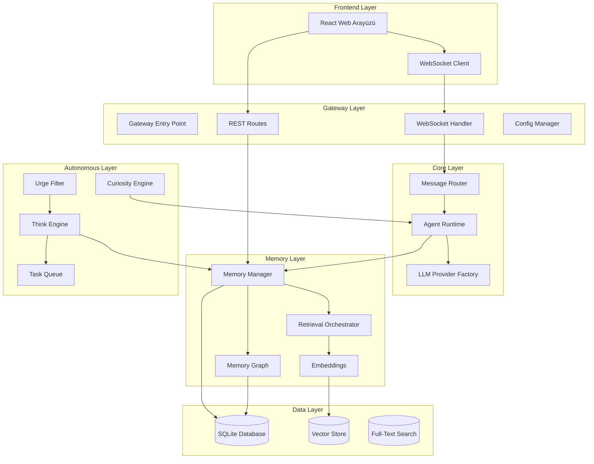
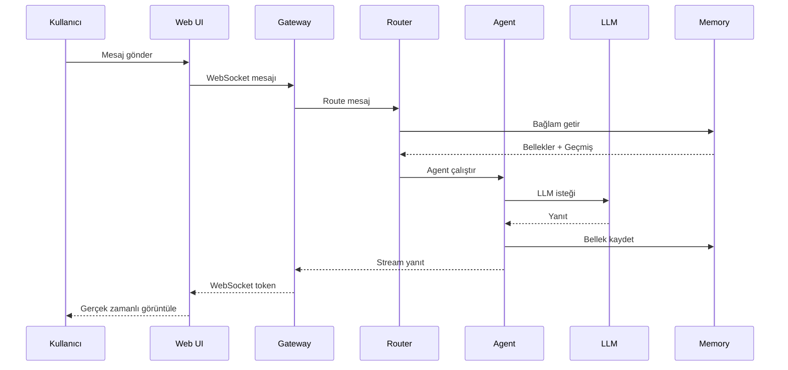
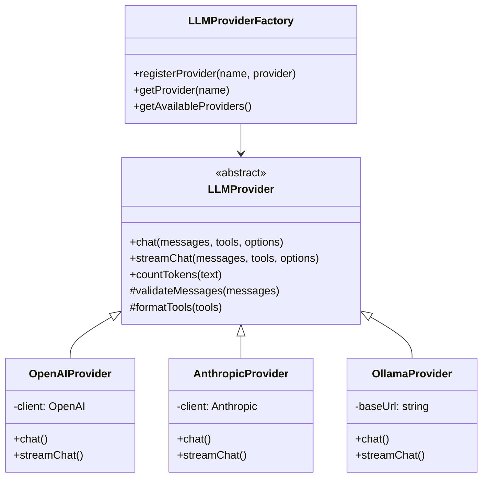
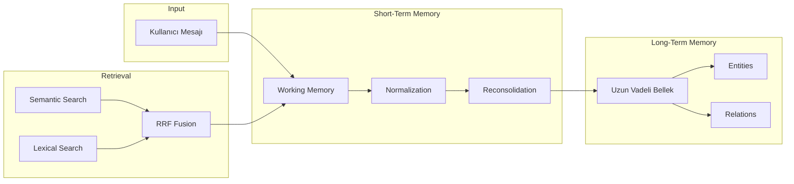
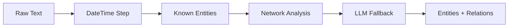
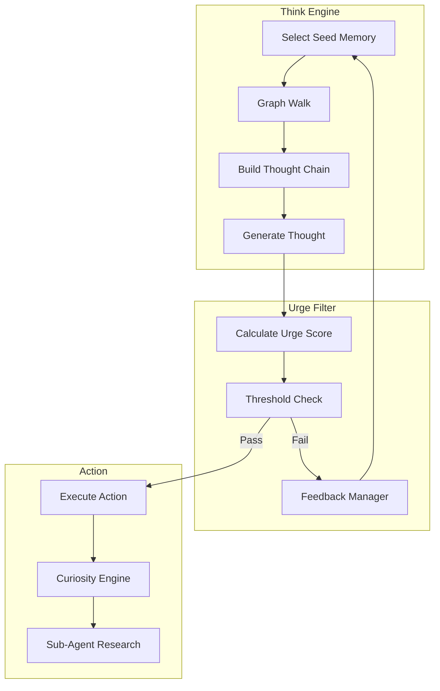
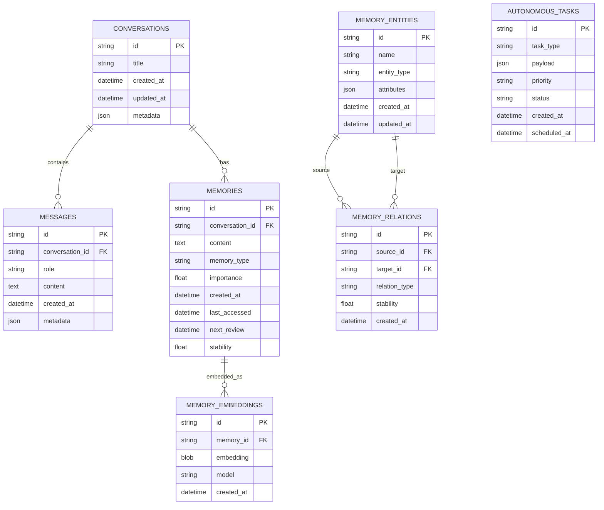
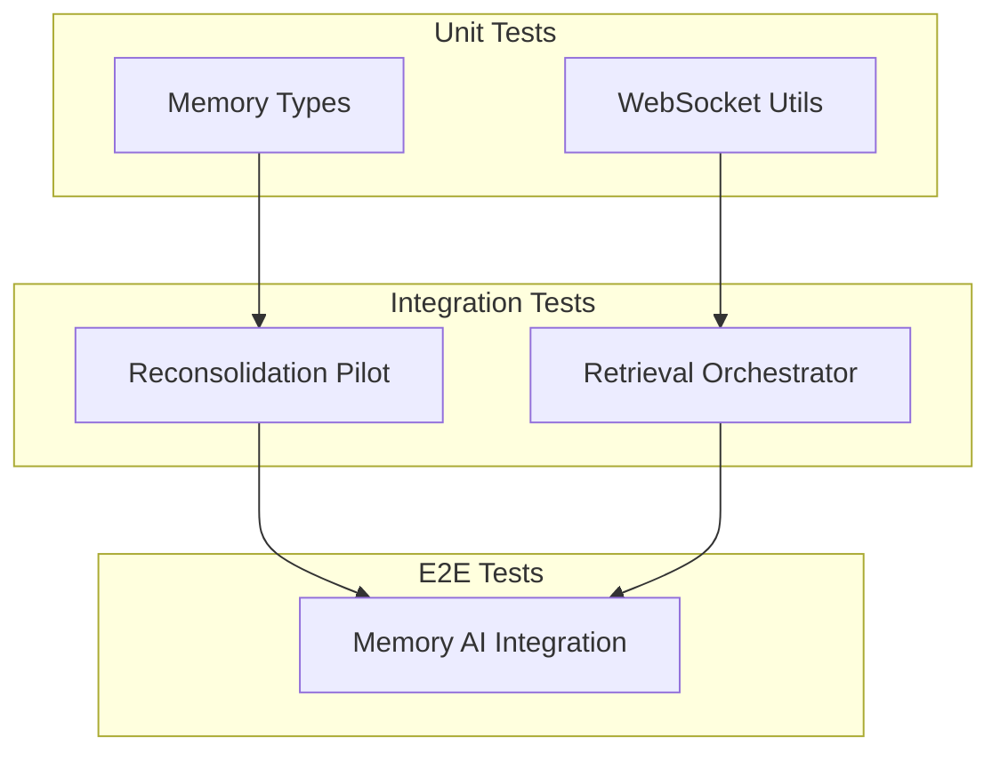

# PenceAI Proje Haritası

> **Son Güncelleme:** 24 Mart 2026
> **Versiyon:** 1.0.2
> **Lisans:** MIT

---

## 📋 İçindekiler

1. [Proje Özeti](#proje-özeti)
2. [Mimari Genel Bakış](#mimari-genel-bakış)
3. [Modül Yapısı](#modül-yapısı)
4. [Veritabanı Şeması](#veritabanı-şeması)
5. [Teknoloji Yığını](#teknoloji-yığını)
6. [API Endpoints](#api-endpoints)
7. [WebSocket Protokolü](#websocket-protokolü)
8. [Güvenlik](#güvenlik)
9. [Test Yapısı](#test-yapısı)
10. [Geliştirici Notları](#geliştirici-notları)

---

## Proje Özeti

**PenceAI**, self-hosted ve local-first bir AI agent platformudur. End-to-end TypeScript mimarisi ile çoklu LLM provider desteği, bilişsel bellek katmanı ve otonom düşünme mekanizması sunar.

### Temel Özellikler

- 🧠 **Bilişsel Bellek Sistemi**: Ebbinghaus unutma eğrisi tabanlı uzun vadeli bellek yönetimi
- 🔄 **ReAct Döngüsü**: Reason → Act → Observe paradigması ile otonom ajan davranışı
- 🔗 **Çoklu LLM Desteği**: OpenAI, Anthropic, Ollama, Groq, Mistral, NVIDIA NIM ve daha fazlası
- 💾 **Local-First**: Tüm veriler yerel SQLite veritabanında saklanır
- 🎯 **Semantik Router**: Intent eşleştirme için ONNX tabanlı embedding modeli
- 🤖 **Otonom Düşünme**: Inner Monologue ve Merak motoru ile bağımsız düşünme

---

## Mimari Genel Bakış



### Veri Akışı



---

## Modül Yapısı

### 1. Agent Modülü (`src/agent/`)

Ana ajan mantığını ve LLM etkileşimini yöneten modül.

| Dosya | Açıklama |
|-------|----------|
| [`prompt.ts`](src/agent/prompt.ts) | Sistem prompt'ları ve LLM araç tanımları |
| [`runtime.ts`](src/agent/runtime.ts) | ReAct döngüsünü uygulayan ana runtime sınıfı |
| [`runtimeContext.ts`](src/agent/runtimeContext.ts) | Konuşma geçmişi budama ve bağlam formatlama |
| [`tools.ts`](src/agent/tools.ts) | Yerleşik araç implementasyonları ve güvenlik kontrolleri |

#### `prompt.ts` - Prompt Yönetimi

```typescript
// Ana fonksiyonlar
buildSystemPrompt()      // Kullanıcı bilgileri, bellekler ve bağlam ile sistem prompt'u oluşturur
getBuiltinToolDefinitions()  // Yerleşik araç tanımlarını döndürür

// Prompt şablonları
buildLightExtractionPrompt()   // Hafif bilgi çıkarımı
buildDeepExtractionPrompt()    // Derin bilgi çıkarımı
buildSummarizationPrompt()     // Özetleme
buildEntityExtractionPrompt()  // Entity çıkarımı
```

#### `runtime.ts` - Agent Runtime

```typescript
class AgentRuntime {
  // Ana metotlar
  processMessage()      // Kullanıcı mesajını işler
  runReActLoop()       // Reason-Act-Observe döngüsü
  
  // Optimizasyonlar
  slidingWindowPrune() // 128K token limit için context budama
  parallelFetch()      // Paralel bellek ve bağlam çekme
}
```

#### `tools.ts` - Yerleşik Araçlar

| Araç | Açıklama | Güvenlik |
|------|----------|----------|
| `readFile` | Dosya okuma | Path validation |
| `writeFile` | Dosya yazma | Path validation + confirm |
| `listDirectory` | Dizin listeleme | Path validation |
| `searchMemory` | Bellek arama | Read-only |
| `deleteMemory` | Bellek silme | Confirm required |
| `saveMemory` | Bellek kaydetme | Validation |
| `searchConversation` | Konuşma arama | Read-only |
| `webTool` | Web isteği | URL whitelist |
| `executeShell` | Komut çalıştırma | Blocked commands |
| `webSearch` | Web arama | Rate limited |

---

### 2. LLM Modülü (`src/llm/`)

Çoklu LLM sağlayıcı desteği için soyutlama katmanı.

| Dosya | Açıklama |
|-------|----------|
| [`provider.ts`](src/llm/provider.ts) | Soyut temel sınıf ve fabrika pattern'i |
| [`index.ts`](src/llm/index.ts) | Tüm provider'ları dışa aktarır |
| [`openai.ts`](src/llm/openai.ts) | OpenAI provider |
| [`anthropic.ts`](src/llm/anthropic.ts) | Anthropic provider |
| [`ollama.ts`](src/llm/ollama.ts) | Ollama yerel provider |
| [`minimax.ts`](src/llm/minimax.ts) | MiniMax provider |
| [`github.ts`](src/llm/github.ts) | GitHub Models provider |
| [`groq.ts`](src/llm/groq.ts) | Groq provider |
| [`mistral.ts`](src/llm/mistral.ts) | Mistral AI provider |
| [`nvidia.ts`](src/llm/nvidia.ts) | NVIDIA NIM provider |

#### Provider Mimarisi



#### Desteklenen Modeller

| Provider | Modeller |
|----------|----------|
| **OpenAI** | gpt-4o, gpt-4-turbo, o1, o1-mini |
| **Anthropic** | claude-sonnet-4, claude-3.5-haiku, claude-3-opus |
| **Ollama** | llama3.3, mistral, deepseek-r1, qwen2.5 |
| **MiniMax** | MiniMax-M2.5, MiniMax-M2.1 |
| **GitHub** | GPT-4o, Llama 3.x, Phi-4, DeepSeek |
| **Groq** | Llama 3.3, Compound, Llama 4 Scout |
| **Mistral** | mistral-large-3, codestral, devstral |
| **NVIDIA** | Llama 4, Nemotron, DeepSeek, Qwen, Gemma |

---

### 3. Memory Modülü (`src/memory/`)

Bilişsel bellek sistemi ve bilgi yönetimi.

| Dosya | Açıklama |
|-------|----------|
| [`database.ts`](src/memory/database.ts) | SQLite veritabanı bağlantısı ve şema |
| [`graph.ts`](src/memory/graph.ts) | Bellek grafi yönetimi |
| [`ebbinghaus.ts`](src/memory/ebbinghaus.ts) | Ebbinghaus unutma eğrisi |
| [`embeddings.ts`](src/memory/embeddings.ts) | Embedding provider'ları |
| [`contextUtils.ts`](src/memory/contextUtils.ts) | Bağlam hesaplama yardımcıları |
| [`retrievalOrchestrator.ts`](src/memory/retrievalOrchestrator.ts) | Bellek getirme stratejileri |
| [`shortTermPhase.ts`](src/memory/shortTermPhase.ts) | Kısa vadeli bellek fazı |
| [`types.ts`](src/memory/types.ts) | Tip tanımları |

#### Manager Alt Modülü (`src/memory/manager/`)

| Dosya | Açıklama |
|-------|----------|
| [`index.ts`](src/memory/manager/index.ts) | MemoryManager ana giriş noktası |
| [`ConversationManager.ts`](src/memory/manager/ConversationManager.ts) | Konuşma yönetimi |
| [`MemoryStore.ts`](src/memory/manager/MemoryStore.ts) | Bellek depolama işlemleri |
| [`RetrievalService.ts`](src/memory/manager/RetrievalService.ts) | Bellek getirme servisi |
| [`types.ts`](src/memory/manager/types.ts) | Manager tip tanımları |

#### Bellek Katmanları



#### `manager.ts` - MemoryManager

```typescript
class MemoryManager {
  // CRUD operasyonları
  getOrCreateConversation()
  addMessage()
  deleteMemory()
  
  // Arama
  graphAwareSearch()
  hybridSearchMessages()
  
  // Entity yönetimi
  createEntity()
  updateEntity()
  deleteEntity()
  
  // İlişki yönetimi
  createRelation()
  updateRelationStability()
}
```

#### `ebbinghaus.ts` - Unutma Eğrisi

```typescript
// Ebbinghaus matematik fonksiyonları
computeRetention(stability, daysSinceReview)  // Hatırlama olasılığı
computeNextReview(stability, targetRetention) // Sonraki gözden geçirme tarihi
computeNewStability(currentStability, quality) // Yeni stabilite hesabı

// Sabitler
const FORGETTING_RATE = 0.3  // Unutma oranı
const MIN_STABILITY = 0.5    // Minimum stabilite (gün)
const MAX_STABILITY = 365    // Maksimum stabilite (gün)
```

#### `retrievalOrchestrator.ts` - Getirme Stratejileri

```typescript
class MemoryRetrievalOrchestrator {
  // Çok aşamalı getirme
  async retrieve(query, options) {
    // 1. Semantic search (embeddings)
    // 2. Lexical search (FTS5)
    // 3. Graph traversal (relations)
    // 4. RRF fusion
    // 5. Relevance ranking
  }
}
```

#### Extraction Pipeline (`src/memory/extraction/`)

| Dosya | Açıklama |
|-------|----------|
| [`pipeline.ts`](src/memory/extraction/pipeline.ts) | Ana pipeline orchestrator |
| [`types.ts`](src/memory/extraction/types.ts) | Extraction tip tanımları |
| [`steps/datetime.ts`](src/memory/extraction/steps/datetime.ts) | Tarih/saat çıkarımı |
| [`steps/knownEntities.ts`](src/memory/extraction/steps/knownEntities.ts) | Bilinen entity eşleştirme |
| [`steps/network.ts`](src/memory/extraction/steps/network.ts) | Ağ analizi |
| [`steps/llmFallback.ts`](src/memory/extraction/steps/llmFallback.ts) | LLM tabanlı çıkarım |



---

### 4. Router Modülü (`src/router/`)

Mesaj yönlendirme ve semantik intent eşleştirme.

| Dosya | Açıklama |
|-------|----------|
| [`index.ts`](src/router/index.ts) | Mesaj yönlendirme ve kanal yönetimi |
| [`types.ts`](src/router/types.ts) | Router ve LLM tip tanımları |
| [`semantic.ts`](src/router/semantic.ts) | Semantik intent eşleştirme |
| [`embedding-worker.ts`](src/router/embedding-worker.ts) | Worker thread embedding |

#### Semantic Router

```typescript
class SemanticRouter {
  // Intent eşleştirme
  async matchIntent(query) {
    // 1. Query embedding
    // 2. Cosine similarity with intents
    // 3. Threshold filtering
    // 4. Return matched intent
  }
}

// Worker thread'de çalışır
// Model: Xenova/all-MiniLM-L6-v2 (INT8 quantized)
```

---

### 5. Gateway Modülü (`src/gateway/`)

HTTP/WebSocket sunucusu ve uygulama başlatma.

| Dosya | Açıklama |
|-------|----------|
| [`index.ts`](src/gateway/index.ts) | Ana giriş noktası |
| [`routes.ts`](src/gateway/routes.ts) | REST API route tanımları |
| [`websocket.ts`](src/gateway/websocket.ts) | WebSocket bağlantı yönetimi |
| [`config.ts`](src/gateway/config.ts) | Uygulama konfigürasyonu |
| [`bootstrap.ts`](src/gateway/bootstrap.ts) | Başlatma yardımcıları |
| [`envUtils.ts`](src/gateway/envUtils.ts) | .env dosyası işlemleri |
| [`userName.ts`](src/gateway/userName.ts) | Kullanıcı adı çözümleme |

#### Konfigürasyon (`config.ts`)

```typescript
interface AppConfig {
  port: number;           // Sunucu portu (default: 3000)
  host: string;           // Host adresi
  llm: {
    provider: string;     // LLM sağlayıcı
    model: string;        // Model adı
    apiKey?: string;      // API anahtarı
  };
  embedding: {
    provider: string;     // Embedding sağlayıcı
    model: string;        // Embedding modeli
  };
  security: {
    allowedPaths: string[];  // İzin verilen dosya yolları
    blockedCommands: string[]; // Engellenen shell komutları
  };
}
```

---

### 6. Autonomous Modülü (`src/autonomous/`)

Otonom düşünme ve görev yönetimi.

| Dosya | Açıklama |
|-------|----------|
| [`thinkEngine.ts`](src/autonomous/thinkEngine.ts) | İç Ses Motoru (Inner Monologue) |
| [`curiosityEngine.ts`](src/autonomous/curiosityEngine.ts) | Merak motoru |
| [`urgeFilter.ts`](src/autonomous/urgeFilter.ts) | Dürtü Eşiği ve Aksiyon Filtresi |
| [`queue.ts`](src/autonomous/queue.ts) | Öncelik tabanlı görev kuyruğu |
| [`worker.ts`](src/autonomous/worker.ts) | Arka plan görev çalıştırıcısı |
| [`index.ts`](src/autonomous/index.ts) | Modül giriş noktası |

#### Otonom Düşünme Akışı



#### `thinkEngine.ts` - İç Ses Motoru

```typescript
class ThinkEngine {
  selectSeed()         // Başlangıç belleği seç
  graphWalk()          // Bellek grafiğinde yürü
  buildThoughtChain()  // Düşünce zinciri oluştur
  think()              // Ana düşünme döngüsü
}
```

#### `queue.ts` - Görev Kuyruğu

```typescript
enum TaskPriority {
  CRITICAL = 0,   // Kritik görevler
  HIGH = 1,       // Yüksek öncelik
  NORMAL = 2,     // Normal öncelik
  LOW = 3,        // Düşük öncelik
  BACKGROUND = 4  // Arka plan görevleri
}

class TaskQueue {
  enqueue(task, priority)
  dequeue()
  peek()
  size()
}
```

---

### 7. Web Arayüzü (`src/web/`)

#### React Uygulaması (`src/web/react-app/`)

| Dosya | Açıklama |
|-------|----------|
| [`src/App.tsx`](src/web/react-app/src/App.tsx) | Ana giriş noktası |
| [`src/main.tsx`](src/web/react-app/src/main.tsx) | React bootstrap |
| [`src/hooks/useAgentSocket.ts`](src/web/react-app/src/hooks/useAgentSocket.ts) | WebSocket hook |
| [`src/store/agentStore.ts`](src/web/react-app/src/store/agentStore.ts) | Zustand state |

##### Bileşenler (`src/components/chat/`)

| Bileşen | Açıklama |
|---------|----------|
| [`ChatWindow.tsx`](src/web/react-app/src/components/chat/ChatWindow.tsx) | Ana sohbet arayüzü |
| [`MessageStream.tsx`](src/web/react-app/src/components/chat/MessageStream.tsx) | Mesaj akışı |
| [`MessageArea.tsx`](src/web/react-app/src/components/chat/MessageArea.tsx) | Mesaj alanı bileşeni |
| [`ConversationSidebar.tsx`](src/web/react-app/src/components/chat/ConversationSidebar.tsx) | Konuşma kenar çubuğu |
| [`ConversationListItem.tsx`](src/web/react-app/src/components/chat/ConversationListItem.tsx) | Konuşma listesi öğesi |
| [`ChatInput.tsx`](src/web/react-app/src/components/chat/ChatInput.tsx) | Mesaj giriş alanı |
| [`ChannelsView.tsx`](src/web/react-app/src/components/chat/ChannelsView.tsx) | Kanal görünümü |
| [`MemoryDialog.tsx`](src/web/react-app/src/components/chat/MemoryDialog.tsx) | Bellek yönetimi |
| [`MemoryGraphView.tsx`](src/web/react-app/src/components/chat/MemoryGraphView.tsx) | Bellek grafiği görünümü |
| [`SettingsDialog.tsx`](src/web/react-app/src/components/chat/SettingsDialog.tsx) | Ayarlar |
| [`ConfirmDialog.tsx`](src/web/react-app/src/components/chat/ConfirmDialog.tsx) | Onay dialogu |
| [`ExportDialog.tsx`](src/web/react-app/src/components/chat/ExportDialog.tsx) | Dışa aktarma dialogu |
| [`ImageLightbox.tsx`](src/web/react-app/src/components/chat/ImageLightbox.tsx) | Resim görüntüleyici |
| [`OnboardingDialog.tsx`](src/web/react-app/src/components/chat/OnboardingDialog.tsx) | İlk kurulum |
| [`ConversationPanel.tsx`](src/web/react-app/src/components/chat/ConversationPanel.tsx) | Konuşma paneli |
| [`InputPanel.tsx`](src/web/react-app/src/components/chat/InputPanel.tsx) | Giriş paneli |
| [`MessagePanel.tsx`](src/web/react-app/src/components/chat/MessagePanel.tsx) | Mesaj paneli |
| [`LLMSettings.tsx`](src/web/react-app/src/components/chat/LLMSettings.tsx) | LLM ayarları |
| [`MemorySettings.tsx`](src/web/react-app/src/components/chat/MemorySettings.tsx) | Bellek ayarları |
| [`SecuritySettings.tsx`](src/web/react-app/src/components/chat/SecuritySettings.tsx) | Güvenlik ayarları |

##### UI Bileşenleri (`src/components/ui/`)

| Bileşen | Kaynak |
|---------|--------|
| `button.tsx` | Radix UI |
| `dialog.tsx` | Radix UI |
| `input.tsx` | Radix UI |
| `textarea.tsx` | Radix UI |
| `scroll-area.tsx` | Radix UI |
| [`Toast.tsx`](src/web/react-app/src/components/ui/Toast.tsx) | Bildirim bileşeni |
| [`ErrorBoundary.tsx`](src/web/react-app/src/components/ui/ErrorBoundary.tsx) | Hata sınırı bileşeni |
| [`skeleton.tsx`](src/web/react-app/src/components/ui/skeleton.tsx) | Yükleme iskeleti |

##### Styles Klasörü (`src/web/react-app/src/styles/`)

| Dosya | Açıklama |
|-------|----------|
| [`dialog.ts`](src/web/react-app/src/styles/dialog.ts) | Dialog stilleri |

#### Eski Arayüz (`src/web/public_old/`)

| Dosya | Açıklama |
|-------|----------|
| [`app.js`](src/web/public_old/app.js) | Eski vanilla JS |
| [`index.html`](src/web/public_old/index.html) | Eski HTML |
| [`style.css`](src/web/public_old/style.css) | Eski stiller |
| [`app/core.js`](src/web/public_old/app/core.js) | Eski çekirdek |
| [`app/dashboard.js`](src/web/public_old/app/dashboard.js) | Eski dashboard |
| [`app/constants.js`](src/web/public_old/app/constants.js) | Uygulama sabitleri |
| [`lib/d3.v7.min.js`](src/web/public_old/lib/d3.v7.min.js) | D3.js kütüphanesi |
| [`lib/github-dark.min.css`](src/web/public_old/lib/github-dark.min.css) | Highlight.js teması |
| [`lib/highlight.min.js`](src/web/public_old/lib/highlight.min.js) | Kod vurgulama |
| [`lib/katex.min.css`](src/web/public_old/lib/katex.min.css) | KaTeX stilleri |
| [`lib/katex.min.js`](src/web/public_old/lib/katex.min.js) | Matematik render |
| [`lib/marked-katex-extension.js`](src/web/public_old/lib/marked-katex-extension.js) | Marked-KaTeX entegrasyonu |
| [`lib/marked.min.js`](src/web/public_old/lib/marked.min.js) | Markdown parser |

---

### 8. Utils Modülü (`src/utils/`)

| Dosya | Açıklama |
|-------|----------|
| [`datetime.ts`](src/utils/datetime.ts) | Tarih/saat yardımcıları |
| [`logger.ts`](src/utils/logger.ts) | Yapılandırılmış loglama |

#### `logger.ts` - Loglama Sistemi

```typescript
// Pino tabanlı yapılandırılmış loglama
const logger = pino({
  level: process.env.LOG_LEVEL || 'info',
  transport: {
    target: 'pino-roll',
    options: { file: 'logs/pence.log' }
  }
});

// Trace ID desteği
runWithTraceId(traceId, () => {
  logger.info({ msg: 'Operation completed' });
});
```

---

### 9. CLI Modülü (`src/cli/`)

| Dosya | Açıklama |
|-------|----------|
| [`maintenance.ts`](src/cli/maintenance.ts) | Bellek grafiği bakım aracı |

```bash
# Kullanım
npx ts-node src/cli/maintenance.ts --command [options]

# Komutlar
--vacuum       # Veritabanı temizleme
--reindex      # FTS yeniden indeksleme
--prune        # Eski bellekleri temizle
--stats        # İstatistikler
```

---

### 10. Scripts (`scripts/`)

| Dosya | Açıklama |
|-------|----------|
| [`memory_short_term_debug.ts`](scripts/memory_short_term_debug.ts) | Kısa vadeli bellek debug |
| [`test_memory_ai.ts`](scripts/test_memory_ai.ts) | Kapsamlı bellek testi |

---

### 11. Tests (`tests/`)

| Dosya | Açıklama |
|-------|----------|
| [`gateway/websocket.test.ts`](tests/gateway/websocket.test.ts) | WebSocket testleri |
| [`memory/memoryType.test.ts`](tests/memory/memoryType.test.ts) | Bellek türü testleri |
| [`memory/reconsolidationPilot.test.ts`](tests/memory/reconsolidationPilot.test.ts) | Reconsolidation testleri |
| [`memory/retrievalOrchestrator.observability.test.ts`](tests/memory/retrievalOrchestrator.observability.test.ts) | Gözlemlenebilirlik testleri |

---

## Veritabanı Şeması

### Entity-Relationship Diyagramı



### Tablo Detayları

| Tablo | Amaç | İndeksler |
|-------|------|-----------|
| `conversations` | Konuşma metadata | id, created_at |
| `messages` | Mesaj geçmişi | id, conversation_id, created_at |
| `memories` | Uzun vadeli bellekler | id, conversation_id, memory_type |
| `memory_entities` | Entity (kişi, teknoloji, proje) | id, name, entity_type |
| `memory_relations` | Bellek ilişkileri (graph edges) | id, source_id, target_id |
| `memory_embeddings` | Semantik arama vektörleri | id, memory_id |
| `memories_fts` | FTS5 tam metin arama (memories) | content |
| `messages_fts` | FTS5 tam metin arama (messages) | content |
| `autonomous_tasks` | Görev kuyruğu kalıcılığı | id, status, scheduled_at |

---

## Teknoloji Yığını

### Backend

| Kategori | Teknoloji | Versiyon | Amaç |
|----------|-----------|----------|------|
| Runtime | Node.js | 18+ | JavaScript runtime |
| Language | TypeScript | 5.x | Tip güvenli geliştirme |
| Framework | Express | 4.x | HTTP sunucusu |
| WebSocket | ws | 8.x | Gerçek zamanlı iletişim |
| Database | better-sqlite3 | 9.x | SQLite veritabanı |
| Vectors | sqlite-vec | 0.x | Vektör depolama |
| AI SDK | @anthropic-ai/sdk | 0.x | Anthropic API |
| AI SDK | openai | 4.x | OpenAI API |
| Logging | pino | 8.x | Yapılandırılmış loglama |
| Logging | pino-roll | 1.x | Log rotasyonu |
| Utility | uuid | 9.x | UUID oluşturma |
| Config | dotenv | 16.x | Ortam değişkenleri |
| NLP | chrono-node | 2.x | Tarih ayrıştırma |

### Frontend

| Kategori | Teknoloji | Versiyon | Amaç |
|----------|-----------|----------|------|
| Framework | React | 18.x | UI framework |
| Language | TypeScript | 5.x | Tip güvenli geliştirme |
| Build | Vite | 5.x | Build tool |
| Styling | Tailwind CSS | 3.x | Utility-first CSS |
| State | Zustand | 4.x | Global state yönetimi |
| UI | Radix UI | 1.x | Erişilebilir bileşenler |
| Icons | Lucide React | 0.x | İkon seti |

### AI/ML

| Kategori | Teknoloji | Amaç |
|----------|-----------|------|
| Embedding | Xenova/all-MiniLM-L6-v2 | Semantik benzerlik |
| Quantization | INT8 | Model boyutu optimizasyonu |
| Inference | ONNX Runtime | Worker thread'de çalıştırma |

### DevOps

| Kategori | Teknoloji | Amaç |
|----------|-----------|------|
| Testing | Jest | Birim testler |
| Linting | ESLint | Kod kalitesi |
| Formatting | Prettier | Kod formatı |
| Version Control | Git | Versiyon kontrolü |

---

## API Endpoints

### REST API

| Endpoint | Method | Açıklama |
|----------|--------|----------|
| `/api/stats` | GET | Sistem istatistikleri |
| `/api/channels` | GET | Kanal durumu |
| `/api/conversations` | GET | Konuşma listesi |
| `/api/conversations` | DELETE | Toplu konuşma silme |
| `/api/conversations/:id` | GET | Konuşma detayı |
| `/api/conversations/:id` | DELETE | Konuşma silme |
| `/api/conversations/:id/messages` | GET | Mesaj geçmişi |
| `/api/memories` | GET | Bellek listesi |
| `/api/memories` | POST | Yeni bellek ekle |
| `/api/memories/search` | GET | Bellek arama |
| `/api/memories/:id` | GET | Bellek detayı |
| `/api/memories/:id` | PUT | Bellek güncelle |
| `/api/memories/:id` | DELETE | Bellek silme |
| `/api/memory-graph` | GET | Bellek grafiği verisi |
| `/api/health` | GET | Sağlık kontrolü |
| `/api/settings` | GET | Ayarları getir |
| `/api/settings` | PUT | Ayarları güncelle |
| `/api/settings/sensitive-paths` | GET | Hassas dizinleri getir |
| `/api/settings/sensitive-paths` | POST | Hassas dizin ekle |
| `/api/settings/sensitive-paths` | DELETE | Hassas dizin sil |
| `/api/llm/providers` | GET | Kullanılabilir LLM provider'ları |

### Örnek İstekler

```bash
# Sistem istatistikleri
GET /api/stats
Response: {
  "conversations": 42,
  "messages": 1337,
  "memories": 256,
  "entities": 89
}

# Bellek arama
GET /api/memories?search=query&limit=10
Response: {
  "results": [...],
  "total": 25,
  "page": 1
}
```

---

## WebSocket Protokolü

### Mesaj Tipleri

| Tip | Yön | Açıklama |
|-----|-----|----------|
| `chat` | Client → Server | Kullanıcı mesajı |
| `set_thinking` | Server → Client | Düşünme durumu |
| `confirm_response` | Server → Client | Onay gerektiren aksiyon |
| `response` | Client → Server | Onay yanıtı |
| `token` | Server → Client | Stream token |
| `error` | Server → Client | Hata mesajı |

### Mesaj Formatları

```typescript
// Chat mesajı
{
  type: 'chat',
  payload: {
    conversationId: string,
    content: string,
    metadata?: object
  }
}

// Token stream
{
  type: 'token',
  payload: {
    token: string,
    isComplete: boolean
  }
}

// Onay gerektiren aksiyon
{
  type: 'confirm_response',
  payload: {
    action: 'writeFile' | 'executeShell' | 'deleteMemory',
    details: object,
    riskLevel: 'low' | 'medium' | 'high'
  }
}
```

---

## Güvenlik

### Path Validation

```typescript
// İzin verilen yollar
const ALLOWED_PATHS = [
  process.cwd(),
  path.join(os.homedir(), 'Documents'),
  path.join(os.homedir(), 'Desktop')
];

// Yasaklanmış desenler
const BLOCKED_PATTERNS = [
  /\.\./,           // Directory traversal
  /\/etc\//,        // Sistem dizinleri
  /\/var\//,        // Sistem dizinleri
  /\.env/,          // Ortam dosyaları
  /\.ssh\//         // SSH anahtarları
];
```

### Shell Komut Güvenliği

```typescript
// Engellenen komutlar
const BLOCKED_COMMANDS = [
  'rm', 'del', 'format', 'mkfs',
  'sudo', 'su', 'chmod', 'chown',
  'curl', 'wget', 'nc', 'netcat',
  'shutdown', 'reboot', 'halt'
];
```

### Rate Limiting

```typescript
const RATE_LIMITS = {
  chat: { window: 60000, max: 30 },      // 30 mesaj/dakika
  webSearch: { window: 60000, max: 10 }, // 10 arama/dakika
  memory: { window: 60000, max: 100 }    // 100 işlem/dakika
};
```

---

## Test Yapısı

### Test Kategorileri



### Test Çalıştırma

```bash
# Tüm testler
npm test

# Belirli test
npm test -- --testPathPattern=memory

# Coverage raporu
npm test -- --coverage
```

---

## Geliştirici Notları

### Proje Başlatma

```bash
# Bağımlılıkları yükle
npm install

# Geliştirme sunucusu
npm run dev

# Production build
npm run build

# Test çalıştır
npm test
```

### Ortam Değişkenleri

```bash
# .env.example
PORT=3000
HOST=localhost

# LLM Provider
LLM_PROVIDER=openai
LLM_MODEL=gpt-4o
LLM_API_KEY=sk-...

# Embedding
EMBEDDING_PROVIDER=minimax
EMBEDDING_MODEL=minimax-embedding

# Logging
LOG_LEVEL=info
LOG_FILE=logs/pence.log
```

### Kod Standartları

- **TypeScript**: Strict mode aktif
- **Linting**: ESLint + Prettier
- **Commits**: Conventional Commits
- **Branching**: Git Flow

### Katkı Rehberi

1. Fork ve branch oluştur
2. Değişiklikleri yap
3. Testleri çalıştır
4. Pull request aç
5. Code review bekle

---

## Ek Kaynaklar

- [README.md](README.md) - Proje dokümantasyonu
- [LICENSE](LICENSE) - MIT Lisansı
- [package.json](package.json) - Bağımlılıklar ve scriptler
- [tsconfig.json](tsconfig.json) - TypeScript yapılandırması

---

> Bu doküman PenceAI projesinin tamamını anlamak için tek bir referans noktası olarak hazırlanmıştır. Son güncelleme: Mart 2026.
