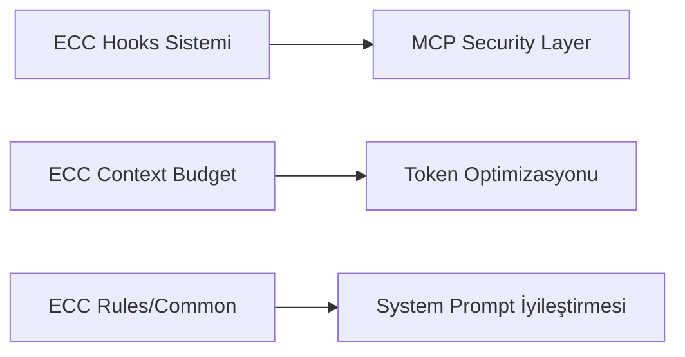
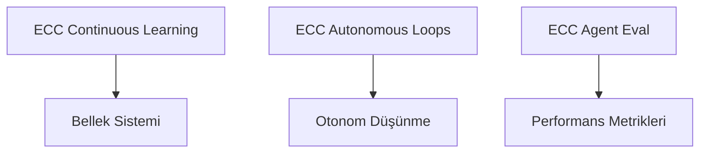
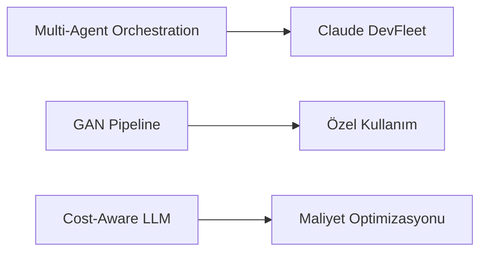

# Everything Claude Code (ECC) — PenceAI Entegrasyon Analizi

> **Analiz Tarihi:** 5 Nisan 2026  
> **Kaynak Repo:** https://github.com/affaan-m/everything-claude-code  
> **ECC Versiyonu:** v1.9.0 (Mar 2026)  
> **Analiz Eden:** PenceAI Development Team

---

## 📊 Repo Özeti

| Metrik | Değer |
|--------|-------|
| ⭐ Stars | 139K+ |
| 🍴 Forks | 20.8K+ |
| 👥 Contributors | 155+ |
| 📦 Haftalık İndirme | 1.9K+ (ecc-universal) |
| 🏆 Anthropic Hackathon Winner | Evet |
| 📅 Son Güncelleme | 3 gün önce |
| 🧪 Internal Tests | 997+ passing |

**Açıklama:** "The agent harness performance optimization system. Skills, instincts, memory, security, and research-first development for Claude Code, Codex, Opencode, Cursor and beyond."

---

## 🏗️ ECC Repo Yapısı

```
everything-claude-code/
├── .agents/                    # AI agent konfigürasyonları (Claude, Codex, Cursor, Gemini, Kiro, Trae...)
├── agents/                     # Özel agent tanımları (.md dosyaları — 40+ agent)
├── skills/                     # 100+ reusable skill klasörleri
├── hooks/                      # Event-driven automation hooks
├── rules/                      # Dil bazlı kodlama kuralları (12 dil)
├── mcp-configs/                # MCP server konfigürasyonları
├── contexts/                   # Session context yönetimi
├── commands/                   # Özel komutlar
├── plugins/                    # Claude Code plugin sistemi
├── schemas/                    # JSON schema tanımları
├── scripts/                    # Install ve utility scriptleri
├── tests/                      # Internal test suite
├── manifests/                  # Selective install manifest'leri
├── research/                   # Araştırma dokümanları
├── examples/                   # Örnek kullanımlar
├── docs/                       # Dokümantasyon
├── .claude/                    # Claude Code konfigürasyonu
├── .codex/                     # Codex konfigürasyonu
├── .cursor/                    # Cursor konfigürasyonu
├── .opencode/                  # OpenCode konfigürasyonu
├── .gemini/                    # Gemini konfigürasyonu
├── .kiro/                      # Kiro konfigürasyonu
├── .trae/                      # Trae konfigürasyonu
├── CLAUDE.md                   # Claude Code için ana rehber
├── AGENTS.md                   # Agent tanımları
├── SECURITY.md                 # Güvenlik rehberi
└── README.md                   # Ana dokümantasyon
```

---

## 🔍 PenceAI İçin Uygun Bileşenler — Detaylı Analiz

### 1. 🎯 **Hooks Sistemi** — ⭐⭐⭐⭐⭐ (YÜKSEK ÖNCELİK)

#### ECC'deki Yapı

```
hooks/
├── hooks.json          # Hook tanımları (matcher + behavior)
└── README.md           # Dokümantasyon
```

#### Hook Tipleri

| Hook | Ne Zaman Çalışır | Kullanım | Exit Code |
|------|------------------|----------|-----------|
| `PreToolUse` | Tool çalışmadan önce | Validation, blocking, warning | 2 (block) / 0 (warn) |
| `PostToolUse` | Tool çalıştıktan sonra | Output analizi, logging | 0 (analyze only) |
| `Stop` | Her AI yanıtı sonrası | Session summary, cleanup | 0 |
| `SessionStart` | Session başlangıcı | State load | 0 |
| `SessionEnd` | Session bitişi | State save | 0 |
| `PreCompact` | Context compaction öncesi | State kaydetme | 0 |

#### PenceAI'ye Uyarlama Potansiyeli

**İlgili PenceAI Dosyaları:**
- [`src/agent/mcp/security.ts`](src/agent/mcp/security.ts:1) — Mevcut security layer'a hook sistemi eklenebilir
- [`src/agent/mcp/command-validator.ts`](src/agent/mcp/command-validator.ts:1) — PreToolUse hook'ları ile entegre edilebilir
- [`src/agent/mcp/eventBus.ts`](src/agent/mcp/eventBus.ts:1) — Event bus zaten mevcut, hook sistemi üzerine inşa edilebilir

**Önerilen Implementasyon:**
```typescript
// src/agent/mcp/hooks.ts (yeni dosya)
interface MCPHook {
  name: string;
  matcher: string | RegExp;      // Tool name pattern
  phase: 'pre' | 'post' | 'stop' | 'session-start' | 'session-end';
  handler: (context: HookContext) => HookResult;
  exitCode: 0 | 2;               // 0 = warn, 2 = block
}

interface HookContext {
  toolName: string;
  args: Record<string, unknown>;
  sessionId: string;
  callCount: number;
}

interface HookResult {
  allowed: boolean;
  message?: string;
  metadata?: Record<string, unknown>;
}
```

#### ECC'den Örnek Hook'lar

| Hook Adı | Matcher | Davranış | PenceAI Uyumu |
|----------|---------|----------|---------------|
| Dev server blocker | `Bash` | `npm run dev` dışarıda çalıştırılmasını engeller | ⭐⭐⭐ |
| Tmux reminder | `Bash` | Uzun komutlar için tmux önerir | ⭐⭐ |
| Git push reminder | `Bash` | `git push` öncesi review hatırlatır | ⭐⭐⭐ |
| Pre-commit quality check | `Bash` | Lint, secrets detection, console.log tespiti | ⭐⭐⭐⭐⭐ |
| Doc file warning | `Write` | Standart dışı .md/.txt dosyaları uyarısı | ⭐⭐⭐ |
| Strategic compact | `Edit\|Write` | ~50 tool call'da context compaction önerir | ⭐⭐⭐⭐⭐ |
| InsAIts security monitor | `Bash\|Write\|Edit\|MultiEdit` | Yüksek riskli input tarama | ⭐⭐⭐⭐ |
| PR logger | `Bash` | `gh pr create` sonrası PR URL loglama | ⭐⭐⭐ |
| Build analysis | `Bash` | Build sonrası asenkron analiz | ⭐⭐⭐⭐ |

---

### 2. 🧠 **Skills Sistemi** — ⭐⭐⭐⭐⭐ (YÜKSEK ÖNCELİK)

#### ECC'deki Yapı

```
skills/
├── agent-eval/                    # Agent değerlendirme
├── agent-harness-construction/    # Agent kurulumu
├── agent-payment-x402/            # Payment entegrasyonu
├── agentic-engineering/           # Ajan mühendisliği
├── ai-first-engineering/          # AI-first yaklaşım
├── ai-regression-testing/         # AI regresyon testleri
├── android-clean-architecture/    # Android mimarisi
├── api-design/                    # API tasarım kalıpları
├── architecture-decision-records/ # ADR sistemi
├── article-writing/               # Makale yazımı
├── autonomous-agent-harness/      # Otonom ajan yönetimi
├── autonomous-loops/              # Döngü yönetimi
├── backend-patterns/              # Backend tasarım kalıpları
├── benchmark/                     # Performans ölçümü
├── blueprint/                     # Proje blueprint
├── brand-voice/                   # Marka sesi
├── browser-qa/                    # Browser test
├── bun-runtime/                   # Bun runtime
├── canary-watch/                  # Canary deployment
├── carrier-relationship-management/ # İlişki yönetimi
├── ck/                            # ClickHouse
├── claude-api/                    # Claude API
├── claude-devfleet/               # Multi-agent orchestration
├── click-path-audit/              # Click path analizi
├── clickhouse-io/                 # ClickHouse I/O
├── codebase-onboarding/           # Kod tabanı tanıma
├── coding-standards/              # Kod standartları
├── compose-multiplatform-patterns/ # Compose MP
├── configure-ecc/                 # ECC konfigürasyonu
├── connections-optimizer/         # Bağlantı optimizasyonu
├── content-engine/                # İçerik motoru
├── content-hash-cache-pattern/    # Content hash cache
├── context-budget/                # Token bütçe yönetimi
├── continuous-agent-loop/         # Sürekli ajan döngüsü
├── continuous-learning/           # Sürekli öğrenme
├── continuous-learning-v2/        # Gelişmiş öğrenme
├── cost-aware-llm-pipeline/       # Maliyet optimizasyonu
├── cpp-coding-standards/          # C++ standartları
├── cpp-testing/                   # C++ test
└── ... (100+ skill)
```

#### PenceAI'ye Uyarlama Potansiyeli

**İlgili PenceAI Modülleri:**
- [`src/autonomous/`](src/autonomous/) — Otonom sistem ECC skill'leri ile güçlendirilebilir
- [`src/memory/`](src/memory/) — Continuous learning skill'i bellek sistemine entegre edilebilir
- [`src/agent/runtime.ts`](src/agent/runtime.ts:1) — Context budget skill'i token yönetimini optimize edebilir

#### En Faydalı Skills — Detaylı

| Skill | PenceAI Uyumu | Açıklama | Entegrasyon Noktası |
|-------|---------------|----------|---------------------|
| `continuous-learning-v2` | ⭐⭐⭐⭐⭐ | Observer session'ları lifecycle sonunda temizler, kendini geliştiren skill altyapısı | [`src/memory/manager/`](src/memory/manager/index.ts:1) |
| `autonomous-loops` | ⭐⭐⭐⭐⭐ | Otonom düşünme motorunu güçlendirir, loop kontrol mekanizmaları | [`src/autonomous/worker.ts`](src/autonomous/worker.ts:1) |
| `context-budget` | ⭐⭐⭐⭐ | Token optimizasyonu, context window yönetimi | [`src/agent/runtimeContext.ts`](src/agent/runtimeContext.ts:1) |
| `cost-aware-llm-pipeline` | ⭐⭐⭐⭐ | Çoklu LLM provider maliyet optimizasyonu, model routing | [`src/llm/provider.ts`](src/llm/provider.ts:1) |
| `benchmark` | ⭐⭐⭐ | Performans ölçümü, metrik toplama | [`tests/benchmark/`](tests/benchmark/) |
| `agent-eval` | ⭐⭐⭐ | Agent performans ölçümü, değerlendirme metrikleri | [`src/agent/runtime.ts`](src/agent/runtime.ts:1) |
| `claude-devfleet` | ⭐⭐⭐⭐ | Multi-agent orchestration, ajan koordinasyonu | [`src/autonomous/`](src/autonomous/) |
| `backend-patterns` | ⭐⭐⭐ | Backend tasarım kalıpları, best practice'ler | [`src/agent/prompt.ts`](src/agent/prompt.ts:1) |
| `api-design` | ⭐⭐⭐ | API tasarım kalıpları | [`src/gateway/routes.ts`](src/gateway/routes.ts:1) |
| `codebase-onboarding` | ⭐⭐⭐ | Kod tabanı tanıma, otomatik dokümantasyon | [`src/agent/tools.ts`](src/agent/tools.ts:1) |
| `autonomous-agent-harness` | ⭐⭐⭐⭐ | Otonom ajan yaşam döngüsü yönetimi | [`src/autonomous/`](src/autonomous/) |
| `ai-regression-testing` | ⭐⭐⭐ | AI model regresyon testleri | [`tests/`](tests/) |

---

### 3. 🤖 **Agents Sistemi** — ⭐⭐⭐⭐ (ORTA-YÜKSEK ÖNCELİK)

#### ECC'deki Yapı

```
agents/
├── architect.md              # Mimari tasarım ajanı
├── planner.md                # Planlama ajanı
├── code-reviewer.md          # Kod inceleme ajanı
├── security-reviewer.md      # Güvenlik inceleme ajanı
├── performance-optimizer.md  # Performans optimizasyonu
├── loop-operator.md          # Döngü operatörü
├── build-error-resolver.md   # Build hata çözücü
├── chief-of-staff.md         # Şef ajan
├── cpp-build-resolver.md     # C++ build çözücü
├── cpp-reviewer.md           # C++ inceleme
├── csharp-reviewer.md        # C# inceleme
├── dart-build-resolver.md    # Dart build çözücü
├── database-reviewer.md      # Veritabanı inceleme
├── doc-updater.md            # Doküman güncelleyici
├── docs-lookup.md            # Doküman arama
├── e2e-runner.md             # E2E test çalıştırıcı
├── flutter-reviewer.md       # Flutter inceleme
├── gan-evaluator.md          # GAN değerlendirici
├── gan-generator.md          # GAN oluşturucu
├── gan-planner.md            # GAN planlayıcı
├── go-build-resolver.md      # Go build çözücü
├── go-reviewer.md            # Go inceleme
├── harness-optimizer.md      # Harness optimizasyonu
├── healthcare-reviewer.md    # Sağlık alanı inceleme
├── java-build-resolver.md    # Java build çözücü
├── java-reviewer.md          # Java inceleme
├── kotlin-build-resolver.md  # Kotlin build çözücü
├── kotlin-reviewer.md        # Kotlin inceleme
├── opensource-forker.md      # Open source fork
├── opensource-packager.md    # Open source paketleyici
├── opensource-sanitizer.md   # Open source temizleyici
├── python-reviewer.md        # Python inceleme
├── pytorch-build-resolver.md # PyTorch build çözücü
├── refactor-cleaner.md       # Refaktor temizleyici
├── rust-build-resolver.md    # Rust build çözücü
├── rust-reviewer.md          # Rust inceleme
├── tdd-guide.md              # TDD rehberi
├── typescript-reviewer.md    # TypeScript inceleme
└── ... (40+ agent)
```

#### PenceAI'ye Uyarlama Potansiyeli

**İlgili PenceAI Dosyaları:**
- [`src/autonomous/thinkEngine.ts`](src/autonomous/thinkEngine.ts:1) — `planner.md` ajanı ile entegre edilebilir
- [`src/agent/tools.ts`](src/agent/tools.ts:1) — `code-reviewer.md` ve `security-reviewer.md` araç olarak eklenebilir
- [`src/autonomous/worker.ts`](src/autonomous/worker.ts:1) — Sub-agent sistemi genişletilebilir

#### Önerilen Agent Entegrasyonları

| ECC Agent | PenceAI Kullanımı | Açıklama |
|-----------|-------------------|----------|
| `planner.md` | Görev planlama | Otonom düşünme motoruna planlama yeteneği |
| `code-reviewer.md` | Kod kalite kontrolü | MCP tool olarak eklenebilir |
| `security-reviewer.md` | Güvenlik tarama | [`src/agent/mcp/security.ts`](src/agent/mcp/security.ts:1) ile entegre |
| `architect.md` | Mimari danışman | Sistem tasarımı önerileri |
| `loop-operator.md` | Döngü yönetimi | [`src/autonomous/worker.ts`](src/autonomous/worker.ts:1) entegrasyonu |
| `performance-optimizer.md` | Performans analizi | Runtime optimizasyon önerileri |

---

### 4. 📐 **Rules Sistemi** — ⭐⭐⭐⭐ (ORTA-YÜKSEK ÖNCELİK)

#### ECC'deki Yapı

```
rules/
├── common/                   # Dil-agnostik kurallar (her zaman yüklenir)
│   ├── coding-style.md       # Kod stili
│   ├── git-workflow.md       # Git iş akışı
│   ├── testing.md            # Test standartları
│   ├── performance.md        # Performans kuralları
│   ├── patterns.md           # Tasarım kalıpları
│   ├── hooks.md              # Hook kuralları
│   ├── agents.md             # Agent kuralları
│   └── security.md           # Güvenlik kuralları
├── typescript/               # TypeScript/JavaScript özel
├── python/                   # Python özel
├── golang/                   # Go özel
├── web/                      # Web/frontend özel
├── swift/                    # Swift özel
├── php/                      # PHP özel
├── java/                     # Java özel
├── kotlin/                   # Kotlin özel
├── rust/                     # Rust özel
├── cpp/                      # C++ özel
├── csharp/                   # C# özel
├── dart/                     # Dart özel
├── perl/                     # Perl özel
└── zh/                       # Çince dokümantasyon
```

#### PenceAI'ye Uyarlama Potansiyeli

**İlgili PenceAI Dosyaları:**
- [`src/agent/prompt.ts`](src/agent/prompt.ts:1) — System prompt'a rules entegre edilebilir
- [`src/agent/mcp/security.ts`](src/agent/mcp/security.ts:1) — `security.md` kuralları ile güçlendirilebilir

#### Önerilen Rule Entegrasyonları

| ECC Rule | PenceAI Kullanımı | Açıklama |
|----------|-------------------|----------|
| `common/security.md` | Güvenlik politikaları | MCP security layer'a eklenebilir |
| `common/testing.md` | Test standartları | Jest test konvansiyonları |
| `common/coding-style.md` | Kod stili | TypeScript lint kuralları |
| `common/performance.md` | Performans | Runtime optimizasyon kuralları |
| `common/patterns.md` | Tasarım kalıpları | Agent pattern'leri |
| `typescript/` | TS kuralları | PenceAI TypeScript yapısı için doğrudan uygun |
| `web/` | Frontend kuralları | React app için uygun |

---

### 5. 🔌 **MCP Configs** — ⭐⭐⭐⭐⭐ (YÜKSEK ÖNCELİK)

#### ECC'deki Yapı

```
mcp-configs/
├── (MCP server konfigürasyonları)
└── .mcp.json             # Ana MCP konfigürasyonu
```

#### PenceAI'ye Uyarlama Potansiyeli

**İlgili PenceAI Dosyaları:**
- [`src/agent/mcp/`](src/agent/mcp/) — Tam MCP modülü mevcut
- [`src/agent/mcp/marketplace-catalog.json`](src/agent/mcp/marketplace-catalog.json:1) — Marketplace kataloğu
- [`src/agent/mcp/marketplace-service.ts`](src/agent/mcp/marketplace-service.ts:1) — Marketplace servisi
- [`src/gateway/services/mcpService.ts`](src/gateway/services/mcpService.ts:1) — Gateway MCP servisi

**Önerilen Entegrasyon:**
- ECC'nin MCP server katalog yapısı PenceAI marketplace'ine eklenebilir
- `.mcp.json` konfigürasyon formatı PenceAI config yapısına uyarlanabilir

---

### 6. 🧪 **Test Sistemi** — ⭐⭐⭐ (ORTA ÖNCELİK)

#### ECC Özellikleri

- 997+ internal test passing
- CI hardening (19 test failure fix)
- Catalog count enforcement
- Install manifest validation
- Full test suite green after hook/runtime refactor

#### PenceAI'ye Uyarlama

**Mevcut PenceAI Test Yapısı:**
- [`tests/agent/mcp/`](tests/agent/mcp/) — MCP testleri mevcut
- [`tests/memory/`](tests/memory/) — Bellek testleri mevcut
- [`tests/benchmark/`](tests/benchmark/) — Benchmark testleri mevcut
- [`tests/e2e/`](tests/e2e/) — E2E testleri mevcut

**ECC'den Eklenebilecekler:**
- Hook test pattern'leri
- Install manifest validation testleri
- CI pipeline testleri

---

## 📋 Öncelikli Entegrasyon Önerileri

### Phase 1 — Hızlı Kazanımlar (1-2 hafta)



#### 1.1 Hooks Sistemi Entegrasyonu

**Hedef Dosyalar:**
- [`src/agent/mcp/eventBus.ts`](src/agent/mcp/eventBus.ts:1) — Event bus zaten mevcut
- [`src/agent/mcp/security.ts`](src/agent/mcp/security.ts:1) — Security layer'a hook desteği
- [`src/agent/mcp/command-validator.ts`](src/agent/mcp/command-validator.ts:1) — Command validation'a hook entegrasyonu

**Implementasyon Adımları:**
1. `src/agent/mcp/hooks.ts` — Hook interface ve registry oluştur
2. `src/agent/mcp/hooks/pre-tool-use.ts` — PreToolUse hook'ları
3. `src/agent/mcp/hooks/post-tool-use.ts` — PostToolUse hook'ları
4. `src/agent/mcp/hooks/stop.ts` — Stop hook'ları
5. `src/agent/mcp/runtime.ts` — Runtime'a hook execution entegre et
6. `tests/agent/mcp/hooks.test.ts` — Hook testleri

**Tahmini Efor:** 2-3 gün

#### 1.2 Context Budget Skill Entegrasyonu

**Hedef Dosyalar:**
- [`src/agent/runtimeContext.ts`](src/agent/runtimeContext.ts:1) — Mevcut pruning mekanizması
- [`src/agent/runtime.ts`](src/agent/runtime.ts:1) — Runtime context yönetimi

**Implementasyon Adımları:**
1. ECC'nin context-budget skill'ini incele
2. Mevcut `pruneConversationHistory()` fonksiyonunu optimize et
3. Token budget tracking ekle
4. Dynamic context window management implement et

**Tahmini Efor:** 1-2 gün

#### 1.3 Rules Entegrasyonu

**Hedef Dosyalar:**
- [`src/agent/prompt.ts`](src/agent/prompt.ts:1) — System prompt
- [`src/agent/mcp/security.ts`](src/agent/mcp/security.ts:1) — Security rules

**Implementasyon Adımları:**
1. `rules/common/` klasörünü PenceAI yapısına uyarla
2. `rules/common/security.md` → MCP security layer'a ekle
3. `rules/common/testing.md` → Test standartlarına ekle
4. `rules/typescript/` → TypeScript lint kurallarına entegre et

**Tahmini Efor:** 1 gün

---

### Phase 2 — Orta Vadeli (2-4 hafta)



#### 2.1 Continuous Learning Skill Entegrasyonu

**Hedef Dosyalar:**
- [`src/memory/manager/index.ts`](src/memory/manager/index.ts:1) — MemoryManager
- [`src/memory/manager/MemoryStore.ts`](src/memory/manager/MemoryStore.ts:1) — MemoryStore
- [`src/autonomous/worker.ts`](src/autonomous/worker.ts:1) — Background worker

**Implementasyon Adımları:**
1. ECC'nin continuous-learning-v2 skill'ini incele
2. Session bazlı öğrenme pattern'leri ekle
3. Observer pattern'i bellek sistemine entegre et
4. Lifecycle sonunda state temizleme implement et
5. Self-improving skill altyapısı oluştur

**Tahmini Efor:** 1 hafta

#### 2.2 Autonomous Loops Entegrasyonu

**Hedef Dosyalar:**
- [`src/autonomous/worker.ts`](src/autonomous/worker.ts:1) — Background worker
- [`src/autonomous/thinkEngine.ts`](src/autonomous/thinkEngine.ts:1) — Think engine
- [`src/autonomous/queue.ts`](src/autonomous/queue.ts:1) — Task queue

**Implementasyon Adımları:**
1. ECC'nin autonomous-loops skill'ini incele
2. Loop kontrol mekanizmaları ekle
3. Loop interrupt ve resume desteği
4. Loop state persistence
5. Loop monitoring ve metrics

**Tahmini Efor:** 1 hafta

#### 2.3 Agent Evaluation Sistemi

**Hedef Dosyalar:**
- [`src/agent/runtime.ts`](src/agent/runtime.ts:1) — Agent runtime
- [`src/utils/logger.ts`](src/utils/logger.ts:1) — Logging sistemi

**Implementasyon Adımları:**
1. ECC'nin agent-eval skill'ini incele
2. Agent performans metrikleri tanımla
3. Eval pipeline oluştur
4. Metrics dashboard'a entegre et
5. Continuous evaluation loop implement et

**Tahmini Efor:** 3-5 gün

---

### Phase 3 — Uzun Vadeli (1-2 ay)



#### 3.1 Multi-Agent Orchestration

**Hedef Dosyalar:**
- [`src/autonomous/`](src/autonomous/) — Otonom modül
- [`src/agent/runtime.ts`](src/agent/runtime.ts:1) — Agent runtime

**Implementasyon Adımları:**
1. ECC'nin claude-devfleet skill'ini incele
2. Multi-agent coordinator oluştur
3. Agent communication protocol tanımla
4. Task distribution ve load balancing
5. Agent lifecycle management

**Tahmini Efor:** 2-3 hafta

#### 3.2 Cost-Aware LLM Pipeline

**Hedef Dosyalar:**
- [`src/llm/provider.ts`](src/llm/provider.ts:1) — LLM provider factory
- [`src/llm/index.ts`](src/llm/index.ts:1) — Provider registry

**Implementasyon Adımları:**
1. ECC'nin cost-aware-llm-pipeline skill'ini incele
2. Model cost database oluştur
3. Cost-based model routing implement et
4. Budget tracking ve alerting
5. Cost optimization recommendations

**Tahmini Efor:** 1 hafta

---

## ⚠️ Dikkat Edilmesi Gerekenler

| Konu | Açıklama | Risk Seviyesi |
|------|----------|---------------|
| **Platform Farkı** | ECC Claude Code için tasarlandı, PenceAI custom agent runtime kullanıyor | Orta |
| **Hook Runtime** | ECC hook'ları Claude Code'un native hook sistemine bağımlı — PenceAI'de custom implementasyon gerekir | Yüksek |
| **Skill Format** | ECC skill'leri `.md` dosyaları — PenceAI'nin TypeScript yapısına adaptasyon gerekir | Orta |
| **Plugin Sistemi** | ECC plugin sistemi Claude Code specific — doğrudan kullanılamaz | Yüksek |
| **Install Script** | ECC'nin `install.sh` bash script'i — Windows uyumluluğu için PowerShell'e port gerekir | Düşük |
| **Agent Tanımları** | ECC agent'ları `.md` formatında — PenceAI runtime'a entegrasyon gerekir | Orta |
| **Rules Format** | ECC rules markdown dosyaları — TypeScript interface'lere dönüştürme gerekir | Düşük |

---

## ✅ Sonuç ve Öneriler

### En Değerli ECC Bileşenleri

| Bileşen | Uyumluluk | Öncelik | Tahmini Efor | ROI |
|---------|-----------|---------|--------------|-----|
| Hooks Sistemi | ⭐⭐⭐⭐ | Yüksek | 2-3 gün | ⭐⭐⭐⭐⭐ |
| Context Budget Skill | ⭐⭐⭐⭐⭐ | Yüksek | 1-2 gün | ⭐⭐⭐⭐⭐ |
| Rules/Common | ⭐⭐⭐⭐⭐ | Yüksek | 1 gün | ⭐⭐⭐⭐ |
| Continuous Learning | ⭐⭐⭐⭐ | Orta-Yüksek | 1 hafta | ⭐⭐⭐⭐⭐ |
| Autonomous Loops | ⭐⭐⭐⭐ | Orta-Yüksek | 1 hafta | ⭐⭐⭐⭐ |
| MCP Configs | ⭐⭐⭐⭐⭐ | Yüksek | 2-3 gün | ⭐⭐⭐⭐ |
| Agent Eval | ⭐⭐⭐ | Orta | 3-5 gün | ⭐⭐⭐ |
| Multi-Agent Orchestration | ⭐⭐⭐ | Düşük-Orta | 2-3 hafta | ⭐⭐⭐⭐ |
| Cost-Aware LLM | ⭐⭐⭐⭐ | Orta | 1 hafta | ⭐⭐⭐⭐ |

### İlk Adım Önerisi

**Hooks sistemi ve context budget skill'i entegrasyonu ile başlanması önerilir.**

**Neden?**
1. Mevcut altyapıya (eventBus, runtimeContext) en uyumlu bileşenler
2. Hızlı kazanım sağlar (2-3 gün)
3. Diğer entegrasyonlar için temel oluşturur
4. Güvenlik ve performans iyileştirmeleri doğrudan hissedilir

### Başlangıç Checklist

- [ ] ECC repo'sunu clone et ve lokalde incele
- [ ] `hooks/` klasörünü detaylı analiz et
- [ ] `skills/context-budget/` skill'ini incele
- [ ] `rules/common/` kurallarını gözden geçir
- [ ] Phase 1 implementasyon planını detaylandır
- [ ] Hook interface tasarımını oluştur
- [ ] Test stratejisini belirle

---

## 📚 Kaynaklar

- **ECC Repo:** https://github.com/affaan-m/everything-claude-code
- **ECC Website:** https://ecc.tools
- **ECC README:** https://github.com/affaan-m/everything-claude-code/blob/main/README.md
- **ECC Security Guide:** https://github.com/affaan-m/everything-claude-code/blob/main/SECURITY.md
- **ECC AGENTS.md:** https://github.com/affaan-m/everything-claude-code/blob/main/AGENTS.md
- **PenceAI PROJECT_MAP.md:** [`PROJECT_MAP.md`](PROJECT_MAP.md:1)
- **PenceAI MCP Modülü:** [`src/agent/mcp/`](src/agent/mcp/)

---

> **Not:** Bu analiz 5 Nisan 2026 tarihinde yapılmıştır. ECC repo'su aktif olarak geliştirilmektedir ve yeni özellikler eklenebilir. Entegrasyon öncesi güncel repo durumunu kontrol ediniz.
