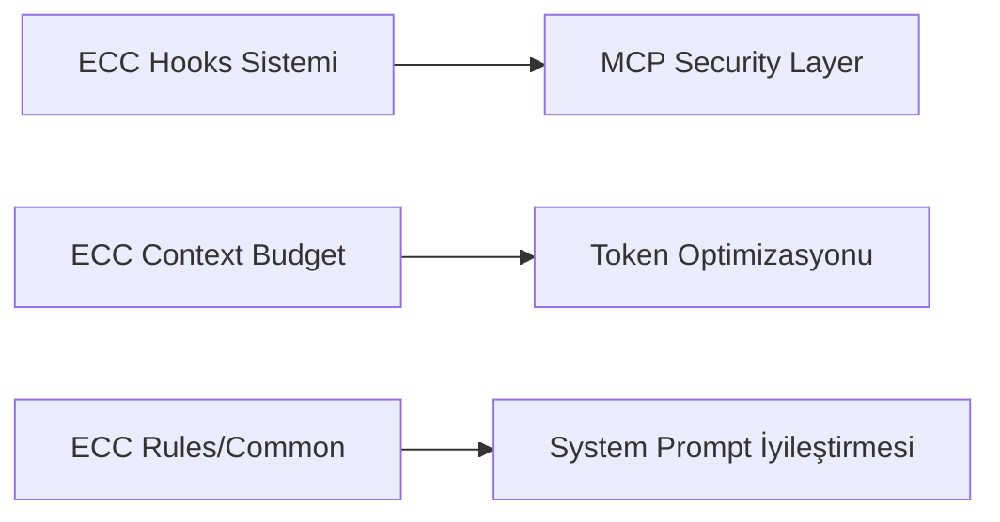
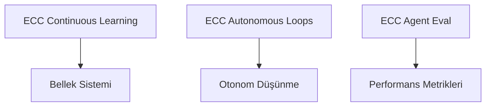
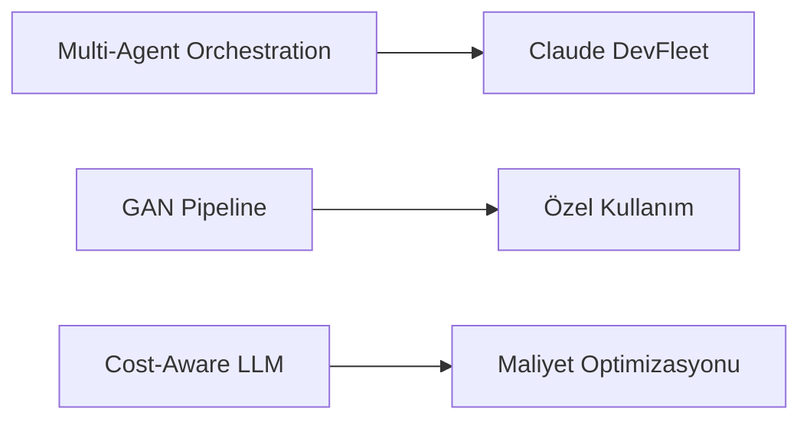

# Everything Claude Code (ECC) — PenceAI Entegrasyon Analizi

> **Analiz Tarihi:** 5 Nisan 2026  
> **Kaynak Repo:** https://github.com/affaan-m/everything-claude-code  
> **ECC Versiyonu:** v1.9.0 (Mar 2026)  
> **Analiz Eden:** PenceAI Development Team

---

## 📊 Repo Özeti

| Metrik | Değer |
|--------|-------|
| ⭐ Stars | 139K+ |
| 🍴 Forks | 20.8K+ |
| 👥 Contributors | 155+ |
| 📦 Haftalık İndirme | 1.9K+ (ecc-universal) |
| 🏆 Anthropic Hackathon Winner | Evet |
| 📅 Son Güncelleme | 3 gün önce |
| 🧪 Internal Tests | 997+ passing |

**Açıklama:** "The agent harness performance optimization system. Skills, instincts, memory, security, and research-first development for Claude Code, Codex, Opencode, Cursor and beyond."

---

## 🏗️ ECC Repo Yapısı

```
everything-claude-code/
├── .agents/                    # AI agent konfigürasyonları (Claude, Codex, Cursor, Gemini, Kiro, Trae...)
├── agents/                     # Özel agent tanımları (.md dosyaları — 40+ agent)
├── skills/                     # 100+ reusable skill klasörleri
├── hooks/                      # Event-driven automation hooks
├── rules/                      # Dil bazlı kodlama kuralları (12 dil)
├── mcp-configs/                # MCP server konfigürasyonları
├── contexts/                   # Session context yönetimi
├── commands/                   # Özel komutlar
├── plugins/                    # Claude Code plugin sistemi
├── schemas/                    # JSON schema tanımları
├── scripts/                    # Install ve utility scriptleri
├── tests/                      # Internal test suite
├── manifests/                  # Selective install manifest'leri
├── research/                   # Araştırma dokümanları
├── examples/                   # Örnek kullanımlar
├── docs/                       # Dokümantasyon
├── .claude/                    # Claude Code konfigürasyonu
├── .codex/                     # Codex konfigürasyonu
├── .cursor/                    # Cursor konfigürasyonu
├── .opencode/                  # OpenCode konfigürasyonu
├── .gemini/                    # Gemini konfigürasyonu
├── .kiro/                      # Kiro konfigürasyonu
├── .trae/                      # Trae konfigürasyonu
├── CLAUDE.md                   # Claude Code için ana rehber
├── AGENTS.md                   # Agent tanımları
├── SECURITY.md                 # Güvenlik rehberi
└── README.md                   # Ana dokümantasyon
```

---

## 🔍 PenceAI İçin Uygun Bileşenler — Detaylı Analiz

### 1. 🎯 **Hooks Sistemi** — ⭐⭐⭐⭐⭐ (YÜKSEK ÖNCELİK)

#### ECC'deki Yapı

```
hooks/
├── hooks.json          # Hook tanımları (matcher + behavior)
└── README.md           # Dokümantasyon
```

#### Hook Tipleri

| Hook | Ne Zaman Çalışır | Kullanım | Exit Code |
|------|------------------|----------|-----------|
| `PreToolUse` | Tool çalışmadan önce | Validation, blocking, warning | 2 (block) / 0 (warn) |
| `PostToolUse` | Tool çalıştıktan sonra | Output analizi, logging | 0 (analyze only) |
| `Stop` | Her AI yanıtı sonrası | Session summary, cleanup | 0 |
| `SessionStart` | Session başlangıcı | State load | 0 |
| `SessionEnd` | Session bitişi | State save | 0 |
| `PreCompact` | Context compaction öncesi | State kaydetme | 0 |

#### PenceAI'ye Uyarlama Potansiyeli

**İlgili PenceAI Dosyaları:**
- [`src/agent/mcp/security.ts`](src/agent/mcp/security.ts:1) — Mevcut security layer'a hook sistemi eklenebilir
- [`src/agent/mcp/command-validator.ts`](src/agent/mcp/command-validator.ts:1) — PreToolUse hook'ları ile entegre edilebilir
- [`src/agent/mcp/eventBus.ts`](src/agent/mcp/eventBus.ts:1) — Event bus zaten mevcut, hook sistemi üzerine inşa edilebilir

**Önerilen Implementasyon:**
```typescript
// src/agent/mcp/hooks.ts (yeni dosya)
interface MCPHook {
  name: string;
  matcher: string | RegExp;      // Tool name pattern
  phase: 'pre' | 'post' | 'stop' | 'session-start' | 'session-end';
  handler: (context: HookContext) => HookResult;
  exitCode: 0 | 2;               // 0 = warn, 2 = block
}

interface HookContext {
  toolName: string;
  args: Record<string, unknown>;
  sessionId: string;
  callCount: number;
}

interface HookResult {
  allowed: boolean;
  message?: string;
  metadata?: Record<string, unknown>;
}
```

#### ECC'den Örnek Hook'lar

| Hook Adı | Matcher | Davranış | PenceAI Uyumu |
|----------|---------|----------|---------------|
| Dev server blocker | `Bash` | `npm run dev` dışarıda çalıştırılmasını engeller | ⭐⭐⭐ |
| Tmux reminder | `Bash` | Uzun komutlar için tmux önerir | ⭐⭐ |
| Git push reminder | `Bash` | `git push` öncesi review hatırlatır | ⭐⭐⭐ |
| Pre-commit quality check | `Bash` | Lint, secrets detection, console.log tespiti | ⭐⭐⭐⭐⭐ |
| Doc file warning | `Write` | Standart dışı .md/.txt dosyaları uyarısı | ⭐⭐⭐ |
| Strategic compact | `Edit\|Write` | ~50 tool call'da context compaction önerir | ⭐⭐⭐⭐⭐ |
| InsAIts security monitor | `Bash\|Write\|Edit\|MultiEdit` | Yüksek riskli input tarama | ⭐⭐⭐⭐ |
| PR logger | `Bash` | `gh pr create` sonrası PR URL loglama | ⭐⭐⭐ |
| Build analysis | `Bash` | Build sonrası asenkron analiz | ⭐⭐⭐⭐ |

---

### 2. 🧠 **Skills Sistemi** — ⭐⭐⭐⭐⭐ (YÜKSEK ÖNCELİK)

#### ECC'deki Yapı

#### En Faydalı Skills — Detaylı

| Skill | PenceAI Uyumu | Açıklama | Entegrasyon Noktası |
|-------|---------------|----------|---------------------|
| `continuous-learning-v2` | ⭐⭐⭐⭐⭐ | Observer session'ları lifecycle sonunda temizler, kendini geliştiren skill altyapısı | [`src/memory/manager/`](src/memory/manager/index.ts:1) |
| `autonomous-loops` | ⭐⭐⭐⭐⭐ | Otonom düşünme motorunu güçlendirir, loop kontrol mekanizmaları | [`src/autonomous/worker.ts`](src/autonomous/worker.ts:1) |
| `context-budget` | ⭐⭐⭐⭐ | Token optimizasyonu, context window yönetimi | [`src/agent/runtimeContext.ts`](src/agent/runtimeContext.ts:1) |
| `cost-aware-llm-pipeline` | ⭐⭐⭐⭐ | Çoklu LLM provider maliyet optimizasyonu, model routing | [`src/llm/provider.ts`](src/llm/provider.ts:1) |
| `benchmark` | ⭐⭐⭐ | Performans ölçümü, metrik toplama | [`tests/benchmark/`](tests/benchmark/) |
| `agent-eval` | ⭐⭐⭐ | Agent performans ölçümü, değerlendirme metrikleri | [`src/agent/runtime.ts`](src/agent/runtime.ts:1) |
| `claude-devfleet` | ⭐⭐⭐⭐ | Multi-agent orchestration, ajan koordinasyonu | [`src/autonomous/`](src/autonomous/) |
| `backend-patterns` | ⭐⭐⭐ | Backend tasarım kalıpları, best practice'ler | [`src/agent/prompt.ts`](src/agent/prompt.ts:1) |
| `api-design` | ⭐⭐⭐ | API tasarım kalıpları | [`src/gateway/routes.ts`](src/gateway/routes.ts:1) |
| `codebase-onboarding` | ⭐⭐⭐ | Kod tabanı tanıma, otomatik dokümantasyon | [`src/agent/tools.ts`](src/agent/tools.ts:1) |
| `autonomous-agent-harness` | ⭐⭐⭐⭐ | Otonom ajan yaşam döngüsü yönetimi | [`src/autonomous/`](src/autonomous/) |
| `ai-regression-testing` | ⭐⭐⭐ | AI model regresyon testleri | [`tests/`](tests/) |

---

### 3. 🤖 **Agents Sistemi** — ⭐⭐⭐⭐ (ORTA-YÜKSEK ÖNCELİK)

#### Önerilen Agent Entegrasyonları

| ECC Agent | PenceAI Kullanımı | Açıklama |
|-----------|-------------------|----------|
| `planner.md` | Görev planlama | Otonom düşünme motoruna planlama yeteneği |
| `code-reviewer.md` | Kod kalite kontrolü | MCP tool olarak eklenebilir |
| `security-reviewer.md` | Güvenlik tarama | [`src/agent/mcp/security.ts`](src/agent/mcp/security.ts:1) ile entegre |
| `architect.md` | Mimari danışman | Sistem tasarımı önerileri |
| `loop-operator.md` | Döngü yönetimi | [`src/autonomous/worker.ts`](src/autonomous/worker.ts:1) entegrasyonu |
| `performance-optimizer.md` | Performans analizi | Runtime optimizasyon önerileri |

---

### 4. 📐 **Rules Sistemi** — ⭐⭐⭐⭐ (ORTA-YÜKSEK ÖNCELİK)

#### Önerilen Rule Entegrasyonları

| ECC Rule | PenceAI Kullanımı | Açıklama |
|----------|-------------------|----------|
| `common/security.md` | Güvenlik politikaları | MCP security layer'a eklenebilir |
| `common/testing.md` | Test standartları | Jest test konvansiyonları |
| `common/coding-style.md` | Kod stili | TypeScript lint kuralları |
| `common/performance.md` | Performans | Runtime optimizasyon kuralları |
| `common/patterns.md` | Tasarım kalıpları | Agent pattern'leri |
| `typescript/` | TS kuralları | PenceAI TypeScript yapısı için doğrudan uygun |
| `web/` | Frontend kuralları | React app için uygun |

---

### 5. 🔌 **MCP Configs** — ⭐⭐⭐⭐⭐ (YÜKSEK ÖNCELİK)

---

### 6. 🧪 **Test Sistemi** — ⭐⭐⭐ (ORTA ÖNCELİK)

---

## 📋 Öncelikli Entegrasyon Önerileri

### Phase 1 — Hızlı Kazanımlar (1-2 hafta)



#### 1.1 Hooks Sistemi Entegrasyonu

**Tahmini Efor:** 2-3 gün

#### 1.2 Context Budget Skill Entegrasyonu

**Tahmini Efor:** 1-2 gün

#### 1.3 Rules Entegrasyonu

**Tahmini Efor:** 1 gün

---

### Phase 2 — Orta Vadeli (2-4 hafta)



#### 2.1 Continuous Learning Skill Entegrasyonu

**Tahmini Efor:** 1 hafta

#### 2.2 Autonomous Loops Entegrasyonu

**Tahmini Efor:** 1 hafta

#### 2.3 Agent Evaluation Sistemi

**Tahmini Efor:** 3-5 gün

---

### Phase 3 — Uzun Vadeli (1-2 ay)



#### 3.1 Multi-Agent Orchestration

**Tahmini Efor:** 2-3 hafta

#### 3.2 Cost-Aware LLM Pipeline

**Tahmini Efor:** 1 hafta

---

## ⚠️ Dikkat Edilmesi Gerekenler

| Konu | Açıklama | Risk Seviyesi |
|------|----------|---------------|
| **Platform Farkı** | ECC Claude Code için tasarlandı, PenceAI custom agent runtime kullanıyor | Orta |
| **Hook Runtime** | ECC hook'ları Claude Code'un native hook sistemine bağımlı — PenceAI'de custom implementasyon gerekir | Yüksek |
| **Skill Format** | ECC skill'leri `.md` dosyaları — PenceAI'nin TypeScript yapısına adaptasyon gerekir | Orta |

---

## ✅ Sonuç ve Öneriler

### En Değerli ECC Bileşenleri

| Bileşen | Uyumluluk | Öncelik | Tahmini Efor | ROI |
|---------|-----------|---------|--------------|-----|
| Hooks Sistemi | ⭐⭐⭐⭐ | Yüksek | 2-3 gün | ⭐⭐⭐⭐⭐ |
| Context Budget Skill | ⭐⭐⭐⭐⭐ | Yüksek | 1-2 gün | ⭐⭐⭐⭐⭐ |
| Rules/Common | ⭐⭐⭐⭐⭐ | Yüksek | 1 gün | ⭐⭐⭐⭐ |
| Continuous Learning | ⭐⭐⭐⭐ | Orta-Yüksek | 1 hafta | ⭐⭐⭐⭐⭐ |
| Autonomous Loops | ⭐⭐⭐⭐ | Orta-Yüksek | 1 hafta | ⭐⭐⭐⭐ |
| MCP Configs | ⭐⭐⭐⭐⭐ | Yüksek | 2-3 gün | ⭐⭐⭐⭐ |
| Agent Eval | ⭐⭐⭐ | Orta | 3-5 gün | ⭐⭐⭐ |
| Multi-Agent Orchestration | ⭐⭐⭐ | Düşük-Orta | 2-3 hafta | ⭐⭐⭐⭐ |
| Cost-Aware LLM | ⭐⭐⭐⭐ | Orta | 1 hafta | ⭐⭐⭐⭐ |

### İlk Adım Önerisi

**Hooks sistemi ve context budget skill'i entegrasyonu ile başlanması önerilir.**

---

## 📚 Kaynaklar

- **ECC Repo:** https://github.com/affaan-m/everything-claude-code
- **ECC Website:** https://ecc.tools
- **PenceAI PROJECT_MAP.md:** [`PROJECT_MAP.md`](PROJECT_MAP.md:1)
- **PenceAI MCP Modülü:** [`src/agent/mcp/`](src/agent/mcp/)

---

> **Not:** Bu analiz 5 Nisan 2026 tarihinde yapılmıştır. 
